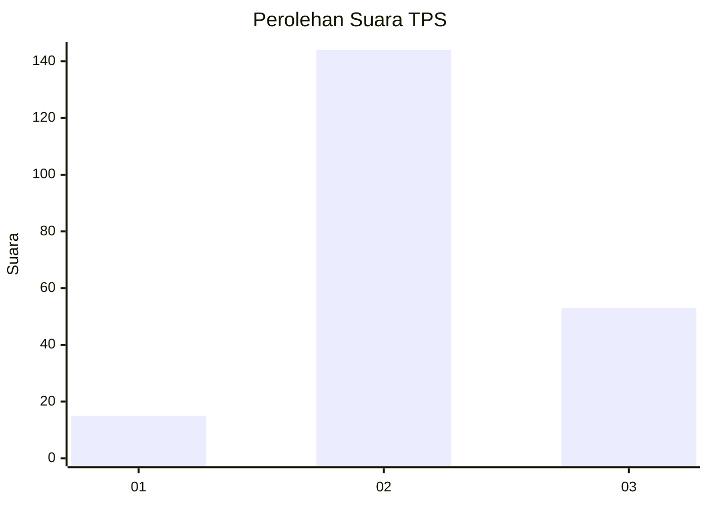
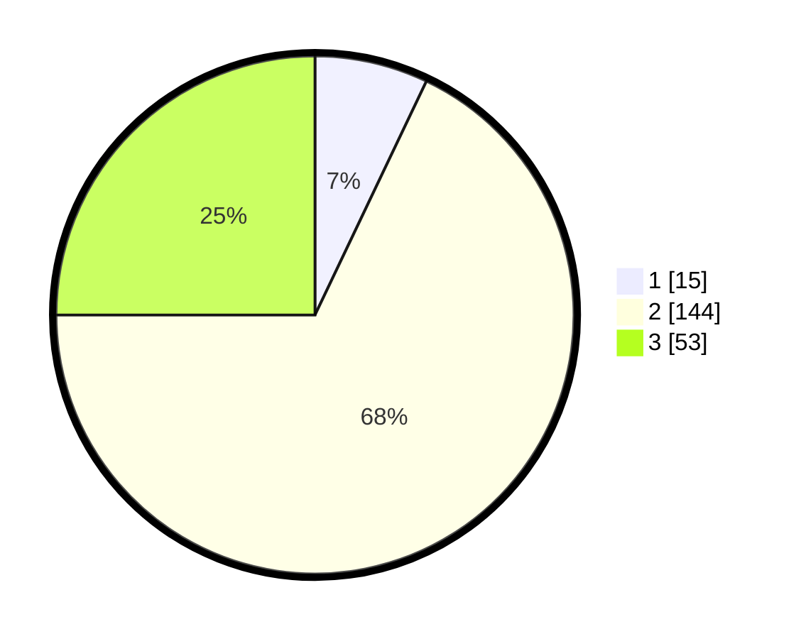

# Hasil

## Grafik

## Tabel

| No. | Nama Paslon    | Suara | Suara (raw) | Persentase |
|:--- |:-------------- | -----:| -----------:| ----------:|
| 1   | ANIES MUHAIMIN | 15    | [15][p-1]   | 7,08       |
| 2   | PRABOWO GIBRAN | 144   | [144][p-2]  | 67,92      |
| 3   | GANJAR MAHFUD  | 53    | [53][p-3]   | 25,00      |

[p-1]: https://github.com/gigit-pemilu/pemilu-2024-34-di-yogyakarta/blob/main/pilpres/hitung-suara/sub/34-di-yogyakarta/sub/03-gunungkidul/sub/03-playen/sub/2005-dengok/sub/006-tps/sub/paslon-1.txt
[p-2]: https://github.com/gigit-pemilu/pemilu-2024-34-di-yogyakarta/blob/main/pilpres/hitung-suara/sub/34-di-yogyakarta/sub/03-gunungkidul/sub/03-playen/sub/2005-dengok/sub/006-tps/sub/paslon-2.txt
[p-3]: https://github.com/gigit-pemilu/pemilu-2024-34-di-yogyakarta/blob/main/pilpres/hitung-suara/sub/34-di-yogyakarta/sub/03-gunungkidul/sub/03-playen/sub/2005-dengok/sub/006-tps/sub/paslon-3.txt

## Foto C Plano

https://sirekap-obj-formc.kpu.go.id/df7d/pemilu/ppwp/34/03/03/20/05/3403032005006-20240215-024106--66f267fb-2844-4330-8622-543013709d03.jpg

https://sirekap-obj-formc.kpu.go.id/df7d/pemilu/ppwp/34/03/03/20/05/3403032005006-20240215-024153--d38e7627-e303-4e6b-9489-e377b485b480.jpg

https://sirekap-obj-formc.kpu.go.id/df7d/pemilu/ppwp/34/03/03/20/05/3403032005006-20240215-024229--3f79d1e6-e991-46bd-bd79-18e45f92d33e.jpg

## Metadata

| Key        | Value               |
| ---------- | ------------------- |
| Time Stamp | 2024-02-17 19:30:00 |

