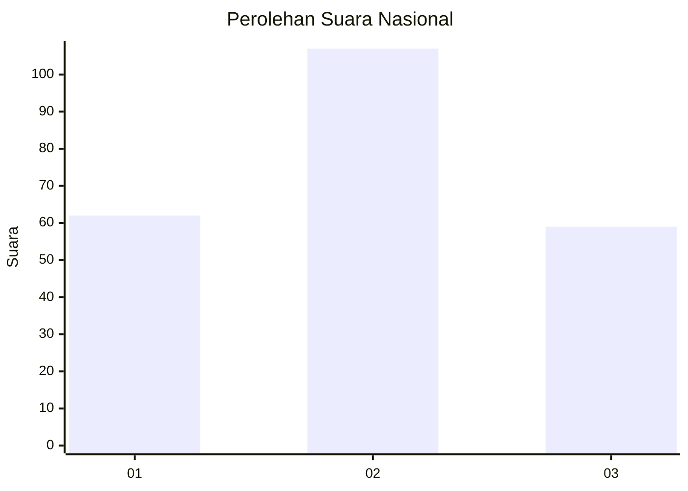
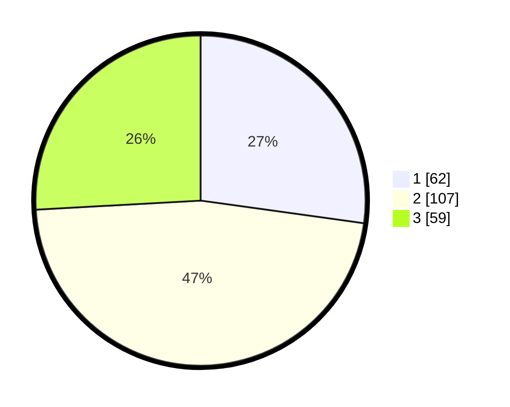

# Hasil

## Grafik

## Tabel

| No. | Nama Paslon    | Suara | Suara (raw) | Persentase |
|:--- |:-------------- | -----:| -----------:| ----------:|
| 1   | ANIES MUHAIMIN | 62    | [62][p-1]   | 27,19      |
| 2   | PRABOWO GIBRAN | 107   | [107][p-2]  | 46,93      |
| 3   | GANJAR MAHFUD  | 59    | [59][p-3]   | 25,88      |

[p-1]: https://github.com/gigit-pemilu/pemilu-2024/blob/main/pilpres/hitung-suara/sub/34-di-yogyakarta/sub/03-gunungkidul/sub/03-playen/sub/2007-playen/sub/004-tps/sub/paslon-1.txt
[p-2]: https://github.com/gigit-pemilu/pemilu-2024/blob/main/pilpres/hitung-suara/sub/34-di-yogyakarta/sub/03-gunungkidul/sub/03-playen/sub/2007-playen/sub/004-tps/sub/paslon-2.txt
[p-3]: https://github.com/gigit-pemilu/pemilu-2024/blob/main/pilpres/hitung-suara/sub/34-di-yogyakarta/sub/03-gunungkidul/sub/03-playen/sub/2007-playen/sub/004-tps/sub/paslon-3.txt

## Foto C Plano

https://sirekap-obj-formc.kpu.go.id/3f08/pemilu/ppwp/34/03/03/20/07/3403032007004-20240214-204109--fbe758d7-0906-45df-bcdf-1e41d56bc05e.jpg

https://sirekap-obj-formc.kpu.go.id/3f08/pemilu/ppwp/34/03/03/20/07/3403032007004-20240214-210022--6f7c0c18-92c4-4770-84c6-9e5b435b27de.jpg

https://sirekap-obj-formc.kpu.go.id/3f08/pemilu/ppwp/34/03/03/20/07/3403032007004-20240214-210025--7f6ed1df-7b9e-4c5c-81da-fca789fdc54c.jpg

## Metadata

| Key        | Value               |
| ---------- | ------------------- |
| Time Stamp | 2024-02-15 17:00:25 |

