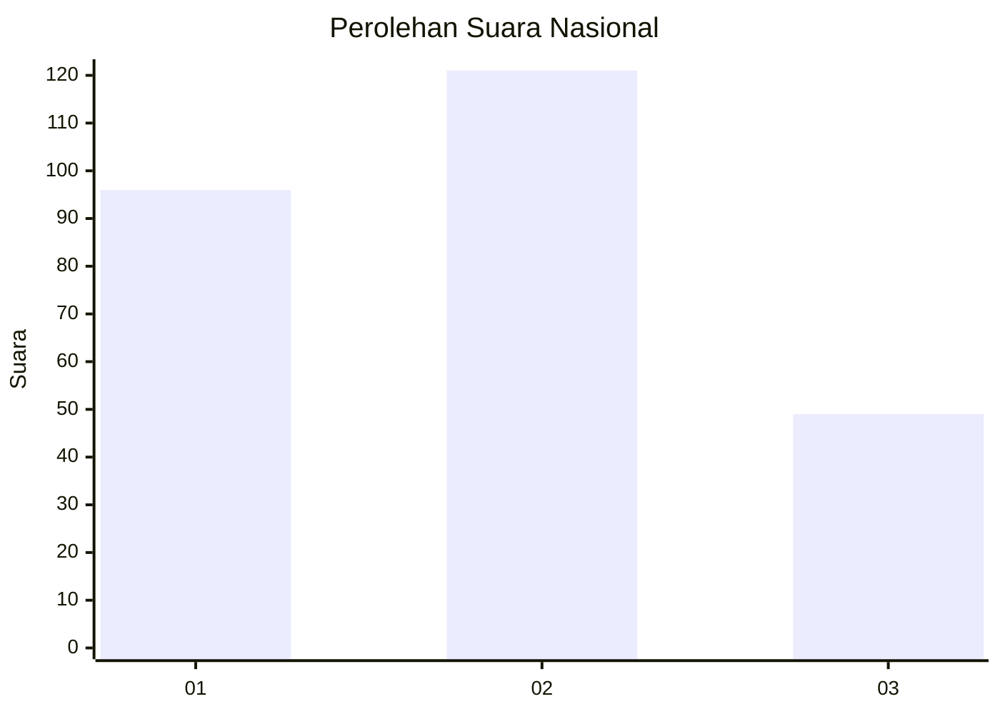
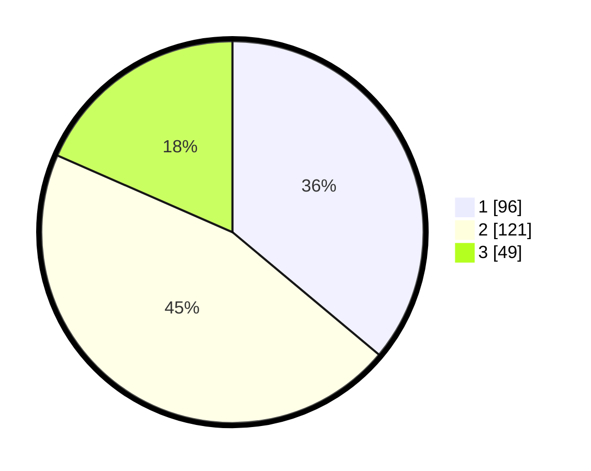

# Hasil

## Grafik

## Tabel

| No. | Nama Paslon    | Suara | Suara (raw) | Persentase |
|:--- |:-------------- | -----:| -----------:| ----------:|
| 1   | ANIES MUHAIMIN | 96    | [96][p-1]   | 36,09      |
| 2   | PRABOWO GIBRAN | 121   | [121][p-2]  | 45,49      |
| 3   | GANJAR MAHFUD  | 49    | [49][p-3]   | 18,42      |

[p-1]: https://github.com/gigit-pemilu/pemilu-2024/blob/main/pilpres/hitung-suara/sub/34-di-yogyakarta/sub/03-gunungkidul/sub/03-playen/sub/2007-playen/sub/005-tps/sub/paslon-1.txt
[p-2]: https://github.com/gigit-pemilu/pemilu-2024/blob/main/pilpres/hitung-suara/sub/34-di-yogyakarta/sub/03-gunungkidul/sub/03-playen/sub/2007-playen/sub/005-tps/sub/paslon-2.txt
[p-3]: https://github.com/gigit-pemilu/pemilu-2024/blob/main/pilpres/hitung-suara/sub/34-di-yogyakarta/sub/03-gunungkidul/sub/03-playen/sub/2007-playen/sub/005-tps/sub/paslon-3.txt

## Foto C Plano

https://sirekap-obj-formc.kpu.go.id/6edc/pemilu/ppwp/34/03/03/20/07/3403032007005-20240216-193608--f01d435e-4196-4201-a361-d7949eb94c92.jpg

https://sirekap-obj-formc.kpu.go.id/6edc/pemilu/ppwp/34/03/03/20/07/3403032007005-20240216-193609--e7d22f72-23b1-4072-a8f7-6b8d86e0f421.jpg

https://sirekap-obj-formc.kpu.go.id/6edc/pemilu/ppwp/34/03/03/20/07/3403032007005-20240216-193609--738ca414-1514-49ef-a7c9-1cc73b4a6edb.jpg

## Metadata

| Key        | Value               |
| ---------- | ------------------- |
| Time Stamp | 2024-02-17 14:45:18 |

## DATA PEMILIH TETAP

Jumlah pemilih dalam DPT: **295**.
 * L: **137**.
 * P: **158**.

## DATA PENGGUNA HAK PILIH

Jumlah pengguna hak pilih dalam DPT: **255**.
 * L: **119**.
 * P: **136**.

Jumlah pengguna hak pilih dalam DPTb: **0**.
 * L: **0**.
 * P: **14**.

Jumlah pengguna hak pilih dalam DPK: **3**.
 * L: **1**.
 * P: **2**.

Jumlah pengguna hak pilih: **272**.
 * L: **120**.
 * P: **152**.

## JUMLAH SUARA SAH DAN TIDAK SAH

JUMLAH SELURUH SUARA SAH: **266**.

JUMLAH SUARA TIDAK SAH: **6**.

JUMLAH SELURUH SUARA SAH DAN SUARA TIDAK SAH: **272**.

