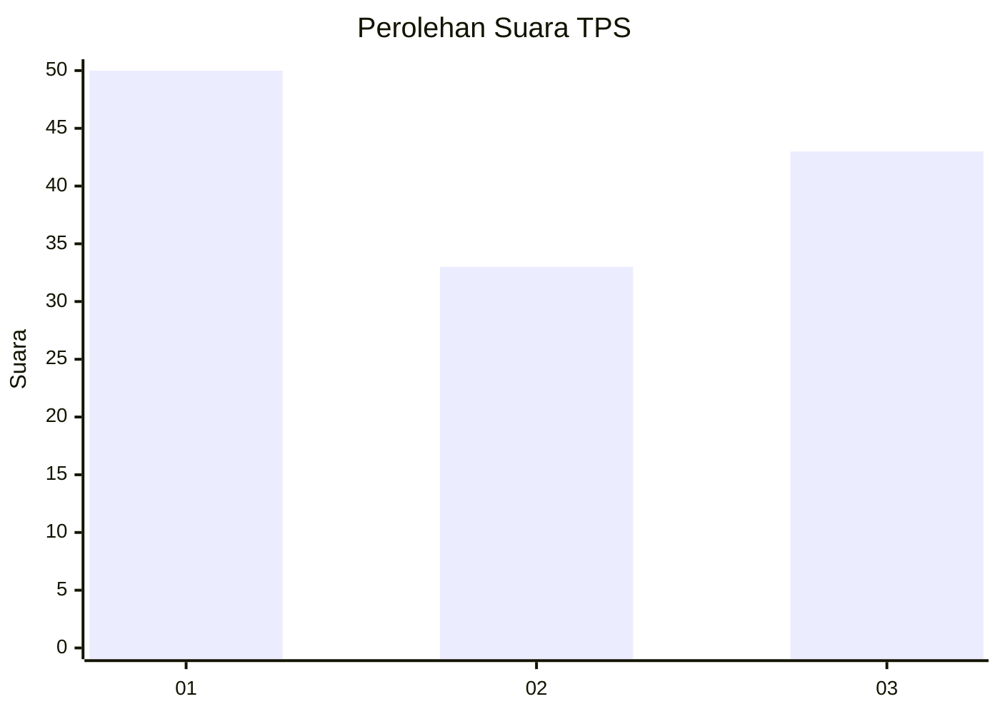
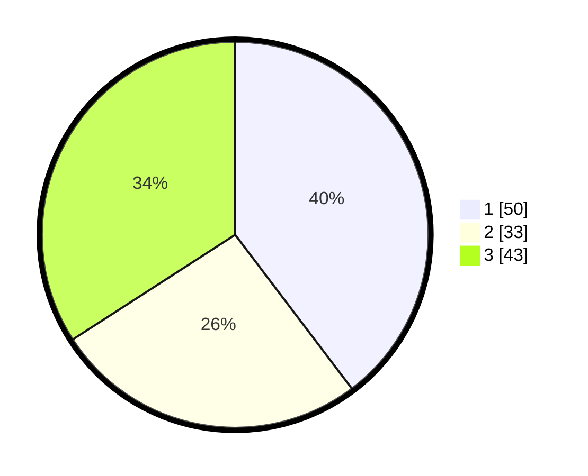

# Hasil

## Grafik

## Tabel

| No. | Nama Paslon    | Suara | Suara (raw) | Persentase |
|:--- |:-------------- | -----:| -----------:| ----------:|
| 1   | ANIES MUHAIMIN | 50    | [50][p-1]   | 39,68      |
| 2   | PRABOWO GIBRAN | 33    | [33][p-2]   | 26,19      |
| 3   | GANJAR MAHFUD  | 43    | [43][p-3]   | 34,13      |

[p-1]: https://github.com/gigit-pemilu/pemilu-2024-34-di-yogyakarta/blob/main/pilpres/hitung-suara/sub/34-di-yogyakarta/sub/03-gunungkidul/sub/03-playen/sub/2007-playen/sub/013-tps/sub/paslon-1.txt
[p-2]: https://github.com/gigit-pemilu/pemilu-2024-34-di-yogyakarta/blob/main/pilpres/hitung-suara/sub/34-di-yogyakarta/sub/03-gunungkidul/sub/03-playen/sub/2007-playen/sub/013-tps/sub/paslon-2.txt
[p-3]: https://github.com/gigit-pemilu/pemilu-2024-34-di-yogyakarta/blob/main/pilpres/hitung-suara/sub/34-di-yogyakarta/sub/03-gunungkidul/sub/03-playen/sub/2007-playen/sub/013-tps/sub/paslon-3.txt

## Foto C Plano

https://sirekap-obj-formc.kpu.go.id/bbe0/pemilu/ppwp/34/03/03/20/07/3403032007013-20240215-002539--12d57477-dce9-402e-a9f6-fe307f6d7e16.jpg

https://sirekap-obj-formc.kpu.go.id/bbe0/pemilu/ppwp/34/03/03/20/07/3403032007013-20240215-002624--37d7be4a-d752-4c9e-ae96-afb5adc13ee9.jpg

https://sirekap-obj-formc.kpu.go.id/bbe0/pemilu/ppwp/34/03/03/20/07/3403032007013-20240215-003313--d88a4dc5-f44d-47d0-b0c6-47402bdc290d.jpg

## Metadata

| Key        | Value               |
| ---------- | ------------------- |
| Time Stamp | 2024-02-16 21:01:00 |

