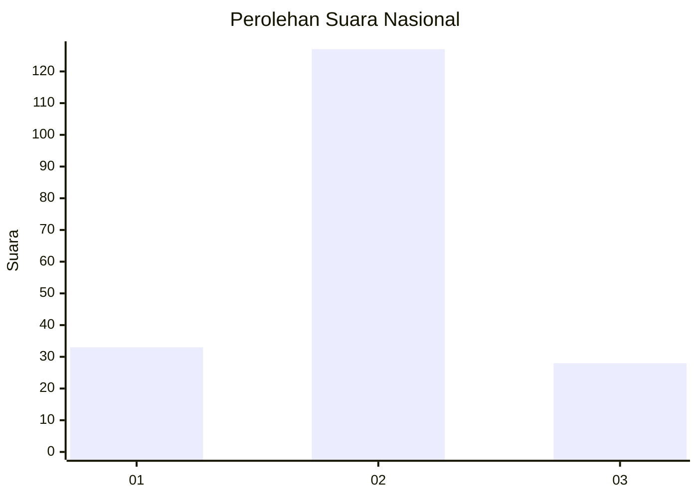
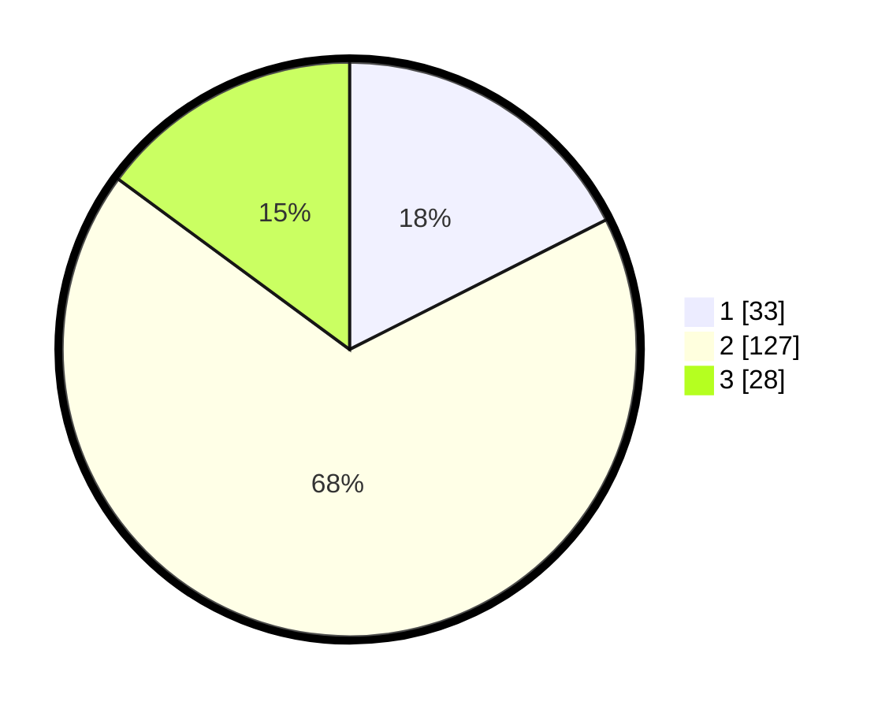

# Hasil

## Grafik

## Tabel

| No. | Nama Paslon    | Suara | Suara (raw) | Persentase |
|:--- |:-------------- | -----:| -----------:| ----------:|
| 1   | ANIES MUHAIMIN | 33    | [33][p-1]   | 17,55      |
| 2   | PRABOWO GIBRAN | 127   | [127][p-2]  | 67,55      |
| 3   | GANJAR MAHFUD  | 28    | [28][p-3]   | 14,89      |

[p-1]: https://github.com/gigit-pemilu/pemilu-2024/blob/main/pilpres/hitung-suara/sub/34-di-yogyakarta/sub/03-gunungkidul/sub/03-playen/sub/2008-ngawu/sub/002-tps/sub/paslon-1.txt
[p-2]: https://github.com/gigit-pemilu/pemilu-2024/blob/main/pilpres/hitung-suara/sub/34-di-yogyakarta/sub/03-gunungkidul/sub/03-playen/sub/2008-ngawu/sub/002-tps/sub/paslon-2.txt
[p-3]: https://github.com/gigit-pemilu/pemilu-2024/blob/main/pilpres/hitung-suara/sub/34-di-yogyakarta/sub/03-gunungkidul/sub/03-playen/sub/2008-ngawu/sub/002-tps/sub/paslon-3.txt

## Foto C Plano

https://sirekap-obj-formc.kpu.go.id/3fcd/pemilu/ppwp/34/03/03/20/08/3403032008002-20240217-224354--2508f6cd-df36-4ceb-8b5b-7620743273fe.jpg

https://sirekap-obj-formc.kpu.go.id/3fcd/pemilu/ppwp/34/03/03/20/08/3403032008002-20240216-210246--a102be8b-a02e-4a23-854d-7a3a9a4a8d39.jpg

https://sirekap-obj-formc.kpu.go.id/3fcd/pemilu/ppwp/34/03/03/20/08/3403032008002-20240217-133033--04f37000-e3b1-4660-9734-b24057eede6a.jpg

## Metadata

| Key        | Value               |
| ---------- | ------------------- |
| Time Stamp | 2024-02-19 06:16:00 |

