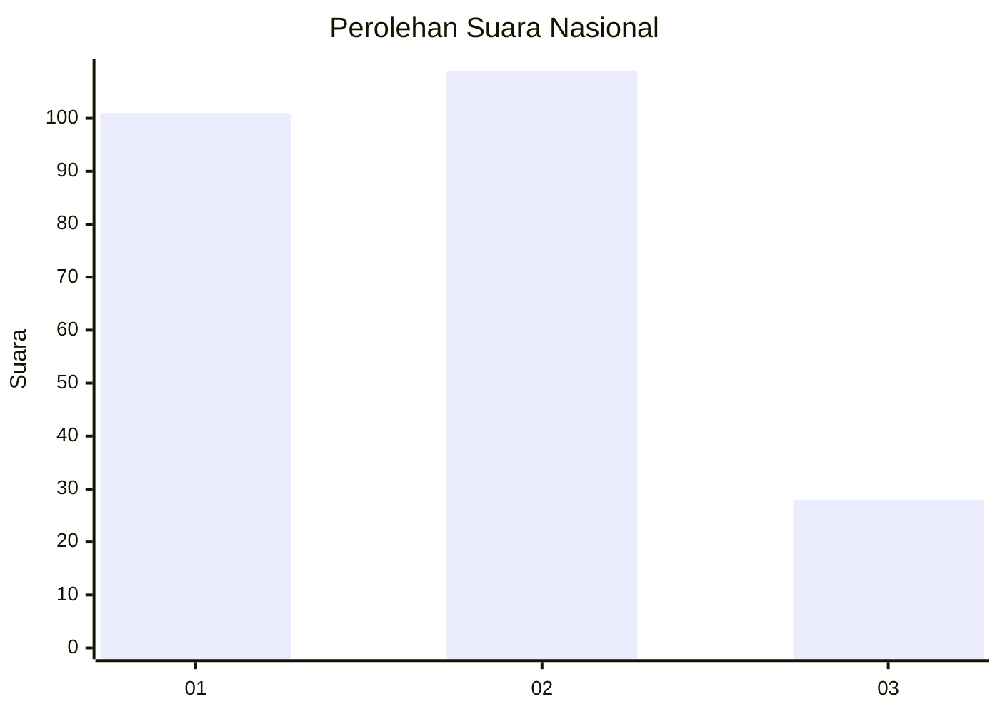
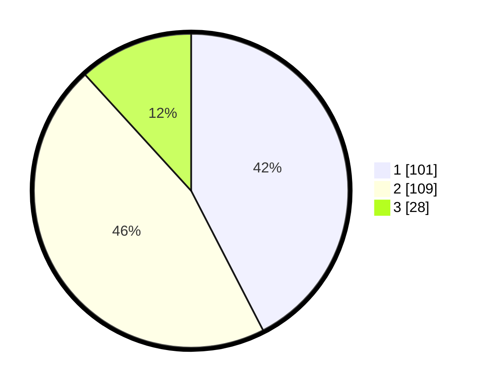

# Hasil

## Grafik

## Tabel

| No. | Nama Paslon    | Suara | Suara (raw) | Persentase |
|:--- |:-------------- | -----:| -----------:| ----------:|
| 1   | ANIES MUHAIMIN | 101   | [101][p-1]  | 42,44      |
| 2   | PRABOWO GIBRAN | 109   | [109][p-2]  | 45,80      |
| 3   | GANJAR MAHFUD  | 28    | [28][p-3]   | 11,76      |

[p-1]: https://github.com/gigit-pemilu/pemilu-2024/blob/main/pilpres/hitung-suara/sub/34-di-yogyakarta/sub/03-gunungkidul/sub/03-playen/sub/2008-ngawu/sub/012-tps/sub/paslon-1.txt
[p-2]: https://github.com/gigit-pemilu/pemilu-2024/blob/main/pilpres/hitung-suara/sub/34-di-yogyakarta/sub/03-gunungkidul/sub/03-playen/sub/2008-ngawu/sub/012-tps/sub/paslon-2.txt
[p-3]: https://github.com/gigit-pemilu/pemilu-2024/blob/main/pilpres/hitung-suara/sub/34-di-yogyakarta/sub/03-gunungkidul/sub/03-playen/sub/2008-ngawu/sub/012-tps/sub/paslon-3.txt

## Foto C Plano

https://sirekap-obj-formc.kpu.go.id/c6f6/pemilu/ppwp/34/03/03/20/08/3403032008012-20240218-130747--dd22ccc2-f003-42b7-a9aa-8e16eec147f0.jpg

https://sirekap-obj-formc.kpu.go.id/c6f6/pemilu/ppwp/34/03/03/20/08/3403032008012-20240218-131135--2d1cf7cb-c434-4a26-bd9c-0a807b4c0fe6.jpg

https://sirekap-obj-formc.kpu.go.id/c6f6/pemilu/ppwp/34/03/03/20/08/3403032008012-20240218-131947--af31c3d8-5bae-4f6e-89db-31ee475b3154.jpg

## Metadata

| Key        | Value               |
| ---------- | ------------------- |
| Time Stamp | 2024-02-19 06:16:00 |

