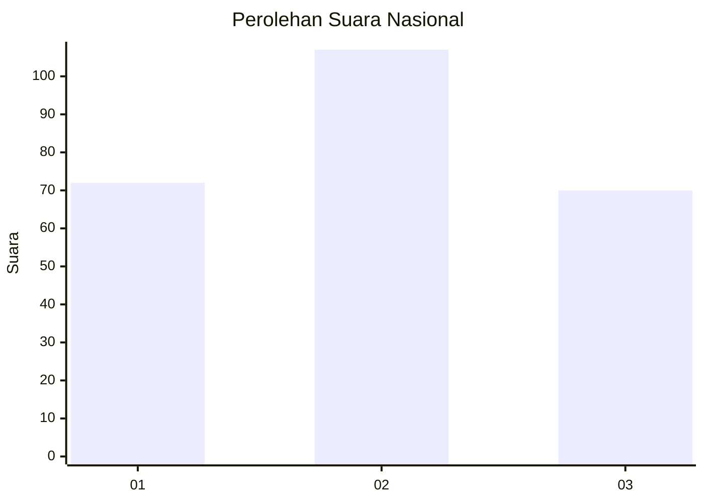
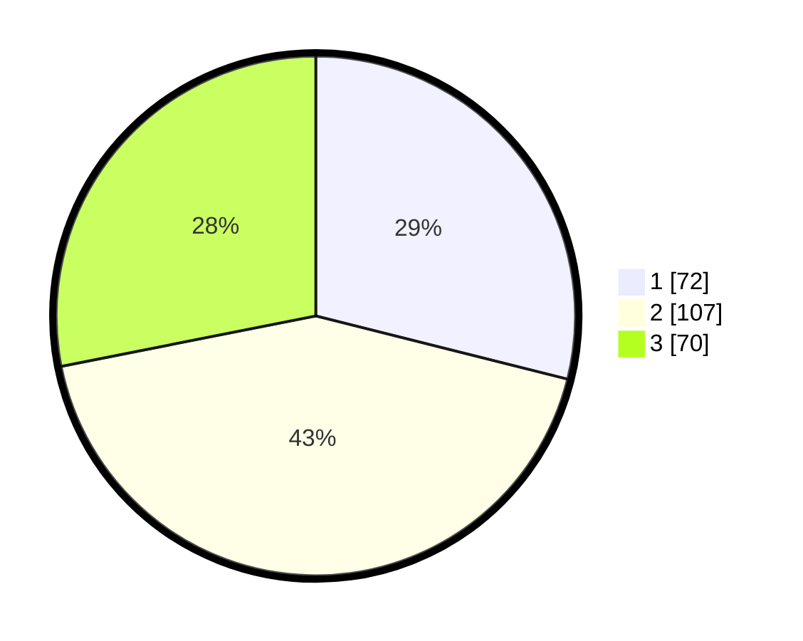

# Hasil

## Grafik

## Tabel

| No. | Nama Paslon    | Suara | Suara (raw) | Persentase |
|:--- |:-------------- | -----:| -----------:| ----------:|
| 1   | ANIES MUHAIMIN | 72    | [72][p-1]   | 28,92      |
| 2   | PRABOWO GIBRAN | 107   | [107][p-2]  | 42,97      |
| 3   | GANJAR MAHFUD  | 70    | [70][p-3]   | 28,11      |

[p-1]: https://github.com/gigit-pemilu/pemilu-2024/blob/main/pilpres/hitung-suara/sub/34-di-yogyakarta/sub/03-gunungkidul/sub/03-playen/sub/2010-logandeng/sub/001-tps/sub/paslon-1.txt
[p-2]: https://github.com/gigit-pemilu/pemilu-2024/blob/main/pilpres/hitung-suara/sub/34-di-yogyakarta/sub/03-gunungkidul/sub/03-playen/sub/2010-logandeng/sub/001-tps/sub/paslon-2.txt
[p-3]: https://github.com/gigit-pemilu/pemilu-2024/blob/main/pilpres/hitung-suara/sub/34-di-yogyakarta/sub/03-gunungkidul/sub/03-playen/sub/2010-logandeng/sub/001-tps/sub/paslon-3.txt

## Foto C Plano

https://sirekap-obj-formc.kpu.go.id/b361/pemilu/ppwp/34/03/03/20/10/3403032010001-20240214-193054--675d8f6c-4a0c-43b0-a1d2-9901851e87ec.jpg

https://sirekap-obj-formc.kpu.go.id/b361/pemilu/ppwp/34/03/03/20/10/3403032010001-20240214-232524--a99a494b-7439-4c62-8095-e3114214c9dd.jpg

https://sirekap-obj-formc.kpu.go.id/b361/pemilu/ppwp/34/03/03/20/10/3403032010001-20240214-193101--b6029186-b60b-433e-abf1-85591143f9ad.jpg

## Metadata

| Key        | Value               |
| ---------- | ------------------- |
| Time Stamp | 2024-02-15 21:01:18 |

## DATA PEMILIH TETAP

Jumlah pemilih dalam DPT: **270**.
 * L: **123**.
 * P: **147**.

## DATA PENGGUNA HAK PILIH

Jumlah pengguna hak pilih dalam DPT: **238**.
 * L: **107**.
 * P: **131**.

Jumlah pengguna hak pilih dalam DPTb: **13**.
 * L: **3**.
 * P: **10**.

Jumlah pengguna hak pilih dalam DPK: **2**.
 * L: **1**.
 * P: **1**.

Jumlah pengguna hak pilih: **253**.
 * L: **111**.
 * P: **142**.

## JUMLAH SUARA SAH DAN TIDAK SAH

JUMLAH SELURUH SUARA SAH: **249**.

JUMLAH SUARA TIDAK SAH: **4**.

JUMLAH SELURUH SUARA SAH DAN SUARA TIDAK SAH: **253**.

