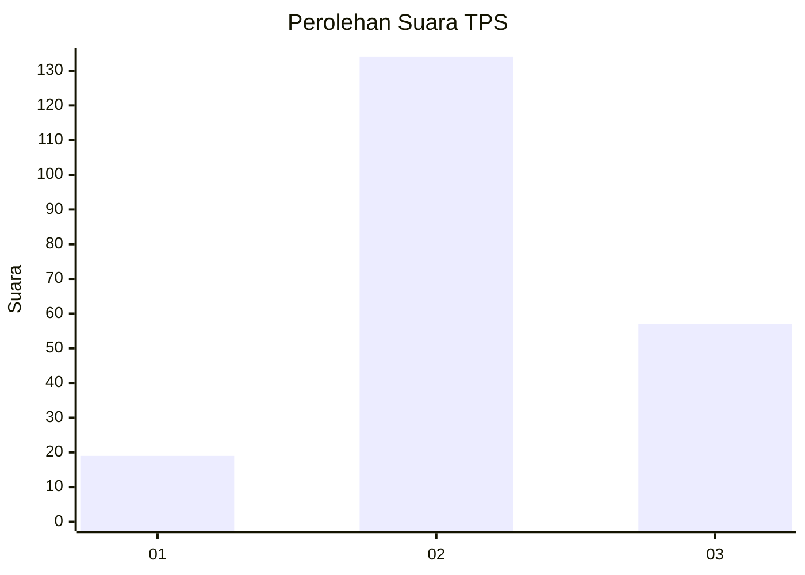
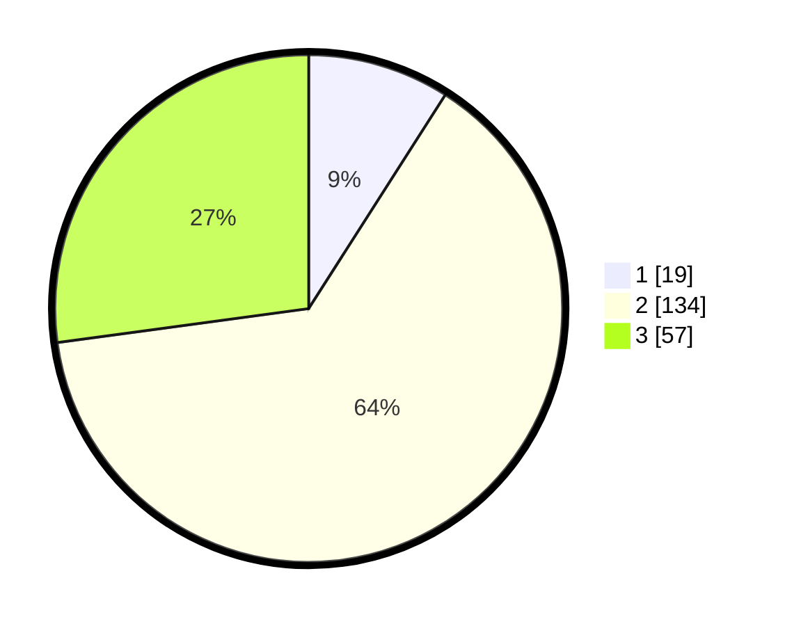

# Hasil

## Grafik

## Tabel

| No. | Nama Paslon    | Suara | Suara (raw) | Persentase |
|:--- |:-------------- | -----:| -----------:| ----------:|
| 1   | ANIES MUHAIMIN | 19    | [19][p-1]   | 9,05       |
| 2   | PRABOWO GIBRAN | 134   | [134][p-2]  | 63,81      |
| 3   | GANJAR MAHFUD  | 57    | [57][p-3]   | 27,14      |

[p-1]: https://github.com/gigit-pemilu/pemilu-2024-34-di-yogyakarta/blob/main/pilpres/hitung-suara/sub/34-di-yogyakarta/sub/03-gunungkidul/sub/03-playen/sub/2010-logandeng/sub/006-tps/sub/paslon-1.txt
[p-2]: https://github.com/gigit-pemilu/pemilu-2024-34-di-yogyakarta/blob/main/pilpres/hitung-suara/sub/34-di-yogyakarta/sub/03-gunungkidul/sub/03-playen/sub/2010-logandeng/sub/006-tps/sub/paslon-2.txt
[p-3]: https://github.com/gigit-pemilu/pemilu-2024-34-di-yogyakarta/blob/main/pilpres/hitung-suara/sub/34-di-yogyakarta/sub/03-gunungkidul/sub/03-playen/sub/2010-logandeng/sub/006-tps/sub/paslon-3.txt

## Foto C Plano

https://sirekap-obj-formc.kpu.go.id/4fa8/pemilu/ppwp/34/03/03/20/10/3403032010006-20240214-221416--029f2701-815a-46b6-a452-5da1fbef3daf.jpg

https://sirekap-obj-formc.kpu.go.id/4fa8/pemilu/ppwp/34/03/03/20/10/3403032010006-20240214-221214--2ac51196-3b4a-4974-8d26-3ca5ae061840.jpg

https://sirekap-obj-formc.kpu.go.id/4fa8/pemilu/ppwp/34/03/03/20/10/3403032010006-20240214-221012--02e74e8d-5d23-4ca1-a1b9-4596bf4f650c.jpg

## Metadata

| Key        | Value               |
| ---------- | ------------------- |
| Time Stamp | 2024-02-15 17:30:25 |

