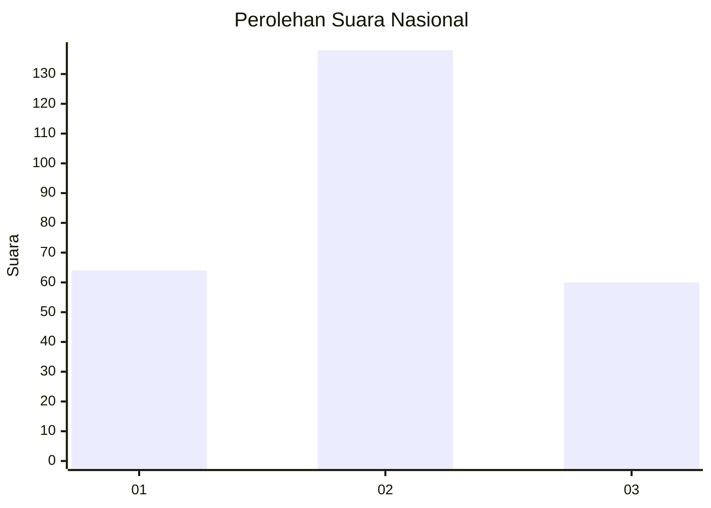
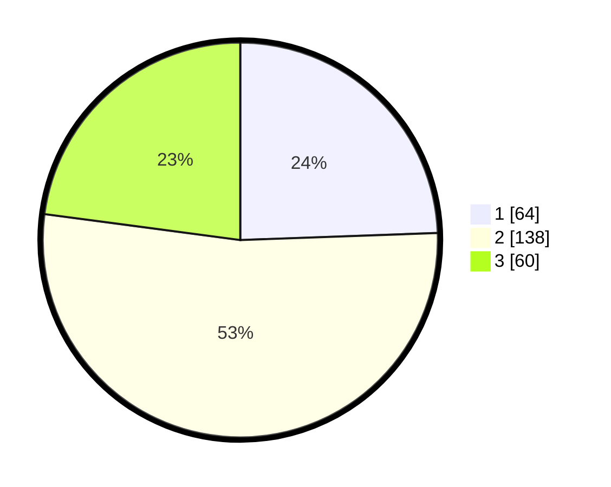

# Hasil

## Grafik

## Tabel

| No. | Nama Paslon    | Suara | Suara (raw) | Persentase |
|:--- |:-------------- | -----:| -----------:| ----------:|
| 1   | ANIES MUHAIMIN | 64    | [64][p-1]   | 24,43      |
| 2   | PRABOWO GIBRAN | 138   | [138][p-2]  | 52,67      |
| 3   | GANJAR MAHFUD  | 60    | [60][p-3]   | 22,90      |

[p-1]: https://github.com/gigit-pemilu/pemilu-2024/blob/main/pilpres/hitung-suara/sub/34-di-yogyakarta/sub/03-gunungkidul/sub/03-playen/sub/2010-logandeng/sub/011-tps/sub/paslon-1.txt
[p-2]: https://github.com/gigit-pemilu/pemilu-2024/blob/main/pilpres/hitung-suara/sub/34-di-yogyakarta/sub/03-gunungkidul/sub/03-playen/sub/2010-logandeng/sub/011-tps/sub/paslon-2.txt
[p-3]: https://github.com/gigit-pemilu/pemilu-2024/blob/main/pilpres/hitung-suara/sub/34-di-yogyakarta/sub/03-gunungkidul/sub/03-playen/sub/2010-logandeng/sub/011-tps/sub/paslon-3.txt

## Foto C Plano

https://sirekap-obj-formc.kpu.go.id/35bd/pemilu/ppwp/34/03/03/20/10/3403032010011-20240215-003614--b5fee975-510f-4b9c-b85b-255ce979c9cc.jpg

https://sirekap-obj-formc.kpu.go.id/35bd/pemilu/ppwp/34/03/03/20/10/3403032010011-20240214-160102--bcd50772-5330-445f-aecf-3be6d7c05caf.jpg

https://sirekap-obj-formc.kpu.go.id/35bd/pemilu/ppwp/34/03/03/20/10/3403032010011-20240216-140429--7a61373d-f2eb-4671-b1de-57e941cb57d5.jpg

## Metadata

| Key        | Value               |
| ---------- | ------------------- |
| Time Stamp | 2024-02-16 14:30:33 |

## DATA PEMILIH TETAP

Jumlah pemilih dalam DPT: **290**.
 * L: **146**.
 * P: **144**.

## DATA PENGGUNA HAK PILIH

Jumlah pengguna hak pilih dalam DPT: **251**.
 * L: **123**.
 * P: **128**.

Jumlah pengguna hak pilih dalam DPTb: **15**.
 * L: **5**.
 * P: **10**.

Jumlah pengguna hak pilih dalam DPK: **1**.
 * L: **0**.
 * P: **1**.

Jumlah pengguna hak pilih: **267**.
 * L: **128**.
 * P: **139**.

## JUMLAH SUARA SAH DAN TIDAK SAH

JUMLAH SELURUH SUARA SAH: **262**.

JUMLAH SUARA TIDAK SAH: **5**.

JUMLAH SELURUH SUARA SAH DAN SUARA TIDAK SAH: **267**.

