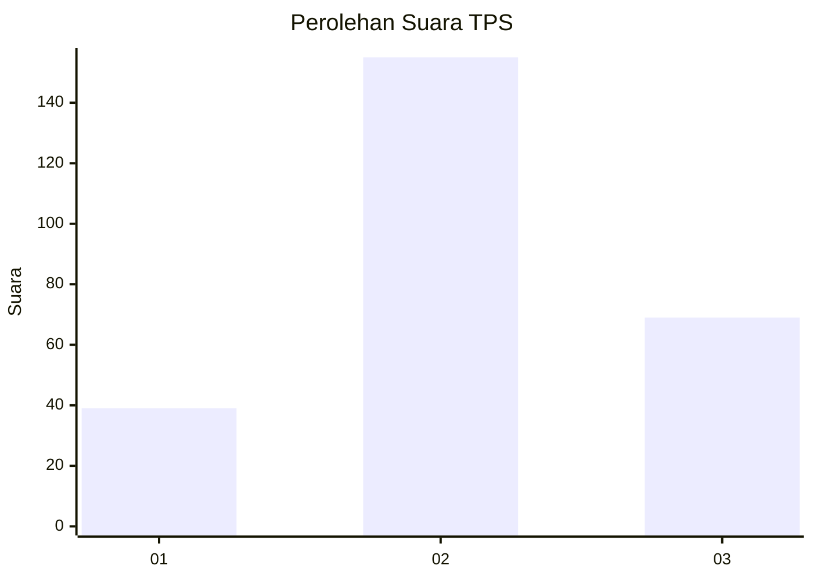
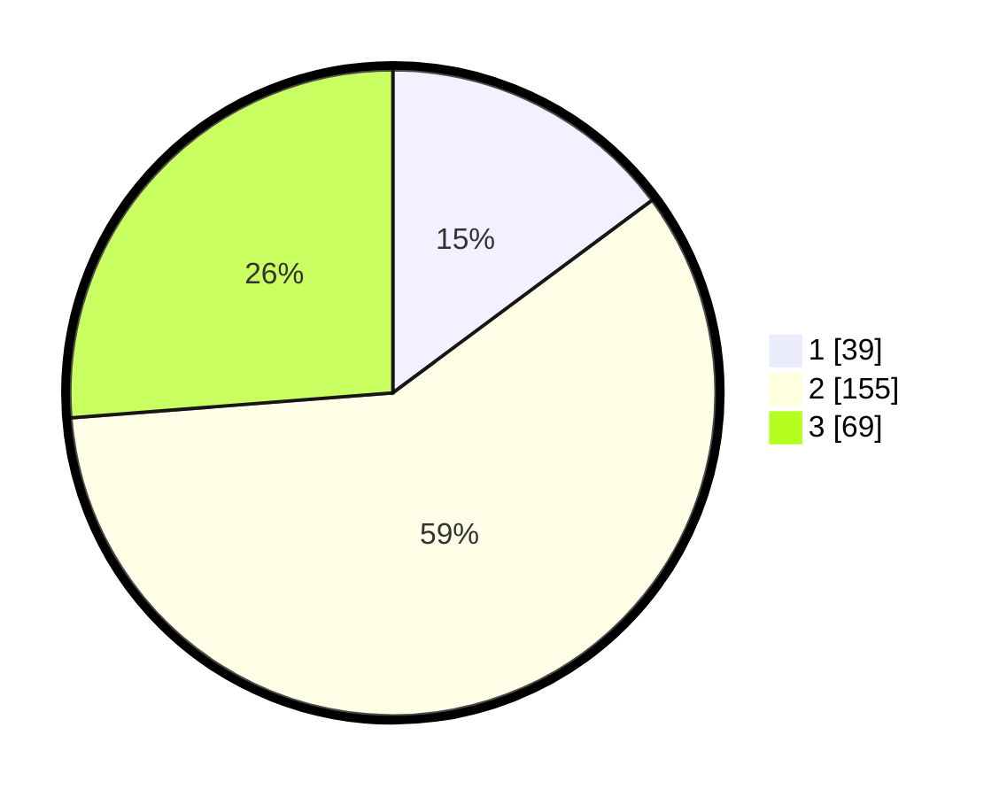

# Hasil

## Grafik

## Tabel

| No. | Nama Paslon    | Suara | Suara (raw) | Persentase |
|:--- |:-------------- | -----:| -----------:| ----------:|
| 1   | ANIES MUHAIMIN | 39    | [39][p-1]   | 14,83      |
| 2   | PRABOWO GIBRAN | 155   | [155][p-2]  | 58,94      |
| 3   | GANJAR MAHFUD  | 69    | [69][p-3]   | 26,24      |

[p-1]: https://github.com/gigit-pemilu/pemilu-2024-34-di-yogyakarta/blob/main/pilpres/hitung-suara/sub/34-di-yogyakarta/sub/03-gunungkidul/sub/03-playen/sub/2011-gading/sub/007-tps/sub/paslon-1.txt
[p-2]: https://github.com/gigit-pemilu/pemilu-2024-34-di-yogyakarta/blob/main/pilpres/hitung-suara/sub/34-di-yogyakarta/sub/03-gunungkidul/sub/03-playen/sub/2011-gading/sub/007-tps/sub/paslon-2.txt
[p-3]: https://github.com/gigit-pemilu/pemilu-2024-34-di-yogyakarta/blob/main/pilpres/hitung-suara/sub/34-di-yogyakarta/sub/03-gunungkidul/sub/03-playen/sub/2011-gading/sub/007-tps/sub/paslon-3.txt

## Foto C Plano

https://sirekap-obj-formc.kpu.go.id/1810/pemilu/ppwp/34/03/03/20/11/3403032011007-20240216-210705--4cb0087a-3cb5-478a-b523-ef5dd614ce42.jpg

https://sirekap-obj-formc.kpu.go.id/1810/pemilu/ppwp/34/03/03/20/11/3403032011007-20240216-210707--b4227760-2a33-4d22-9e57-d8071626e5e9.jpg

https://sirekap-obj-formc.kpu.go.id/1810/pemilu/ppwp/34/03/03/20/11/3403032011007-20240216-210706--e9bbdd68-96a9-48bf-a4be-28a1558aa6f8.jpg

## Metadata

| Key        | Value               |
| ---------- | ------------------- |
| Time Stamp | 2024-02-17 14:45:18 |

## DATA PEMILIH TETAP

Jumlah pemilih dalam DPT: **295**.
 * L: **142**.
 * P: **153**.

## DATA PENGGUNA HAK PILIH

Jumlah pengguna hak pilih dalam DPT: **258**.
 * L: **119**.
 * P: **139**.

Jumlah pengguna hak pilih dalam DPTb: **11**.
 * L: **1**.
 * P: **10**.

Jumlah pengguna hak pilih dalam DPK: **2**.
 * L: **1**.
 * P: **1**.

Jumlah pengguna hak pilih: **271**.
 * L: **121**.
 * P: **150**.

## JUMLAH SUARA SAH DAN TIDAK SAH

JUMLAH SELURUH SUARA SAH: **263**.

JUMLAH SUARA TIDAK SAH: **8**.

JUMLAH SELURUH SUARA SAH DAN SUARA TIDAK SAH: **271**.

