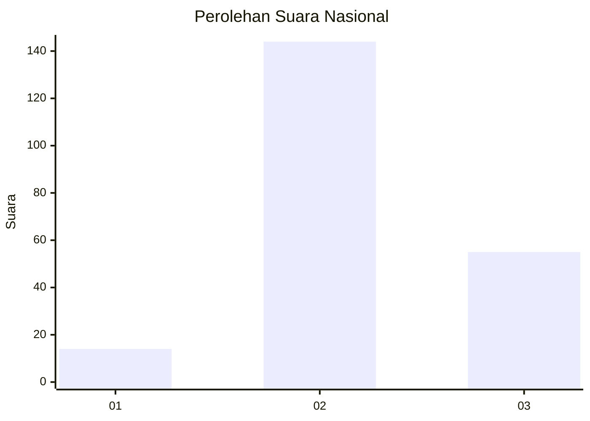

# Hasil

## Grafik

## Tabel

| No. | Nama Paslon    | Suara | Suara (raw) | Persentase |
|:--- |:-------------- | -----:| -----------:| ----------:|
| 1   | ANIES MUHAIMIN | 14    | [14][p-1]   | 6,57       |
| 2   | PRABOWO GIBRAN | 144   | [144][p-2]  | 67,61      |
| 3   | GANJAR MAHFUD  | 55    | [55][p-3]   | 25,82      |

[p-1]: https://github.com/gigit-pemilu/pemilu-2024/blob/main/pilpres/hitung-suara/sub/34-di-yogyakarta/sub/03-gunungkidul/sub/03-playen/sub/2012-banaran/sub/002-tps/sub/paslon-1.txt
[p-2]: https://github.com/gigit-pemilu/pemilu-2024/blob/main/pilpres/hitung-suara/sub/34-di-yogyakarta/sub/03-gunungkidul/sub/03-playen/sub/2012-banaran/sub/002-tps/sub/paslon-2.txt
[p-3]: https://github.com/gigit-pemilu/pemilu-2024/blob/main/pilpres/hitung-suara/sub/34-di-yogyakarta/sub/03-gunungkidul/sub/03-playen/sub/2012-banaran/sub/002-tps/sub/paslon-3.txt

## Foto C Plano

https://sirekap-obj-formc.kpu.go.id/a1ad/pemilu/ppwp/34/03/03/20/12/3403032012002-20240215-084202--f848aa8a-57f2-488c-829d-9ed597c95bd3.jpg

https://sirekap-obj-formc.kpu.go.id/a1ad/pemilu/ppwp/34/03/03/20/12/3403032012002-20240215-084236--1bc5ecd8-43be-41a9-b784-d6273af83a29.jpg

https://sirekap-obj-formc.kpu.go.id/a1ad/pemilu/ppwp/34/03/03/20/12/3403032012002-20240215-084251--20449cac-9510-4f6f-94a9-a6af1b78e2cd.jpg

## Metadata

| Key        | Value               |
| ---------- | ------------------- |
| Time Stamp | 2024-02-17 19:30:00 |

