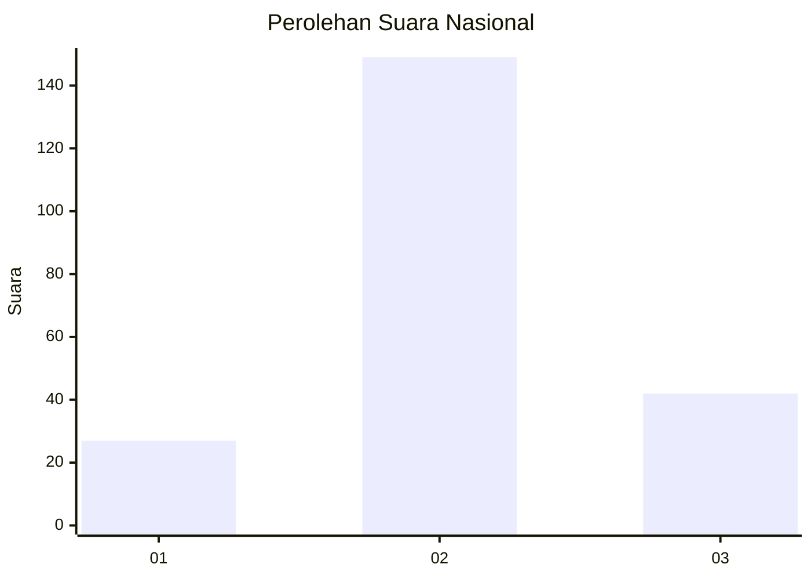
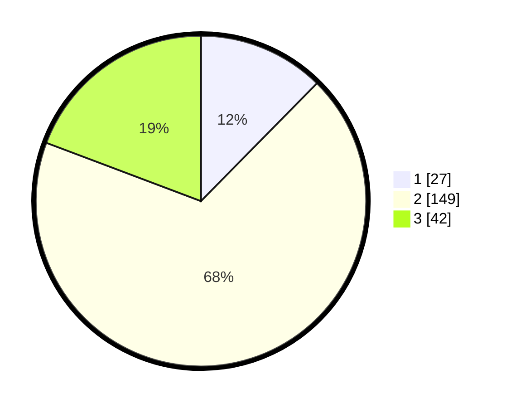

# Hasil

## Grafik

## Tabel

| No. | Nama Paslon    | Suara | Suara (raw) | Persentase |
|:--- |:-------------- | -----:| -----------:| ----------:|
| 1   | ANIES MUHAIMIN | 27    | [27][p-1]   | 12,39      |
| 2   | PRABOWO GIBRAN | 149   | [149][p-2]  | 68,35      |
| 3   | GANJAR MAHFUD  | 42    | [42][p-3]   | 19,27      |

[p-1]: https://github.com/gigit-pemilu/pemilu-2024/blob/main/pilpres/hitung-suara/sub/34-di-yogyakarta/sub/03-gunungkidul/sub/03-playen/sub/2012-banaran/sub/005-tps/sub/paslon-1.txt
[p-2]: https://github.com/gigit-pemilu/pemilu-2024/blob/main/pilpres/hitung-suara/sub/34-di-yogyakarta/sub/03-gunungkidul/sub/03-playen/sub/2012-banaran/sub/005-tps/sub/paslon-2.txt
[p-3]: https://github.com/gigit-pemilu/pemilu-2024/blob/main/pilpres/hitung-suara/sub/34-di-yogyakarta/sub/03-gunungkidul/sub/03-playen/sub/2012-banaran/sub/005-tps/sub/paslon-3.txt

## Foto C Plano

https://sirekap-obj-formc.kpu.go.id/0afa/pemilu/ppwp/34/03/03/20/12/3403032012005-20240217-144604--88a97742-dc5c-4a63-9903-bcb2283c7daa.jpg

https://sirekap-obj-formc.kpu.go.id/0afa/pemilu/ppwp/34/03/03/20/12/3403032012005-20240217-144349--2606fdd4-a33c-4fe0-84c0-c1d23e1e3e79.jpg

https://sirekap-obj-formc.kpu.go.id/0afa/pemilu/ppwp/34/03/03/20/12/3403032012005-20240215-010109--e255fa52-644c-4b99-8efe-fe01bf321e04.jpg

## Metadata

| Key        | Value               |
| ---------- | ------------------- |
| Time Stamp | 2024-02-17 14:56:33 |

## DATA PEMILIH TETAP

Jumlah pemilih dalam DPT: **260**.
 * L: **123**.
 * P: **137**.

## DATA PENGGUNA HAK PILIH

Jumlah pengguna hak pilih dalam DPT: **226**.
 * L: **102**.
 * P: **124**.

Jumlah pengguna hak pilih dalam DPTb: **3**.
 * L: **2**.
 * P: **1**.

Jumlah pengguna hak pilih dalam DPK: **0**.
 * L: **0**.
 * P: **0**.

Jumlah pengguna hak pilih: **229**.
 * L: **104**.
 * P: **125**.

## JUMLAH SUARA SAH DAN TIDAK SAH

JUMLAH SELURUH SUARA SAH: **218**.

JUMLAH SUARA TIDAK SAH: **11**.

JUMLAH SELURUH SUARA SAH DAN SUARA TIDAK SAH: **229**.

