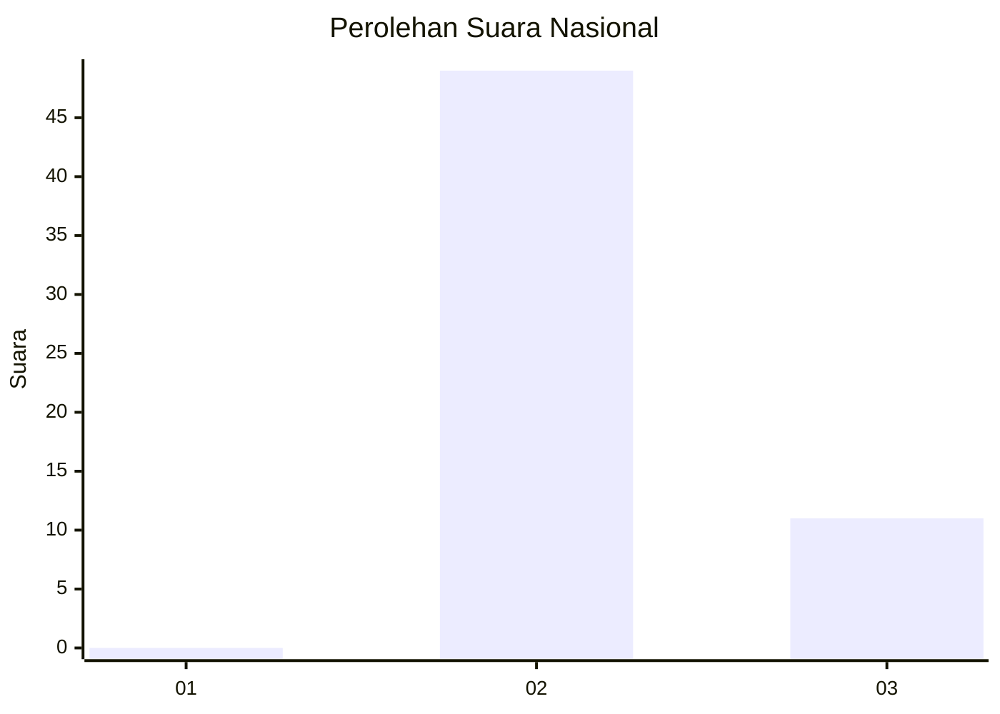
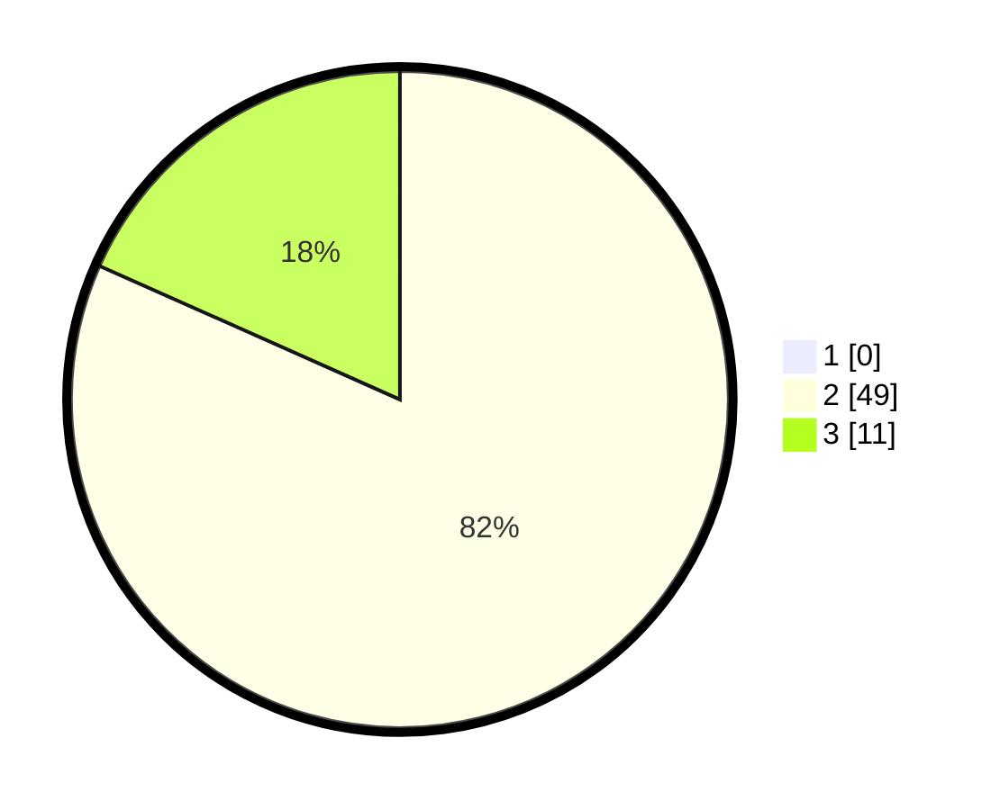

# Hasil

## Grafik

## Tabel

| No. | Nama Paslon    | Suara | Suara (raw) | Persentase |
|:--- |:-------------- | -----:| -----------:| ----------:|
| 1   | ANIES MUHAIMIN | 0     | [0][p-1]    | 0,00       |
| 2   | PRABOWO GIBRAN | 49    | [49][p-2]   | 81,67      |
| 3   | GANJAR MAHFUD  | 11    | [11][p-3]   | 18,33      |

[p-1]: https://github.com/gigit-pemilu/pemilu-2024/blob/main/pilpres/hitung-suara/sub/34-di-yogyakarta/sub/03-gunungkidul/sub/03-playen/sub/2013-ngleri/sub/009-tps/sub/paslon-1.txt
[p-2]: https://github.com/gigit-pemilu/pemilu-2024/blob/main/pilpres/hitung-suara/sub/34-di-yogyakarta/sub/03-gunungkidul/sub/03-playen/sub/2013-ngleri/sub/009-tps/sub/paslon-2.txt
[p-3]: https://github.com/gigit-pemilu/pemilu-2024/blob/main/pilpres/hitung-suara/sub/34-di-yogyakarta/sub/03-gunungkidul/sub/03-playen/sub/2013-ngleri/sub/009-tps/sub/paslon-3.txt

## Foto C Plano

https://sirekap-obj-formc.kpu.go.id/2592/pemilu/ppwp/34/03/03/20/13/3403032013009-20240216-171133--7c672462-d9b7-40b7-a3b9-10202c26a37e.jpg

https://sirekap-obj-formc.kpu.go.id/2592/pemilu/ppwp/34/03/03/20/13/3403032013009-20240214-205114--05fcee98-4181-4563-96c4-22c187b13b9b.jpg

https://sirekap-obj-formc.kpu.go.id/2592/pemilu/ppwp/34/03/03/20/13/3403032013009-20240217-085649--6a71b52a-c7ed-4a8a-a01f-5e222ceb3150.jpg

## Metadata

| Key        | Value               |
| ---------- | ------------------- |
| Time Stamp | 2024-02-17 09:00:02 |

## DATA PEMILIH TETAP

Jumlah pemilih dalam DPT: **60**.
 * L: **27**.
 * P: **33**.

## DATA PENGGUNA HAK PILIH

Jumlah pengguna hak pilih dalam DPT: **57**.
 * L: **27**.
 * P: **30**.

Jumlah pengguna hak pilih dalam DPTb: **4**.
 * L: **2**.
 * P: **2**.

Jumlah pengguna hak pilih dalam DPK: **0**.
 * L: **0**.
 * P: **0**.

Jumlah pengguna hak pilih: **61**.
 * L: **29**.
 * P: **32**.

## JUMLAH SUARA SAH DAN TIDAK SAH

JUMLAH SELURUH SUARA SAH: **60**.

JUMLAH SUARA TIDAK SAH: **1**.

JUMLAH SELURUH SUARA SAH DAN SUARA TIDAK SAH: **61**.

