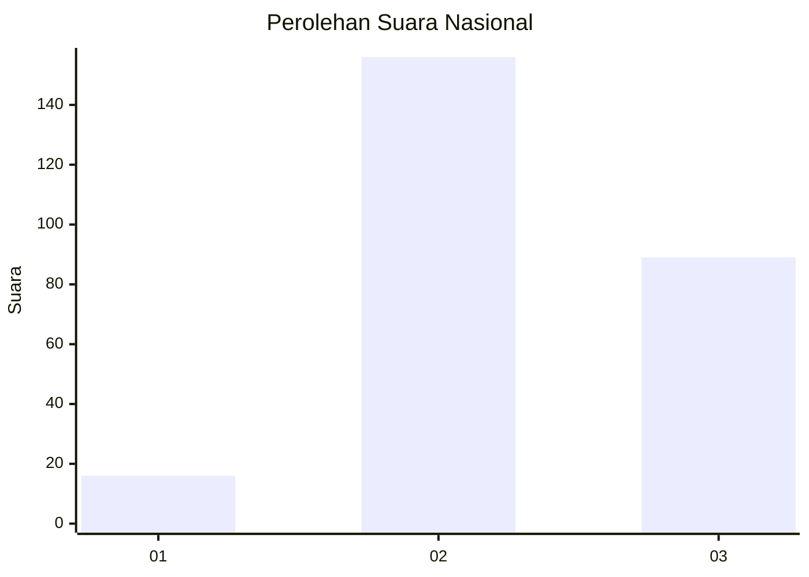
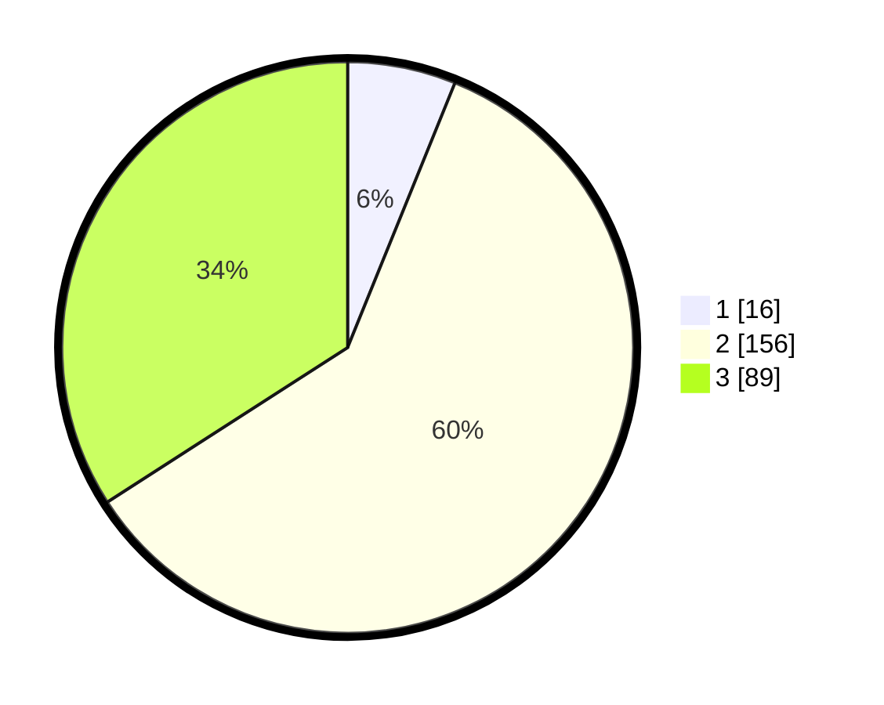

# Hasil

## Grafik

## Tabel

| No. | Nama Paslon    | Suara | Suara (raw) | Persentase |
|:--- |:-------------- | -----:| -----------:| ----------:|
| 1   | ANIES MUHAIMIN | 16    | [16][p-1]   | 6,13       |
| 2   | PRABOWO GIBRAN | 156   | [156][p-2]  | 59,77      |
| 3   | GANJAR MAHFUD  | 89    | [89][p-3]   | 34,10      |

[p-1]: https://github.com/gigit-pemilu/pemilu-2024/blob/main/pilpres/hitung-suara/sub/34-di-yogyakarta/sub/03-gunungkidul/sub/04-patuk/sub/2001-bunder/sub/001-tps/sub/paslon-1.txt
[p-2]: https://github.com/gigit-pemilu/pemilu-2024/blob/main/pilpres/hitung-suara/sub/34-di-yogyakarta/sub/03-gunungkidul/sub/04-patuk/sub/2001-bunder/sub/001-tps/sub/paslon-2.txt
[p-3]: https://github.com/gigit-pemilu/pemilu-2024/blob/main/pilpres/hitung-suara/sub/34-di-yogyakarta/sub/03-gunungkidul/sub/04-patuk/sub/2001-bunder/sub/001-tps/sub/paslon-3.txt

## Foto C Plano

https://sirekap-obj-formc.kpu.go.id/a2b2/pemilu/ppwp/34/03/04/20/01/3403042001001-20240217-235703--f102caa4-60f7-47f1-984d-c18f0498acb3.jpg

https://sirekap-obj-formc.kpu.go.id/a2b2/pemilu/ppwp/34/03/04/20/01/3403042001001-20240214-192641--1f28ddf6-6413-480c-adb5-025e886e3668.jpg

https://sirekap-obj-formc.kpu.go.id/a2b2/pemilu/ppwp/34/03/04/20/01/3403042001001-20240217-235704--820ac919-0ce3-4512-b809-5c8540efa4f4.jpg

## Metadata

| Key        | Value               |
| ---------- | ------------------- |
| Time Stamp | 2024-02-19 06:16:00 |

## DATA PEMILIH TETAP

Jumlah pemilih dalam DPT: **281**.
 * L: **146**.
 * P: **135**.

## DATA PENGGUNA HAK PILIH

Jumlah pengguna hak pilih dalam DPT: **258**.
 * L: **131**.
 * P: **127**.

Jumlah pengguna hak pilih dalam DPTb: **4**.
 * L: **0**.
 * P: **4**.

Jumlah pengguna hak pilih dalam DPK: **8**.
 * L: **4**.
 * P: **4**.

Jumlah pengguna hak pilih: **270**.
 * L: **135**.
 * P: **135**.

## JUMLAH SUARA SAH DAN TIDAK SAH

JUMLAH SELURUH SUARA SAH: **261**.

JUMLAH SUARA TIDAK SAH: **9**.

JUMLAH SELURUH SUARA SAH DAN SUARA TIDAK SAH: **270**.

