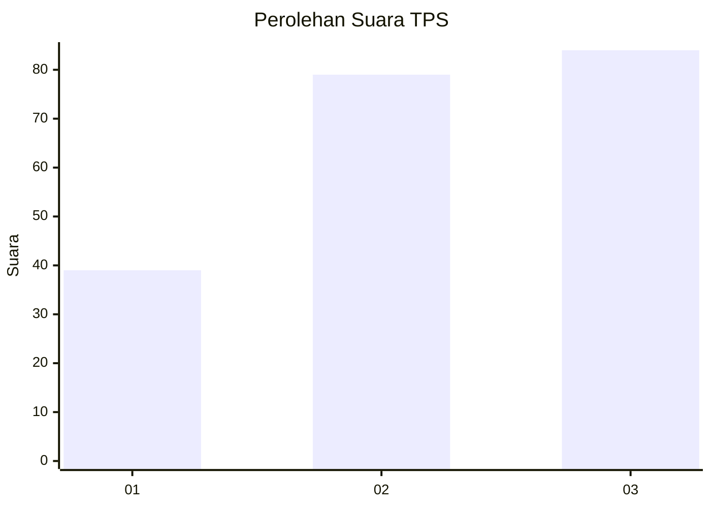
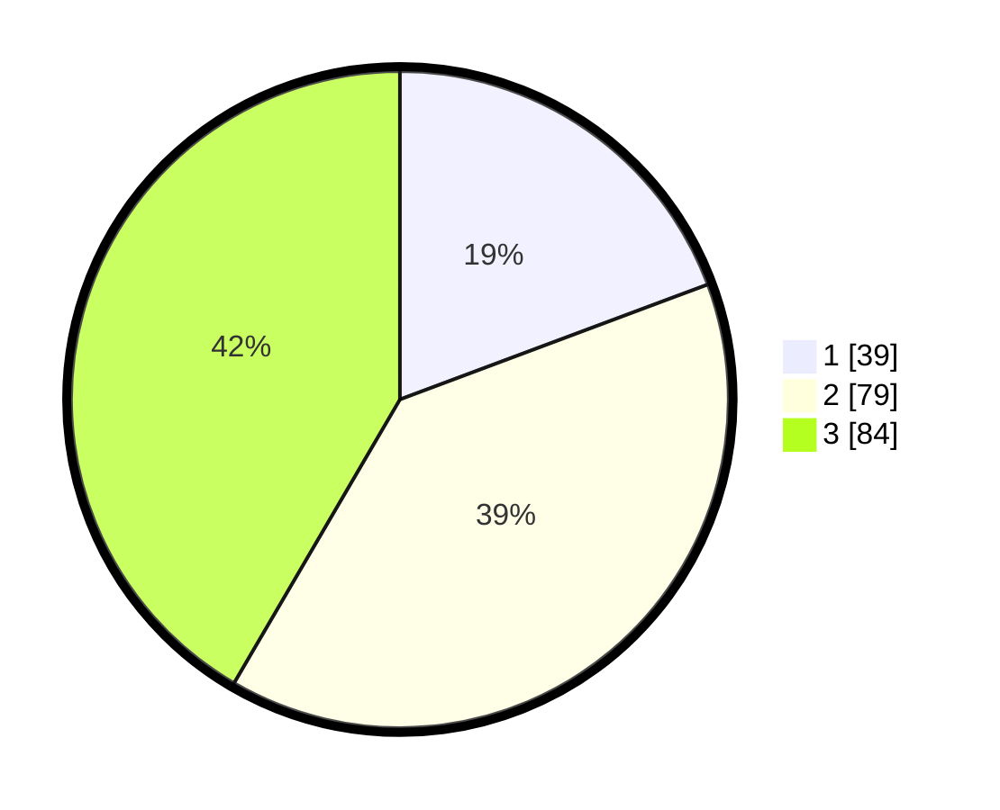

# Hasil

## Grafik

## Tabel

| No. | Nama Paslon    | Suara | Suara (raw) | Persentase |
|:--- |:-------------- | -----:| -----------:| ----------:|
| 1   | ANIES MUHAIMIN | 39    | [39][p-1]   | 19,31      |
| 2   | PRABOWO GIBRAN | 79    | [79][p-2]   | 39,11      |
| 3   | GANJAR MAHFUD  | 84    | [84][p-3]   | 41,58      |

[p-1]: https://github.com/gigit-pemilu/pemilu-2024-34-di-yogyakarta/blob/main/pilpres/hitung-suara/sub/34-di-yogyakarta/sub/03-gunungkidul/sub/04-patuk/sub/2001-bunder/sub/002-tps/sub/paslon-1.txt
[p-2]: https://github.com/gigit-pemilu/pemilu-2024-34-di-yogyakarta/blob/main/pilpres/hitung-suara/sub/34-di-yogyakarta/sub/03-gunungkidul/sub/04-patuk/sub/2001-bunder/sub/002-tps/sub/paslon-2.txt
[p-3]: https://github.com/gigit-pemilu/pemilu-2024-34-di-yogyakarta/blob/main/pilpres/hitung-suara/sub/34-di-yogyakarta/sub/03-gunungkidul/sub/04-patuk/sub/2001-bunder/sub/002-tps/sub/paslon-3.txt

## Foto C Plano

https://sirekap-obj-formc.kpu.go.id/c9e1/pemilu/ppwp/34/03/04/20/01/3403042001002-20240216-142728--216bb4eb-65df-4c66-b2c0-915dbd2a6919.jpg

https://sirekap-obj-formc.kpu.go.id/c9e1/pemilu/ppwp/34/03/04/20/01/3403042001002-20240216-142729--c8457410-c51b-4ffa-8983-1ba3c20cbe4f.jpg

https://sirekap-obj-formc.kpu.go.id/c9e1/pemilu/ppwp/34/03/04/20/01/3403042001002-20240216-142728--59225cce-64f7-40d7-9bdf-02a79f0d8fa4.jpg

## Metadata

| Key        | Value               |
| ---------- | ------------------- |
| Time Stamp | 2024-02-17 10:30:03 |

## DATA PEMILIH TETAP

Jumlah pemilih dalam DPT: **248**.
 * L: **128**.
 * P: **120**.

## DATA PENGGUNA HAK PILIH

Jumlah pengguna hak pilih dalam DPT: **197**.
 * L: **98**.
 * P: **99**.

Jumlah pengguna hak pilih dalam DPTb: **5**.
 * L: **3**.
 * P: **2**.

Jumlah pengguna hak pilih dalam DPK: **0**.
 * L: **0**.
 * P: **0**.

Jumlah pengguna hak pilih: **202**.
 * L: **101**.
 * P: **101**.

## JUMLAH SUARA SAH DAN TIDAK SAH

JUMLAH SELURUH SUARA SAH: **202**.

JUMLAH SUARA TIDAK SAH: **0**.

JUMLAH SELURUH SUARA SAH DAN SUARA TIDAK SAH: **202**.

