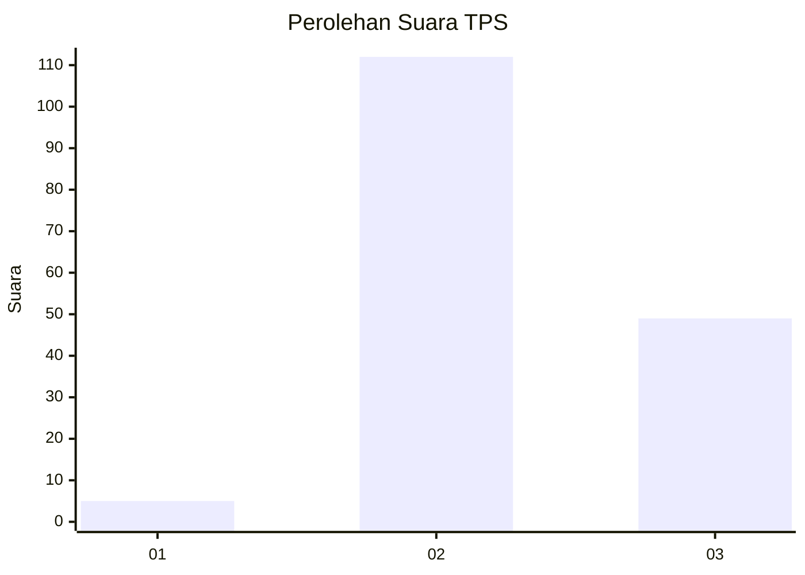

# Hasil

## Grafik

## Tabel

| No. | Nama Paslon    | Suara | Suara (raw) | Persentase |
|:--- |:-------------- | -----:| -----------:| ----------:|
| 1   | ANIES MUHAIMIN | 5     | [5][p-1]    | 3,01       |
| 2   | PRABOWO GIBRAN | 112   | [112][p-2]  | 67,47      |
| 3   | GANJAR MAHFUD  | 49    | [49][p-3]   | 29,52      |

[p-1]: https://github.com/gigit-pemilu/pemilu-2024-34-di-yogyakarta/blob/main/pilpres/hitung-suara/sub/34-di-yogyakarta/sub/03-gunungkidul/sub/04-patuk/sub/2001-bunder/sub/004-tps/sub/paslon-1.txt
[p-2]: https://github.com/gigit-pemilu/pemilu-2024-34-di-yogyakarta/blob/main/pilpres/hitung-suara/sub/34-di-yogyakarta/sub/03-gunungkidul/sub/04-patuk/sub/2001-bunder/sub/004-tps/sub/paslon-2.txt
[p-3]: https://github.com/gigit-pemilu/pemilu-2024-34-di-yogyakarta/blob/main/pilpres/hitung-suara/sub/34-di-yogyakarta/sub/03-gunungkidul/sub/04-patuk/sub/2001-bunder/sub/004-tps/sub/paslon-3.txt

## Foto C Plano

https://sirekap-obj-formc.kpu.go.id/6d3c/pemilu/ppwp/34/03/04/20/01/3403042001004-20240215-150739--b71a4f83-2c06-42b5-9e4d-c8995018a783.jpg

https://sirekap-obj-formc.kpu.go.id/6d3c/pemilu/ppwp/34/03/04/20/01/3403042001004-20240215-150802--ec26443f-f0b4-4513-95c4-7ed1f36e6e2b.jpg

https://sirekap-obj-formc.kpu.go.id/6d3c/pemilu/ppwp/34/03/04/20/01/3403042001004-20240215-150751--ae6769a6-d6dd-488c-8228-82395b60781a.jpg

## Metadata

| Key        | Value               |
| ---------- | ------------------- |
| Time Stamp | 2024-02-15 16:30:25 |

## DATA PEMILIH TETAP

Jumlah pemilih dalam DPT: **217**.
 * L: **102**.
 * P: **115**.

## DATA PENGGUNA HAK PILIH

Jumlah pengguna hak pilih dalam DPT: **193**.
 * L: **88**.
 * P: **105**.

Jumlah pengguna hak pilih dalam DPTb: **11**.
 * L: **4**.
 * P: **7**.

Jumlah pengguna hak pilih dalam DPK: **3**.
 * L: **0**.
 * P: **3**.

Jumlah pengguna hak pilih: **207**.
 * L: **92**.
 * P: **115**.

## JUMLAH SUARA SAH DAN TIDAK SAH

JUMLAH SELURUH SUARA SAH: **205**.

JUMLAH SUARA TIDAK SAH: **2**.

JUMLAH SELURUH SUARA SAH DAN SUARA TIDAK SAH: **207**.

