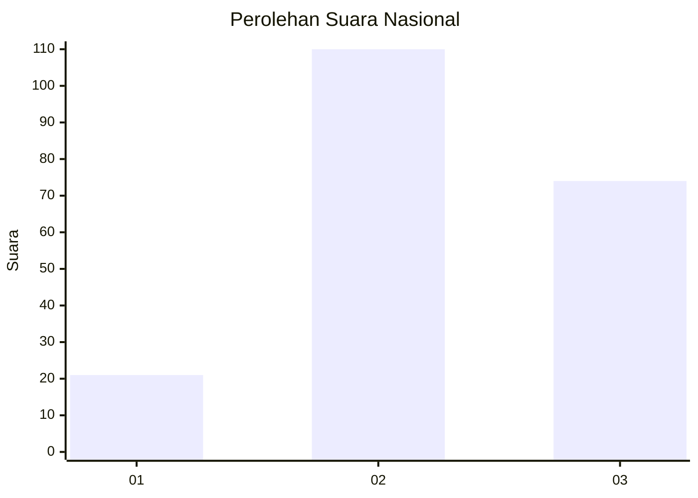
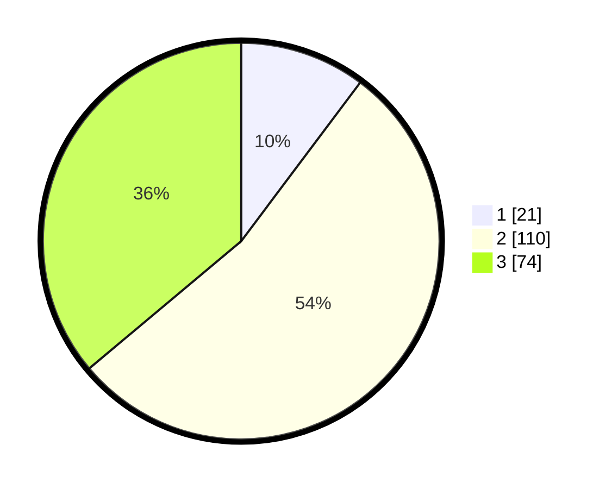

# Hasil

## Grafik

## Tabel

| No. | Nama Paslon    | Suara | Suara (raw) | Persentase |
|:--- |:-------------- | -----:| -----------:| ----------:|
| 1   | ANIES MUHAIMIN | 21    | [21][p-1]   | 10,24      |
| 2   | PRABOWO GIBRAN | 110   | [110][p-2]  | 53,66      |
| 3   | GANJAR MAHFUD  | 74    | [74][p-3]   | 36,10      |

[p-1]: https://github.com/gigit-pemilu/pemilu-2024/blob/main/pilpres/hitung-suara/sub/34-di-yogyakarta/sub/03-gunungkidul/sub/04-patuk/sub/2004-semoyo/sub/001-tps/sub/paslon-1.txt
[p-2]: https://github.com/gigit-pemilu/pemilu-2024/blob/main/pilpres/hitung-suara/sub/34-di-yogyakarta/sub/03-gunungkidul/sub/04-patuk/sub/2004-semoyo/sub/001-tps/sub/paslon-2.txt
[p-3]: https://github.com/gigit-pemilu/pemilu-2024/blob/main/pilpres/hitung-suara/sub/34-di-yogyakarta/sub/03-gunungkidul/sub/04-patuk/sub/2004-semoyo/sub/001-tps/sub/paslon-3.txt

## Foto C Plano

https://sirekap-obj-formc.kpu.go.id/5dea/pemilu/ppwp/34/03/04/20/04/3403042004001-20240215-025754--cc5d170a-fcac-4a46-bc1e-a1913a063001.jpg

https://sirekap-obj-formc.kpu.go.id/5dea/pemilu/ppwp/34/03/04/20/04/3403042004001-20240215-025828--fb82f9a8-0403-4bac-b867-5f2f99dfa107.jpg

https://sirekap-obj-formc.kpu.go.id/5dea/pemilu/ppwp/34/03/04/20/04/3403042004001-20240215-025948--1c8ba210-720b-4446-9759-c3e4fb866957.jpg

## Metadata

| Key        | Value               |
| ---------- | ------------------- |
| Time Stamp | 2024-02-17 19:30:00 |

