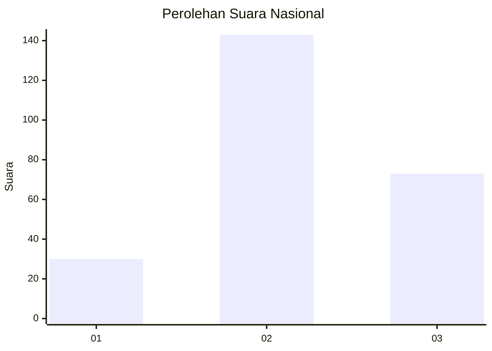
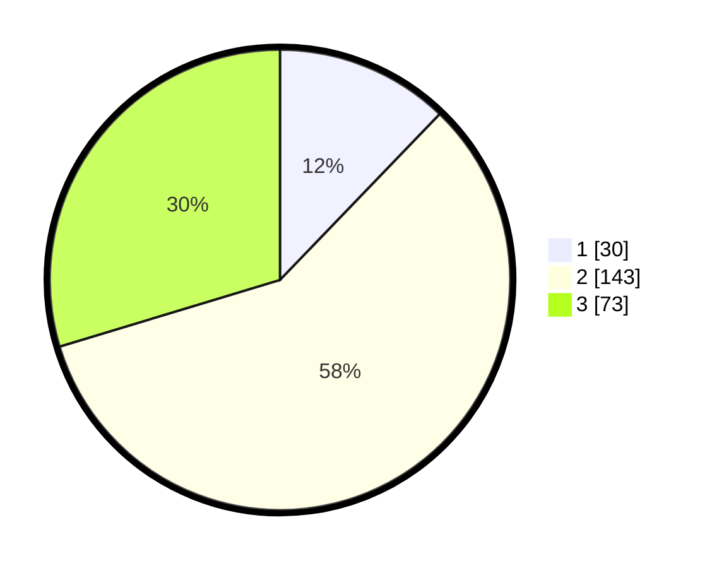

# Hasil

## Grafik

## Tabel

| No. | Nama Paslon    | Suara | Suara (raw) | Persentase |
|:--- |:-------------- | -----:| -----------:| ----------:|
| 1   | ANIES MUHAIMIN | 30    | [30][p-1]   | 12,20      |
| 2   | PRABOWO GIBRAN | 143   | [143][p-2]  | 58,13      |
| 3   | GANJAR MAHFUD  | 73    | [73][p-3]   | 29,67      |

[p-1]: https://github.com/gigit-pemilu/pemilu-2024/blob/main/pilpres/hitung-suara/sub/34-di-yogyakarta/sub/03-gunungkidul/sub/04-patuk/sub/2004-semoyo/sub/008-tps/sub/paslon-1.txt
[p-2]: https://github.com/gigit-pemilu/pemilu-2024/blob/main/pilpres/hitung-suara/sub/34-di-yogyakarta/sub/03-gunungkidul/sub/04-patuk/sub/2004-semoyo/sub/008-tps/sub/paslon-2.txt
[p-3]: https://github.com/gigit-pemilu/pemilu-2024/blob/main/pilpres/hitung-suara/sub/34-di-yogyakarta/sub/03-gunungkidul/sub/04-patuk/sub/2004-semoyo/sub/008-tps/sub/paslon-3.txt

## Foto C Plano

https://sirekap-obj-formc.kpu.go.id/6590/pemilu/ppwp/34/03/04/20/04/3403042004008-20240215-082621--c3b919b6-3e6a-445e-b0e0-327419bc2841.jpg

https://sirekap-obj-formc.kpu.go.id/6590/pemilu/ppwp/34/03/04/20/04/3403042004008-20240215-082319--0c4b240d-b4ed-440d-ad59-fdf24487ab35.jpg

https://sirekap-obj-formc.kpu.go.id/6590/pemilu/ppwp/34/03/04/20/04/3403042004008-20240215-081944--454cf757-0fb3-4abf-815c-752f111cb721.jpg

## Metadata

| Key        | Value               |
| ---------- | ------------------- |
| Time Stamp | 2024-02-19 06:16:00 |

