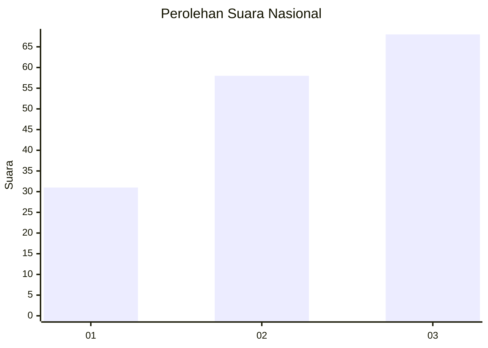
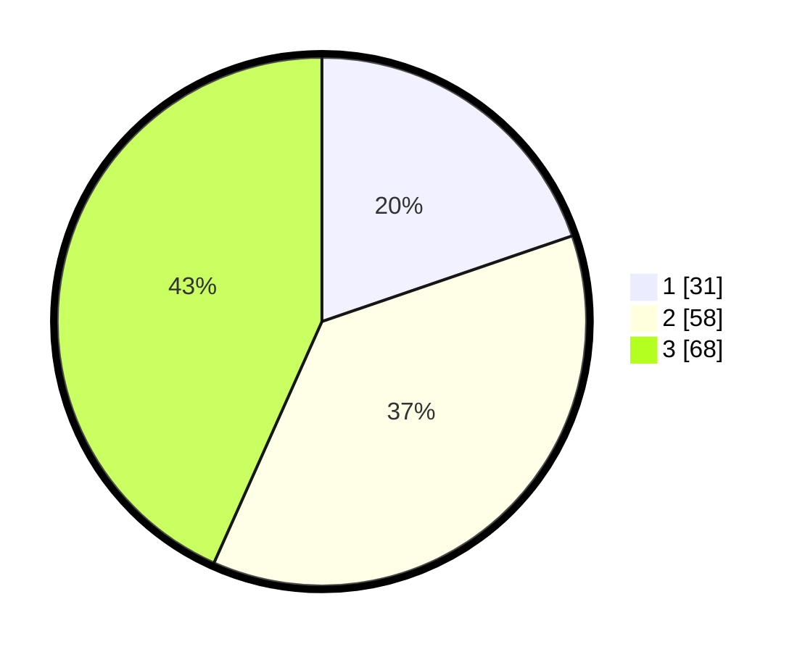

# Hasil

## Grafik

## Tabel

| No. | Nama Paslon    | Suara | Suara (raw) | Persentase |
|:--- |:-------------- | -----:| -----------:| ----------:|
| 1   | ANIES MUHAIMIN | 31    | [31][p-1]   | 19,75      |
| 2   | PRABOWO GIBRAN | 58    | [58][p-2]   | 36,94      |
| 3   | GANJAR MAHFUD  | 68    | [68][p-3]   | 43,31      |

[p-1]: https://github.com/gigit-pemilu/pemilu-2024/blob/main/pilpres/hitung-suara/sub/34-di-yogyakarta/sub/03-gunungkidul/sub/04-patuk/sub/2005-salam/sub/002-tps/sub/paslon-1.txt
[p-2]: https://github.com/gigit-pemilu/pemilu-2024/blob/main/pilpres/hitung-suara/sub/34-di-yogyakarta/sub/03-gunungkidul/sub/04-patuk/sub/2005-salam/sub/002-tps/sub/paslon-2.txt
[p-3]: https://github.com/gigit-pemilu/pemilu-2024/blob/main/pilpres/hitung-suara/sub/34-di-yogyakarta/sub/03-gunungkidul/sub/04-patuk/sub/2005-salam/sub/002-tps/sub/paslon-3.txt

## Foto C Plano

https://sirekap-obj-formc.kpu.go.id/4018/pemilu/ppwp/34/03/04/20/05/3403042005002-20240214-141531--20f9d765-0541-4a27-b82b-d900baa23027.jpg

https://sirekap-obj-formc.kpu.go.id/4018/pemilu/ppwp/34/03/04/20/05/3403042005002-20240214-141653--3007226f-3150-4d05-85cd-0aad4d5a7641.jpg

https://sirekap-obj-formc.kpu.go.id/4018/pemilu/ppwp/34/03/04/20/05/3403042005002-20240214-141308--7f6c16fc-091c-4ace-a3e4-8988579352d5.jpg

## Metadata

| Key        | Value               |
| ---------- | ------------------- |
| Time Stamp | 2024-02-14 21:46:01 |

