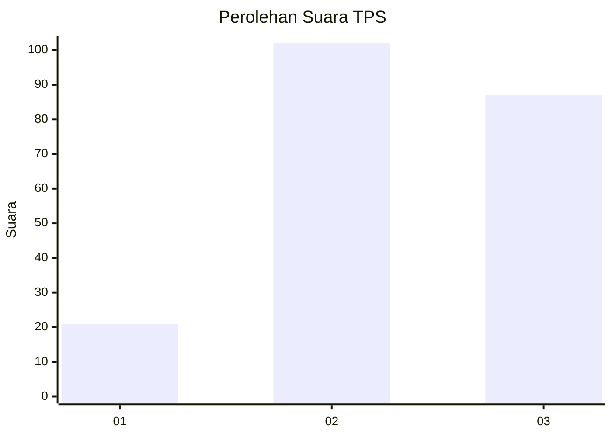
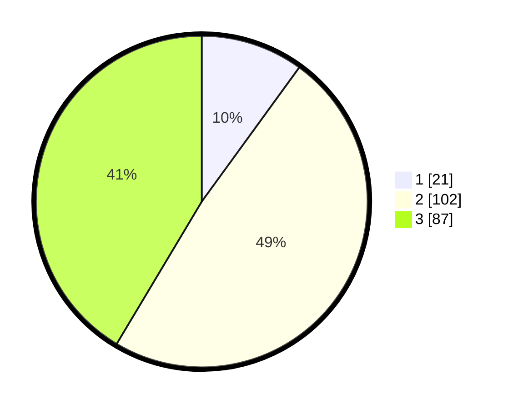

# Hasil

## Grafik

## Tabel

| No. | Nama Paslon    | Suara | Suara (raw) | Persentase |
|:--- |:-------------- | -----:| -----------:| ----------:|
| 1   | ANIES MUHAIMIN | 21    | [21][p-1]   | 10,00      |
| 2   | PRABOWO GIBRAN | 102   | [102][p-2]  | 48,57      |
| 3   | GANJAR MAHFUD  | 87    | [87][p-3]   | 41,43      |

[p-1]: https://github.com/gigit-pemilu/pemilu-2024-34-di-yogyakarta/blob/main/pilpres/hitung-suara/sub/34-di-yogyakarta/sub/03-gunungkidul/sub/04-patuk/sub/2005-salam/sub/004-tps/sub/paslon-1.txt
[p-2]: https://github.com/gigit-pemilu/pemilu-2024-34-di-yogyakarta/blob/main/pilpres/hitung-suara/sub/34-di-yogyakarta/sub/03-gunungkidul/sub/04-patuk/sub/2005-salam/sub/004-tps/sub/paslon-2.txt
[p-3]: https://github.com/gigit-pemilu/pemilu-2024-34-di-yogyakarta/blob/main/pilpres/hitung-suara/sub/34-di-yogyakarta/sub/03-gunungkidul/sub/04-patuk/sub/2005-salam/sub/004-tps/sub/paslon-3.txt

## Foto C Plano

https://sirekap-obj-formc.kpu.go.id/4a9f/pemilu/ppwp/34/03/04/20/05/3403042005004-20240214-141031--8d597402-01ef-4181-acab-13d4baba6ac0.jpg

https://sirekap-obj-formc.kpu.go.id/4a9f/pemilu/ppwp/34/03/04/20/05/3403042005004-20240214-141143--e42944bc-7194-4180-ab96-f026d8c5ee51.jpg

https://sirekap-obj-formc.kpu.go.id/4a9f/pemilu/ppwp/34/03/04/20/05/3403042005004-20240214-233000--775bd705-a5ee-40a6-b541-94e3ee7bfe23.jpg

## Metadata

| Key        | Value               |
| ---------- | ------------------- |
| Time Stamp | 2024-02-15 00:41:44 |

