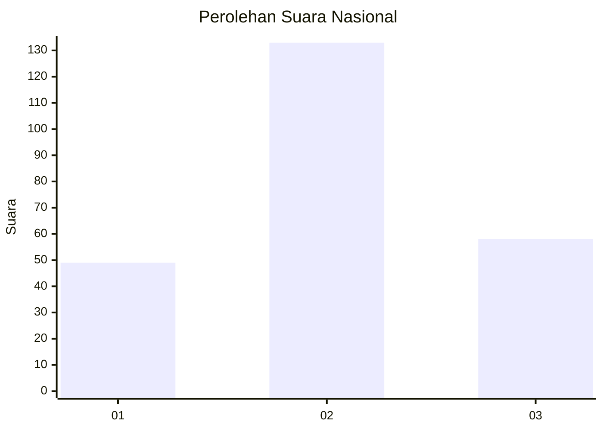
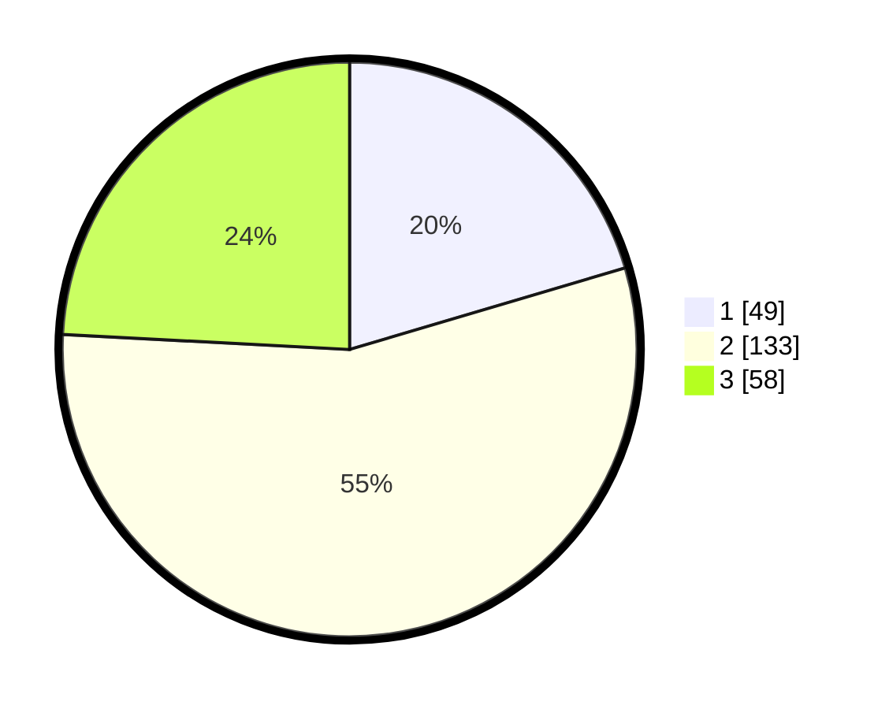

# Hasil

## Grafik

## Tabel

| No. | Nama Paslon    | Suara | Suara (raw) | Persentase |
|:--- |:-------------- | -----:| -----------:| ----------:|
| 1   | ANIES MUHAIMIN | 49    | [49][p-1]   | 20,42      |
| 2   | PRABOWO GIBRAN | 133   | [133][p-2]  | 55,42      |
| 3   | GANJAR MAHFUD  | 58    | [58][p-3]   | 24,17      |

[p-1]: https://github.com/gigit-pemilu/pemilu-2024/blob/main/pilpres/hitung-suara/sub/34-di-yogyakarta/sub/03-gunungkidul/sub/04-patuk/sub/2005-salam/sub/005-tps/sub/paslon-1.txt
[p-2]: https://github.com/gigit-pemilu/pemilu-2024/blob/main/pilpres/hitung-suara/sub/34-di-yogyakarta/sub/03-gunungkidul/sub/04-patuk/sub/2005-salam/sub/005-tps/sub/paslon-2.txt
[p-3]: https://github.com/gigit-pemilu/pemilu-2024/blob/main/pilpres/hitung-suara/sub/34-di-yogyakarta/sub/03-gunungkidul/sub/04-patuk/sub/2005-salam/sub/005-tps/sub/paslon-3.txt

## Foto C Plano

https://sirekap-obj-formc.kpu.go.id/cf12/pemilu/ppwp/34/03/04/20/05/3403042005005-20240215-020543--ba30ebb6-8cb0-4024-8fc6-8d5c4f586eb2.jpg

https://sirekap-obj-formc.kpu.go.id/cf12/pemilu/ppwp/34/03/04/20/05/3403042005005-20240215-020730--1aad8eb2-899f-4d74-9ece-5b8678546535.jpg

https://sirekap-obj-formc.kpu.go.id/cf12/pemilu/ppwp/34/03/04/20/05/3403042005005-20240215-020842--635c21de-0d0c-4e61-80f3-e18510101a71.jpg

## Metadata

| Key        | Value               |
| ---------- | ------------------- |
| Time Stamp | 2024-02-19 06:16:00 |

