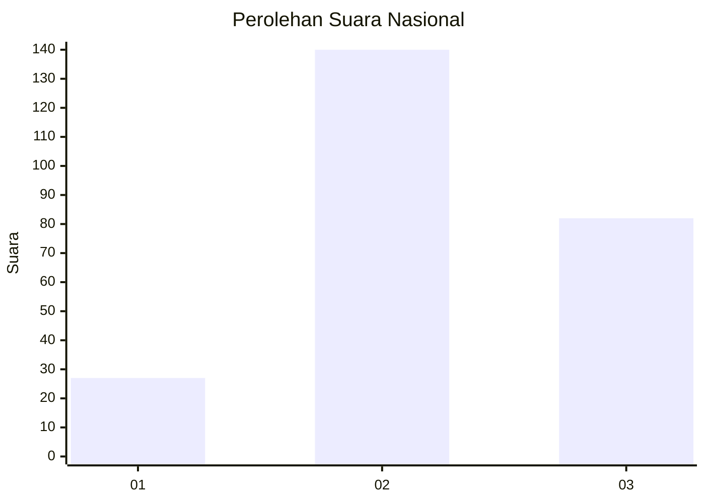
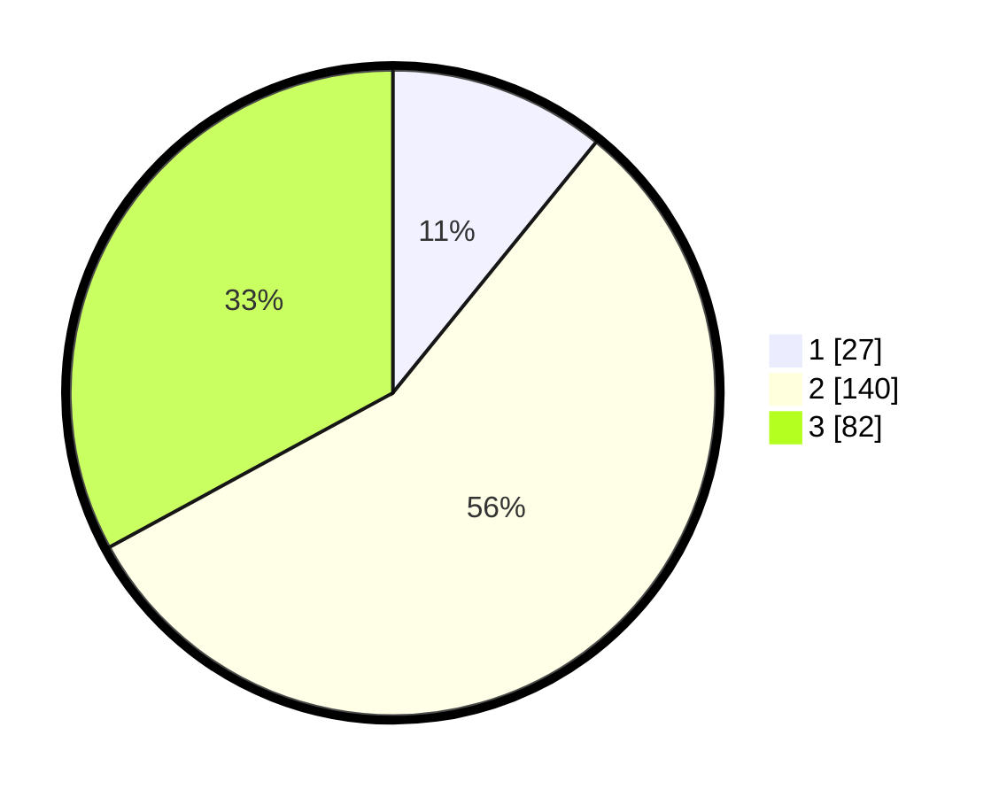

# Hasil

## Grafik

## Tabel

| No. | Nama Paslon    | Suara | Suara (raw) | Persentase |
|:--- |:-------------- | -----:| -----------:| ----------:|
| 1   | ANIES MUHAIMIN | 27    | [27][p-1]   | 10,84      |
| 2   | PRABOWO GIBRAN | 140   | [140][p-2]  | 56,22      |
| 3   | GANJAR MAHFUD  | 82    | [82][p-3]   | 32,93      |

[p-1]: https://github.com/gigit-pemilu/pemilu-2024/blob/main/pilpres/hitung-suara/sub/34-di-yogyakarta/sub/03-gunungkidul/sub/04-patuk/sub/2005-salam/sub/007-tps/sub/paslon-1.txt
[p-2]: https://github.com/gigit-pemilu/pemilu-2024/blob/main/pilpres/hitung-suara/sub/34-di-yogyakarta/sub/03-gunungkidul/sub/04-patuk/sub/2005-salam/sub/007-tps/sub/paslon-2.txt
[p-3]: https://github.com/gigit-pemilu/pemilu-2024/blob/main/pilpres/hitung-suara/sub/34-di-yogyakarta/sub/03-gunungkidul/sub/04-patuk/sub/2005-salam/sub/007-tps/sub/paslon-3.txt

## Foto C Plano

https://sirekap-obj-formc.kpu.go.id/2e7c/pemilu/ppwp/34/03/04/20/05/3403042005007-20240215-110531--04c40982-cfec-4ff9-a496-1370a6cd7439.jpg

https://sirekap-obj-formc.kpu.go.id/2e7c/pemilu/ppwp/34/03/04/20/05/3403042005007-20240215-110633--35f2a6c3-987c-400a-941d-6d6ffc713d84.jpg

https://sirekap-obj-formc.kpu.go.id/2e7c/pemilu/ppwp/34/03/04/20/05/3403042005007-20240215-110637--24365cea-5bc8-4996-8536-1d125a6366d0.jpg

## Metadata

| Key        | Value               |
| ---------- | ------------------- |
| Time Stamp | 2024-02-19 06:16:00 |

