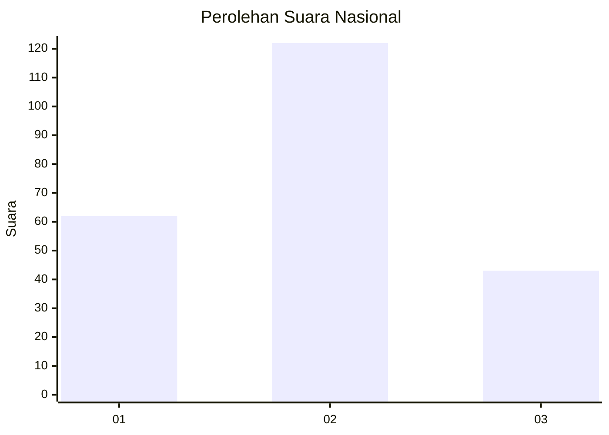
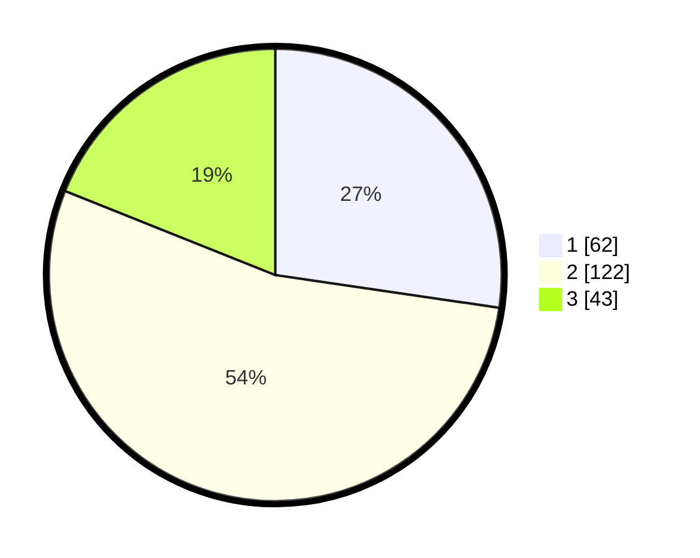

# Hasil

## Grafik

## Tabel

| No. | Nama Paslon    | Suara | Suara (raw) | Persentase |
|:--- |:-------------- | -----:| -----------:| ----------:|
| 1   | ANIES MUHAIMIN | 62    | [62][p-1]   | 27,31      |
| 2   | PRABOWO GIBRAN | 122   | [122][p-2]  | 53,74      |
| 3   | GANJAR MAHFUD  | 43    | [43][p-3]   | 18,94      |

[p-1]: https://github.com/gigit-pemilu/pemilu-2024/blob/main/pilpres/hitung-suara/sub/34-di-yogyakarta/sub/03-gunungkidul/sub/04-patuk/sub/2006-patuk/sub/001-tps/sub/paslon-1.txt
[p-2]: https://github.com/gigit-pemilu/pemilu-2024/blob/main/pilpres/hitung-suara/sub/34-di-yogyakarta/sub/03-gunungkidul/sub/04-patuk/sub/2006-patuk/sub/001-tps/sub/paslon-2.txt
[p-3]: https://github.com/gigit-pemilu/pemilu-2024/blob/main/pilpres/hitung-suara/sub/34-di-yogyakarta/sub/03-gunungkidul/sub/04-patuk/sub/2006-patuk/sub/001-tps/sub/paslon-3.txt

## Foto C Plano

https://sirekap-obj-formc.kpu.go.id/d3ee/pemilu/ppwp/34/03/04/20/06/3403042006001-20240220-140005--d987c50d-f544-4ff6-9530-4285d2a2ba4b.jpg

https://sirekap-obj-formc.kpu.go.id/d3ee/pemilu/ppwp/34/03/04/20/06/3403042006001-20240220-120158--8c08a9b7-139e-453a-ba7f-c2ffce047a94.jpg

https://sirekap-obj-formc.kpu.go.id/d3ee/pemilu/ppwp/34/03/04/20/06/3403042006001-20240220-120557--cb8ce4d7-35e5-43ef-a47b-2ed6ce8d4c47.jpg

## Metadata

| Key        | Value               |
| ---------- | ------------------- |
| Time Stamp | 2024-02-24 22:31:28 |

