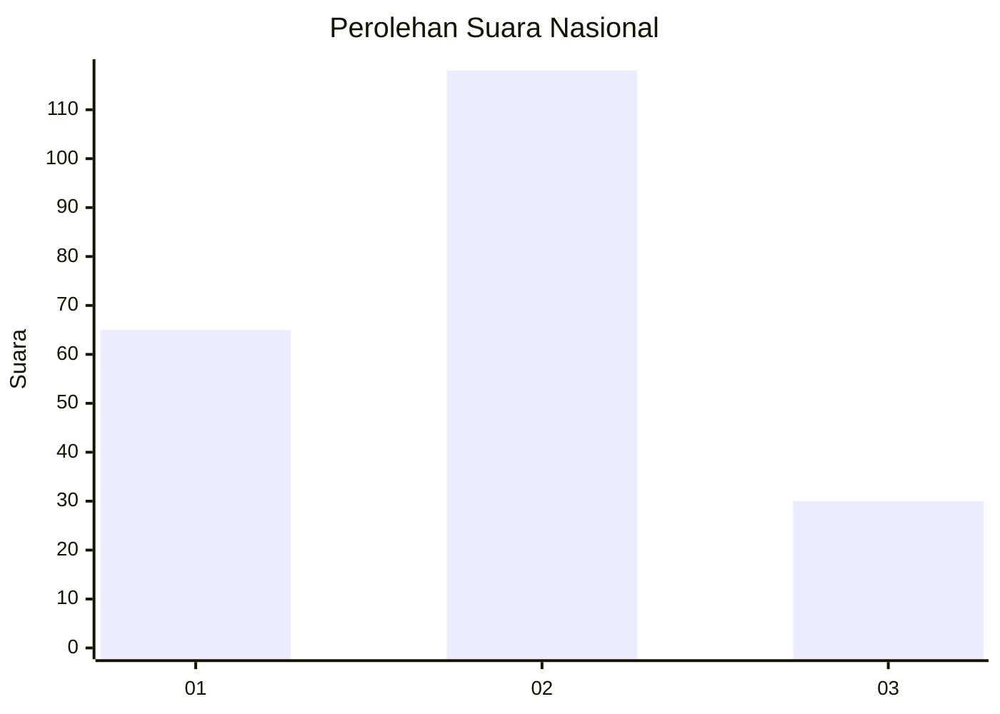
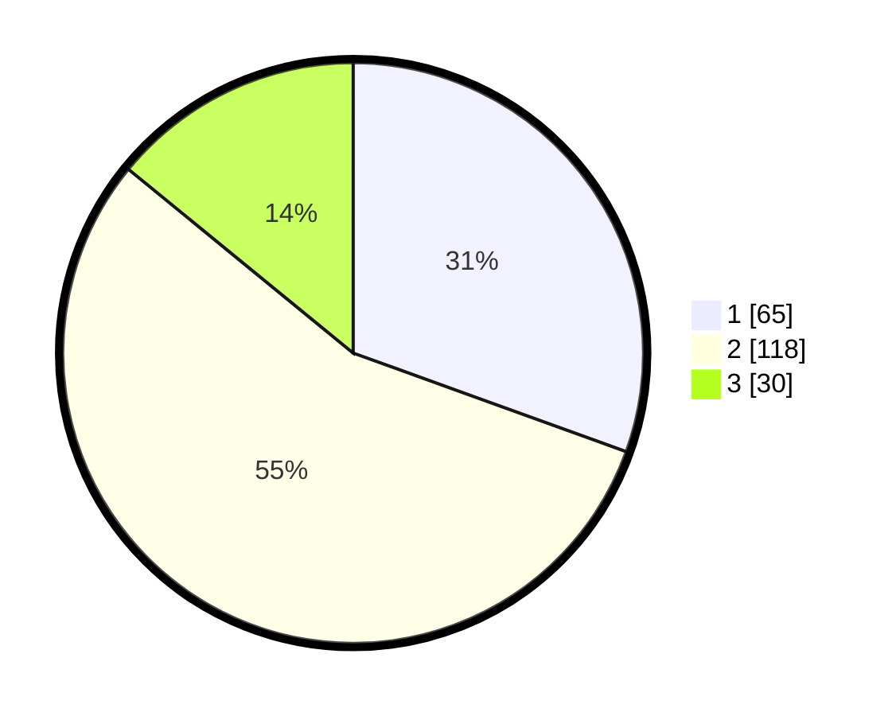

# Hasil

## Grafik

## Tabel

| No. | Nama Paslon    | Suara | Suara (raw) | Persentase |
|:--- |:-------------- | -----:| -----------:| ----------:|
| 1   | ANIES MUHAIMIN | 65    | [65][p-1]   | 30,52      |
| 2   | PRABOWO GIBRAN | 118   | [118][p-2]  | 55,40      |
| 3   | GANJAR MAHFUD  | 30    | [30][p-3]   | 14,08      |

[p-1]: https://github.com/gigit-pemilu/pemilu-2024/blob/main/pilpres/hitung-suara/sub/34-di-yogyakarta/sub/03-gunungkidul/sub/04-patuk/sub/2006-patuk/sub/003-tps/sub/paslon-1.txt
[p-2]: https://github.com/gigit-pemilu/pemilu-2024/blob/main/pilpres/hitung-suara/sub/34-di-yogyakarta/sub/03-gunungkidul/sub/04-patuk/sub/2006-patuk/sub/003-tps/sub/paslon-2.txt
[p-3]: https://github.com/gigit-pemilu/pemilu-2024/blob/main/pilpres/hitung-suara/sub/34-di-yogyakarta/sub/03-gunungkidul/sub/04-patuk/sub/2006-patuk/sub/003-tps/sub/paslon-3.txt

## Foto C Plano

https://sirekap-obj-formc.kpu.go.id/bddf/pemilu/ppwp/34/03/04/20/06/3403042006003-20240215-024552--f6a2a2d0-c95c-4d88-b290-dd29b1658759.jpg

https://sirekap-obj-formc.kpu.go.id/bddf/pemilu/ppwp/34/03/04/20/06/3403042006003-20240215-024744--a991f7c4-d6da-4dc9-b770-c351e58b6051.jpg

https://sirekap-obj-formc.kpu.go.id/bddf/pemilu/ppwp/34/03/04/20/06/3403042006003-20240215-025115--910eb77c-f87b-4290-bfe9-cd586a75a5d1.jpg

## Metadata

| Key        | Value               |
| ---------- | ------------------- |
| Time Stamp | 2024-02-17 19:30:00 |

