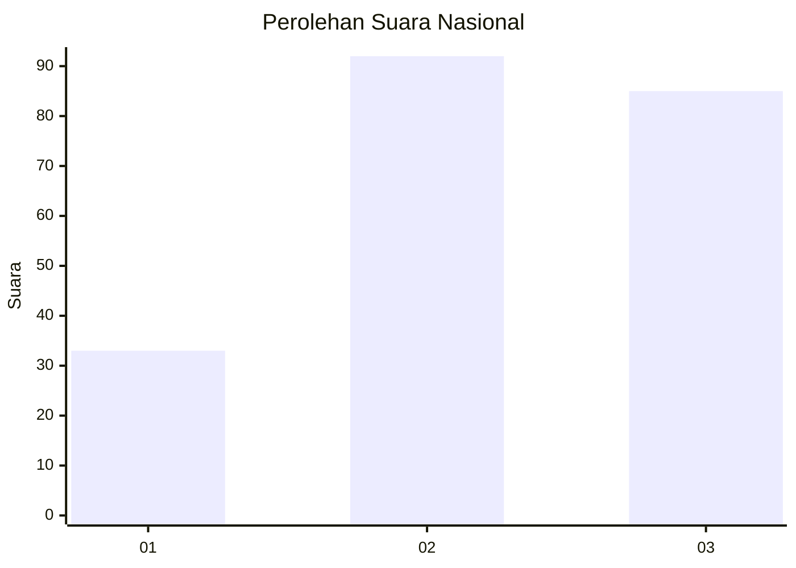
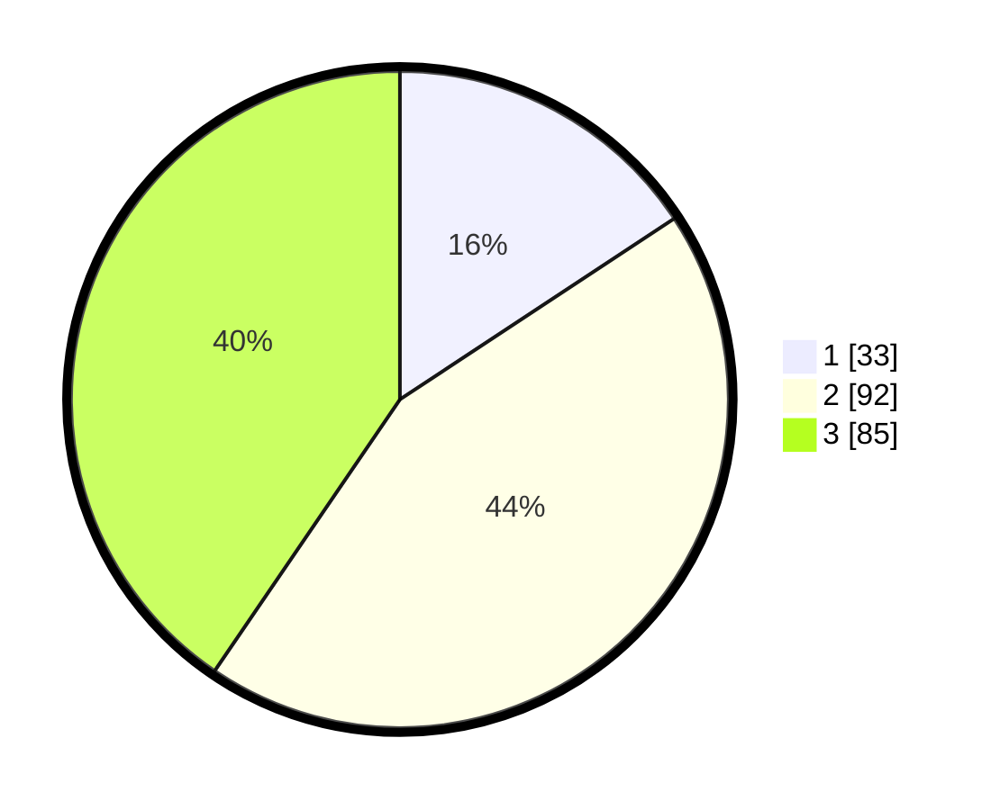

# Hasil

## Grafik

## Tabel

| No. | Nama Paslon    | Suara | Suara (raw) | Persentase |
|:--- |:-------------- | -----:| -----------:| ----------:|
| 1   | ANIES MUHAIMIN | 33    | [33][p-1]   | 15,71      |
| 2   | PRABOWO GIBRAN | 92    | [92][p-2]   | 43,81      |
| 3   | GANJAR MAHFUD  | 85    | [85][p-3]   | 40,48      |

[p-1]: https://github.com/gigit-pemilu/pemilu-2024/blob/main/pilpres/hitung-suara/sub/34-di-yogyakarta/sub/03-gunungkidul/sub/04-patuk/sub/2006-patuk/sub/008-tps/sub/paslon-1.txt
[p-2]: https://github.com/gigit-pemilu/pemilu-2024/blob/main/pilpres/hitung-suara/sub/34-di-yogyakarta/sub/03-gunungkidul/sub/04-patuk/sub/2006-patuk/sub/008-tps/sub/paslon-2.txt
[p-3]: https://github.com/gigit-pemilu/pemilu-2024/blob/main/pilpres/hitung-suara/sub/34-di-yogyakarta/sub/03-gunungkidul/sub/04-patuk/sub/2006-patuk/sub/008-tps/sub/paslon-3.txt

## Foto C Plano

https://sirekap-obj-formc.kpu.go.id/2d48/pemilu/ppwp/34/03/04/20/06/3403042006008-20240214-155054--6d521f0d-8635-4b94-8f86-bb13c43a8c09.jpg

https://sirekap-obj-formc.kpu.go.id/2d48/pemilu/ppwp/34/03/04/20/06/3403042006008-20240214-155120--f39d9362-e0b9-4ba9-b2f3-f02fc1f5d155.jpg

https://sirekap-obj-formc.kpu.go.id/2d48/pemilu/ppwp/34/03/04/20/06/3403042006008-20240214-155136--5d7a9c87-afde-489e-be9c-98a365614169.jpg

## Metadata

| Key        | Value               |
| ---------- | ------------------- |
| Time Stamp | 2024-02-14 21:46:01 |

