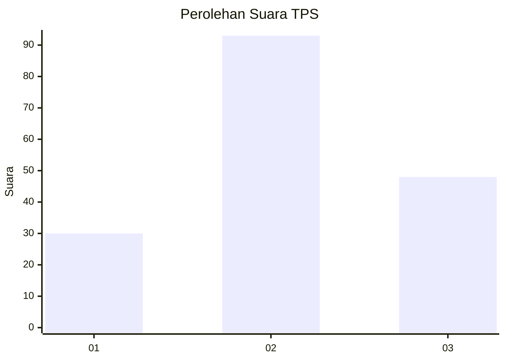
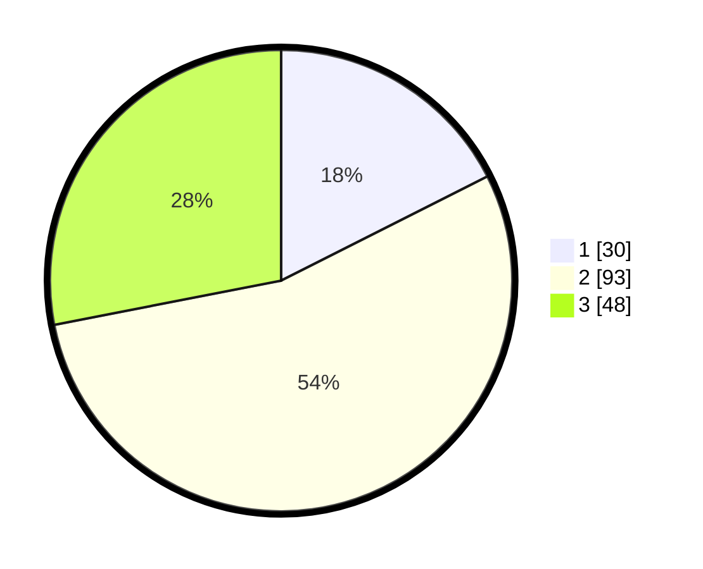

# Hasil

## Grafik

## Tabel

| No. | Nama Paslon    | Suara | Suara (raw) | Persentase |
|:--- |:-------------- | -----:| -----------:| ----------:|
| 1   | ANIES MUHAIMIN | 30    | [30][p-1]   | 17,54      |
| 2   | PRABOWO GIBRAN | 93    | [93][p-2]   | 54,39      |
| 3   | GANJAR MAHFUD  | 48    | [48][p-3]   | 28,07      |

[p-1]: https://github.com/gigit-pemilu/pemilu-2024-34-di-yogyakarta/blob/main/pilpres/hitung-suara/sub/34-di-yogyakarta/sub/03-gunungkidul/sub/04-patuk/sub/2007-ngoro-oro/sub/001-tps/sub/paslon-1.txt
[p-2]: https://github.com/gigit-pemilu/pemilu-2024-34-di-yogyakarta/blob/main/pilpres/hitung-suara/sub/34-di-yogyakarta/sub/03-gunungkidul/sub/04-patuk/sub/2007-ngoro-oro/sub/001-tps/sub/paslon-2.txt
[p-3]: https://github.com/gigit-pemilu/pemilu-2024-34-di-yogyakarta/blob/main/pilpres/hitung-suara/sub/34-di-yogyakarta/sub/03-gunungkidul/sub/04-patuk/sub/2007-ngoro-oro/sub/001-tps/sub/paslon-3.txt

## Foto C Plano

https://sirekap-obj-formc.kpu.go.id/a94d/pemilu/ppwp/34/03/04/20/07/3403042007001-20240218-091804--51958aab-3e02-4ced-a6f0-3d6bb62a8f61.jpg

https://sirekap-obj-formc.kpu.go.id/a94d/pemilu/ppwp/34/03/04/20/07/3403042007001-20240218-073456--daa436cd-7d80-4a13-bfb0-08f0440ecc1e.jpg

https://sirekap-obj-formc.kpu.go.id/a94d/pemilu/ppwp/34/03/04/20/07/3403042007001-20240218-073510--ac7cbc1c-662d-4caa-9c70-83d3d3f066fa.jpg

## Metadata

| Key        | Value               |
| ---------- | ------------------- |
| Time Stamp | 2024-02-20 11:00:00 |

