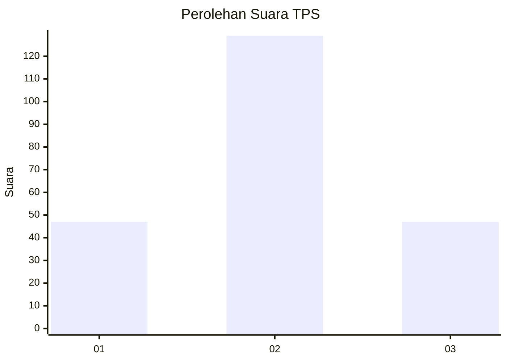
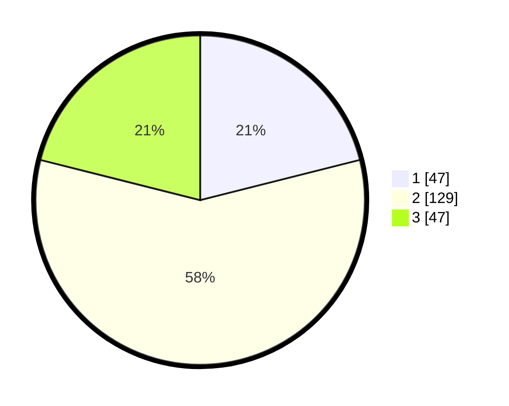

# Hasil

## Grafik

## Tabel

| No. | Nama Paslon    | Suara | Suara (raw) | Persentase |
|:--- |:-------------- | -----:| -----------:| ----------:|
| 1   | ANIES MUHAIMIN | 47    | [47][p-1]   | 21,08      |
| 2   | PRABOWO GIBRAN | 129   | [129][p-2]  | 57,85      |
| 3   | GANJAR MAHFUD  | 47    | [47][p-3]   | 21,08      |

[p-1]: https://github.com/gigit-pemilu/pemilu-2024-34-di-yogyakarta/blob/main/pilpres/hitung-suara/sub/34-di-yogyakarta/sub/03-gunungkidul/sub/04-patuk/sub/2007-ngoro-oro/sub/002-tps/sub/paslon-1.txt
[p-2]: https://github.com/gigit-pemilu/pemilu-2024-34-di-yogyakarta/blob/main/pilpres/hitung-suara/sub/34-di-yogyakarta/sub/03-gunungkidul/sub/04-patuk/sub/2007-ngoro-oro/sub/002-tps/sub/paslon-2.txt
[p-3]: https://github.com/gigit-pemilu/pemilu-2024-34-di-yogyakarta/blob/main/pilpres/hitung-suara/sub/34-di-yogyakarta/sub/03-gunungkidul/sub/04-patuk/sub/2007-ngoro-oro/sub/002-tps/sub/paslon-3.txt

## Foto C Plano

https://sirekap-obj-formc.kpu.go.id/b4be/pemilu/ppwp/34/03/04/20/07/3403042007002-20240214-233011--e800b66d-591e-49ac-abbc-2768ff24bc36.jpg

https://sirekap-obj-formc.kpu.go.id/b4be/pemilu/ppwp/34/03/04/20/07/3403042007002-20240214-233040--94e1e0ad-05c3-4c6d-ac8d-ece2566dd713.jpg

https://sirekap-obj-formc.kpu.go.id/b4be/pemilu/ppwp/34/03/04/20/07/3403042007002-20240214-233202--7be38a7b-bb19-459c-b5e4-1eb9a413233b.jpg

## Metadata

| Key        | Value               |
| ---------- | ------------------- |
| Time Stamp | 2024-02-17 19:30:00 |

