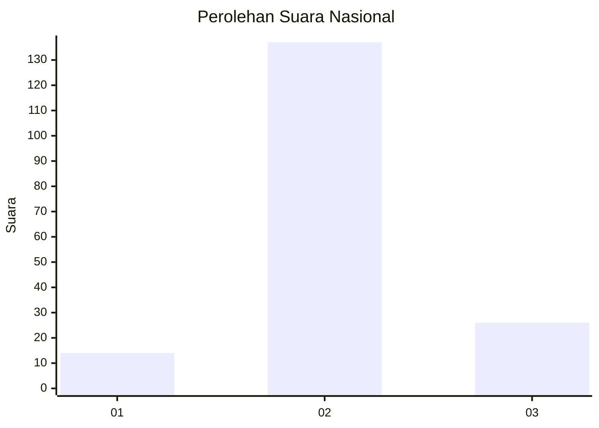

# Hasil

## Grafik

## Tabel

| No. | Nama Paslon    | Suara | Suara (raw) | Persentase |
|:--- |:-------------- | -----:| -----------:| ----------:|
| 1   | ANIES MUHAIMIN | 14    | [14][p-1]   | 7,91       |
| 2   | PRABOWO GIBRAN | 137   | [137][p-2]  | 77,40      |
| 3   | GANJAR MAHFUD  | 26    | [26][p-3]   | 14,69      |

[p-1]: https://github.com/gigit-pemilu/pemilu-2024/blob/main/pilpres/hitung-suara/sub/34-di-yogyakarta/sub/03-gunungkidul/sub/04-patuk/sub/2007-ngoro-oro/sub/004-tps/sub/paslon-1.txt
[p-2]: https://github.com/gigit-pemilu/pemilu-2024/blob/main/pilpres/hitung-suara/sub/34-di-yogyakarta/sub/03-gunungkidul/sub/04-patuk/sub/2007-ngoro-oro/sub/004-tps/sub/paslon-2.txt
[p-3]: https://github.com/gigit-pemilu/pemilu-2024/blob/main/pilpres/hitung-suara/sub/34-di-yogyakarta/sub/03-gunungkidul/sub/04-patuk/sub/2007-ngoro-oro/sub/004-tps/sub/paslon-3.txt

## Foto C Plano

https://sirekap-obj-formc.kpu.go.id/89a5/pemilu/ppwp/34/03/04/20/07/3403042007004-20240215-001420--1285a910-b723-451c-a447-aea473daf55a.jpg

https://sirekap-obj-formc.kpu.go.id/89a5/pemilu/ppwp/34/03/04/20/07/3403042007004-20240215-001455--b936d1f8-46ed-41a0-9c9b-4540f9e67de6.jpg

https://sirekap-obj-formc.kpu.go.id/89a5/pemilu/ppwp/34/03/04/20/07/3403042007004-20240215-001609--dc52d2f5-0256-4686-9213-afd49c59cc01.jpg

## Metadata

| Key        | Value               |
| ---------- | ------------------- |
| Time Stamp | 2024-02-17 19:30:00 |

