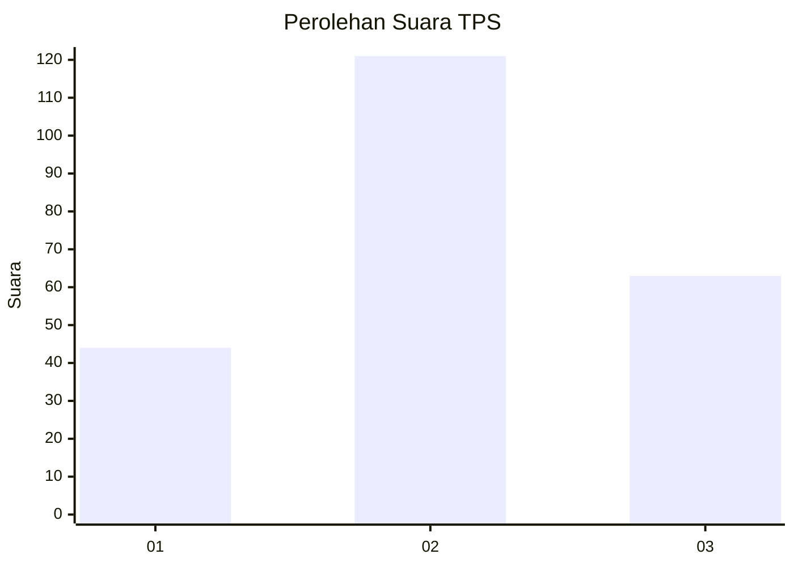
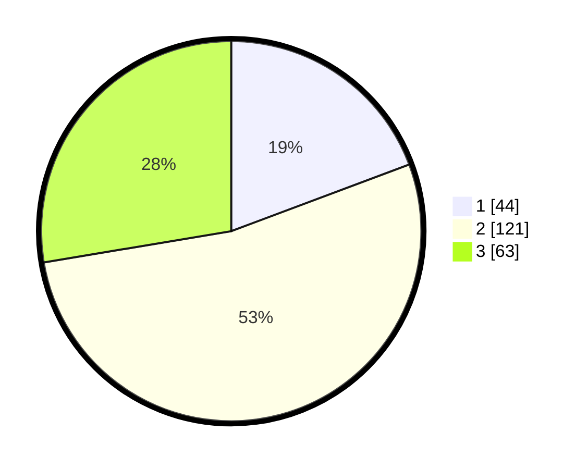

# Hasil

## Grafik

## Tabel

| No. | Nama Paslon    | Suara | Suara (raw) | Persentase |
|:--- |:-------------- | -----:| -----------:| ----------:|
| 1   | ANIES MUHAIMIN | 44    | [44][p-1]   | 19,30      |
| 2   | PRABOWO GIBRAN | 121   | [121][p-2]  | 53,07      |
| 3   | GANJAR MAHFUD  | 63    | [63][p-3]   | 27,63      |

[p-1]: https://github.com/gigit-pemilu/pemilu-2024-34-di-yogyakarta/blob/main/pilpres/hitung-suara/sub/34-di-yogyakarta/sub/03-gunungkidul/sub/04-patuk/sub/2007-ngoro-oro/sub/006-tps/sub/paslon-1.txt
[p-2]: https://github.com/gigit-pemilu/pemilu-2024-34-di-yogyakarta/blob/main/pilpres/hitung-suara/sub/34-di-yogyakarta/sub/03-gunungkidul/sub/04-patuk/sub/2007-ngoro-oro/sub/006-tps/sub/paslon-2.txt
[p-3]: https://github.com/gigit-pemilu/pemilu-2024-34-di-yogyakarta/blob/main/pilpres/hitung-suara/sub/34-di-yogyakarta/sub/03-gunungkidul/sub/04-patuk/sub/2007-ngoro-oro/sub/006-tps/sub/paslon-3.txt

## Foto C Plano

https://sirekap-obj-formc.kpu.go.id/1eab/pemilu/ppwp/34/03/04/20/07/3403042007006-20240215-012235--d43c7333-c3d9-49da-b315-c8ba46203937.jpg

https://sirekap-obj-formc.kpu.go.id/1eab/pemilu/ppwp/34/03/04/20/07/3403042007006-20240215-012322--2c6304e1-52f3-4324-b758-c34c991613ac.jpg

https://sirekap-obj-formc.kpu.go.id/1eab/pemilu/ppwp/34/03/04/20/07/3403042007006-20240215-012400--f84f9d82-4692-4e7e-b449-214f7eb5398c.jpg

## Metadata

| Key        | Value               |
| ---------- | ------------------- |
| Time Stamp | 2024-02-17 19:30:00 |

