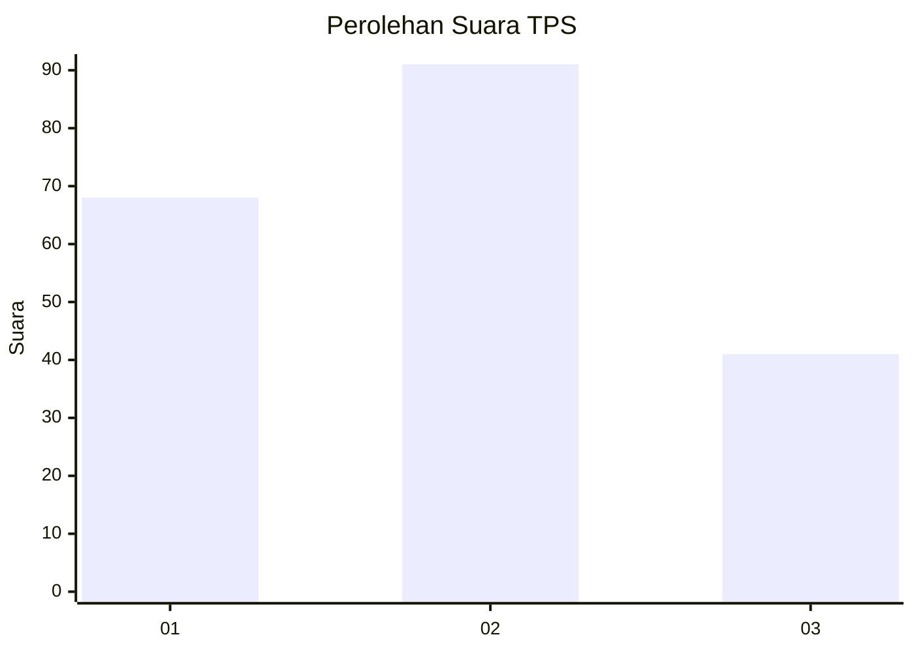
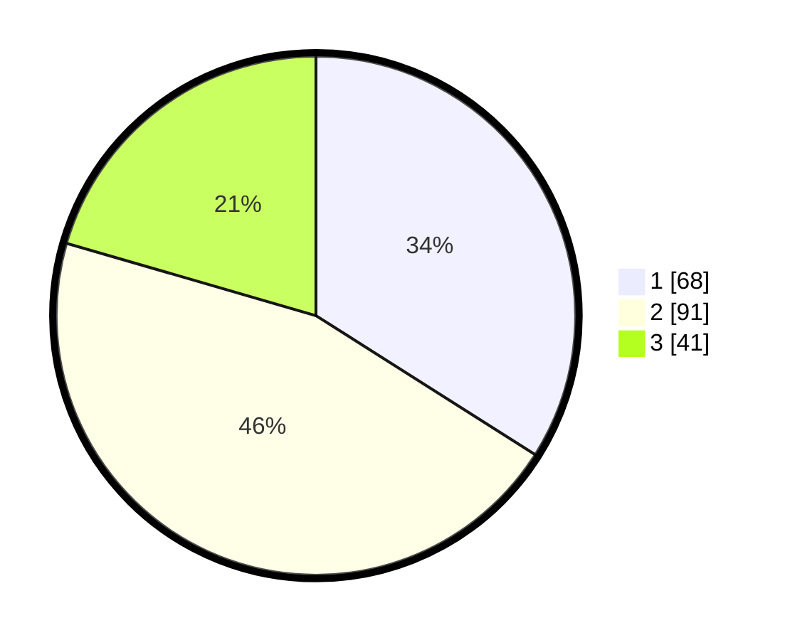

# Hasil

## Grafik

## Tabel

| No. | Nama Paslon    | Suara | Suara (raw) | Persentase |
|:--- |:-------------- | -----:| -----------:| ----------:|
| 1   | ANIES MUHAIMIN | 68    | [68][p-1]   | 34,00      |
| 2   | PRABOWO GIBRAN | 91    | [91][p-2]   | 45,50      |
| 3   | GANJAR MAHFUD  | 41    | [41][p-3]   | 20,50      |

[p-1]: https://github.com/gigit-pemilu/pemilu-2024-34-di-yogyakarta/blob/main/pilpres/hitung-suara/sub/34-di-yogyakarta/sub/03-gunungkidul/sub/04-patuk/sub/2007-ngoro-oro/sub/008-tps/sub/paslon-1.txt
[p-2]: https://github.com/gigit-pemilu/pemilu-2024-34-di-yogyakarta/blob/main/pilpres/hitung-suara/sub/34-di-yogyakarta/sub/03-gunungkidul/sub/04-patuk/sub/2007-ngoro-oro/sub/008-tps/sub/paslon-2.txt
[p-3]: https://github.com/gigit-pemilu/pemilu-2024-34-di-yogyakarta/blob/main/pilpres/hitung-suara/sub/34-di-yogyakarta/sub/03-gunungkidul/sub/04-patuk/sub/2007-ngoro-oro/sub/008-tps/sub/paslon-3.txt

## Foto C Plano

https://sirekap-obj-formc.kpu.go.id/f994/pemilu/ppwp/34/03/04/20/07/3403042007008-20240214-225606--4c7fcca0-e17a-4e7d-95d8-e7718f0c8758.jpg

https://sirekap-obj-formc.kpu.go.id/f994/pemilu/ppwp/34/03/04/20/07/3403042007008-20240214-225631--ab6e0e77-115b-43c5-8197-f3409ceeb60a.jpg

https://sirekap-obj-formc.kpu.go.id/f994/pemilu/ppwp/34/03/04/20/07/3403042007008-20240214-225647--e5eb4415-34b0-40e3-85bc-7cc924fef8c1.jpg

## Metadata

| Key        | Value               |
| ---------- | ------------------- |
| Time Stamp | 2024-02-19 06:16:00 |

