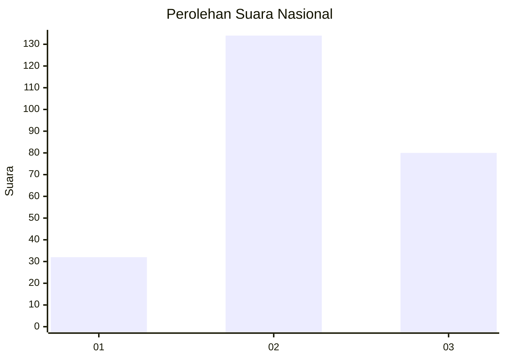
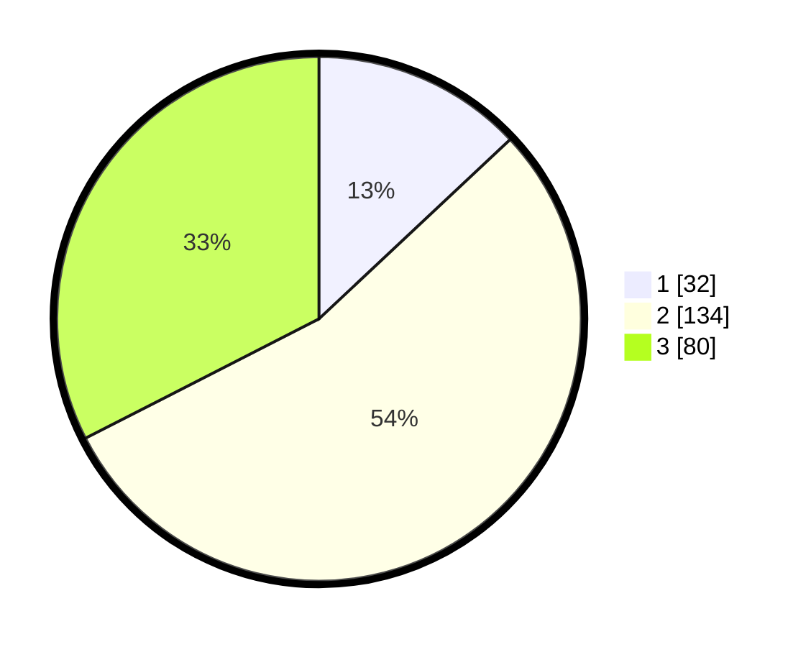

# Hasil

## Grafik

## Tabel

| No. | Nama Paslon    | Suara | Suara (raw) | Persentase |
|:--- |:-------------- | -----:| -----------:| ----------:|
| 1   | ANIES MUHAIMIN | 32    | [32][p-1]   | 13,01      |
| 2   | PRABOWO GIBRAN | 134   | [134][p-2]  | 54,47      |
| 3   | GANJAR MAHFUD  | 80    | [80][p-3]   | 32,52      |

[p-1]: https://github.com/gigit-pemilu/pemilu-2024/blob/main/pilpres/hitung-suara/sub/34-di-yogyakarta/sub/03-gunungkidul/sub/04-patuk/sub/2009-putat/sub/007-tps/sub/paslon-1.txt
[p-2]: https://github.com/gigit-pemilu/pemilu-2024/blob/main/pilpres/hitung-suara/sub/34-di-yogyakarta/sub/03-gunungkidul/sub/04-patuk/sub/2009-putat/sub/007-tps/sub/paslon-2.txt
[p-3]: https://github.com/gigit-pemilu/pemilu-2024/blob/main/pilpres/hitung-suara/sub/34-di-yogyakarta/sub/03-gunungkidul/sub/04-patuk/sub/2009-putat/sub/007-tps/sub/paslon-3.txt

## Foto C Plano

https://sirekap-obj-formc.kpu.go.id/ceb8/pemilu/ppwp/34/03/04/20/09/3403042009007-20240215-003703--6d92984d-5df2-4fd4-89e4-c62c57acb289.jpg

https://sirekap-obj-formc.kpu.go.id/ceb8/pemilu/ppwp/34/03/04/20/09/3403042009007-20240215-003821--bb51051a-fd68-4002-8e55-7b31d670842c.jpg

https://sirekap-obj-formc.kpu.go.id/ceb8/pemilu/ppwp/34/03/04/20/09/3403042009007-20240215-003855--615c39fa-95c2-4c4e-ba3c-1d28bdbad7ef.jpg

## Metadata

| Key        | Value               |
| ---------- | ------------------- |
| Time Stamp | 2024-02-19 06:16:00 |

