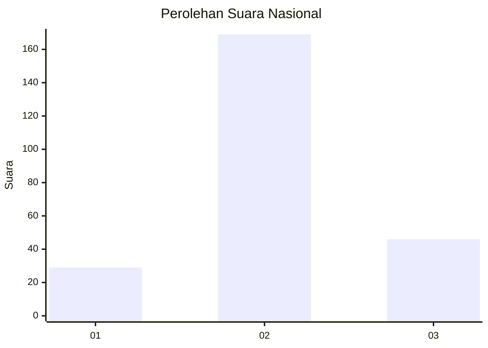
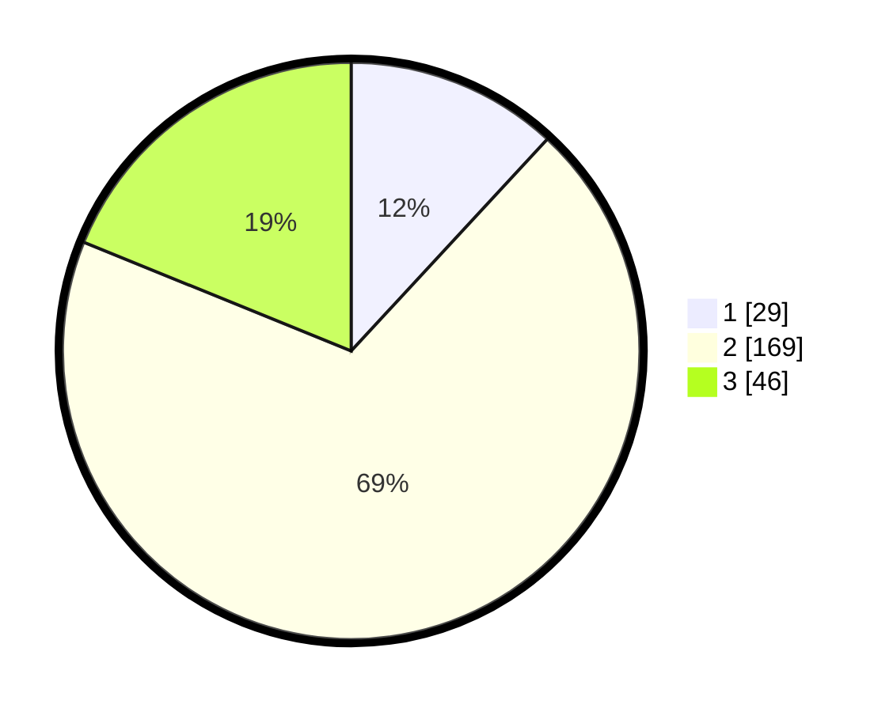

# Hasil

## Grafik

## Tabel

| No. | Nama Paslon    | Suara | Suara (raw) | Persentase |
|:--- |:-------------- | -----:| -----------:| ----------:|
| 1   | ANIES MUHAIMIN | 29    | [29][p-1]   | 11,89      |
| 2   | PRABOWO GIBRAN | 169   | [169][p-2]  | 69,26      |
| 3   | GANJAR MAHFUD  | 46    | [46][p-3]   | 18,85      |

[p-1]: https://github.com/gigit-pemilu/pemilu-2024/blob/main/pilpres/hitung-suara/sub/34-di-yogyakarta/sub/03-gunungkidul/sub/04-patuk/sub/2009-putat/sub/008-tps/sub/paslon-1.txt
[p-2]: https://github.com/gigit-pemilu/pemilu-2024/blob/main/pilpres/hitung-suara/sub/34-di-yogyakarta/sub/03-gunungkidul/sub/04-patuk/sub/2009-putat/sub/008-tps/sub/paslon-2.txt
[p-3]: https://github.com/gigit-pemilu/pemilu-2024/blob/main/pilpres/hitung-suara/sub/34-di-yogyakarta/sub/03-gunungkidul/sub/04-patuk/sub/2009-putat/sub/008-tps/sub/paslon-3.txt

## Foto C Plano

https://sirekap-obj-formc.kpu.go.id/4f74/pemilu/ppwp/34/03/04/20/09/3403042009008-20240215-032122--cc1dafea-4c6b-4ec4-b884-8f29e6dbb241.jpg

https://sirekap-obj-formc.kpu.go.id/4f74/pemilu/ppwp/34/03/04/20/09/3403042009008-20240215-032143--a9a7f5a2-f643-41ae-b777-cb099bff7fa4.jpg

https://sirekap-obj-formc.kpu.go.id/4f74/pemilu/ppwp/34/03/04/20/09/3403042009008-20240215-032235--e682b86c-6090-43eb-bec7-a37ae1fa49c3.jpg

## Metadata

| Key        | Value               |
| ---------- | ------------------- |
| Time Stamp | 2024-02-17 19:30:00 |

