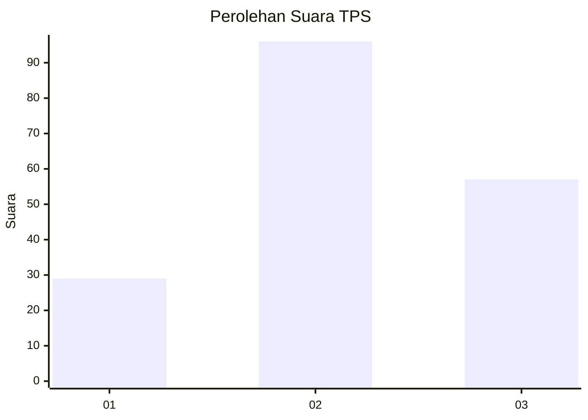
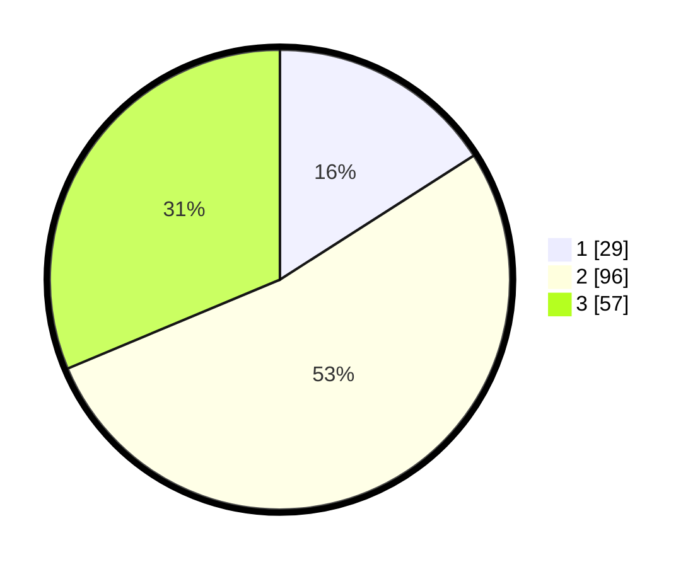

# Hasil

## Grafik

## Tabel

| No. | Nama Paslon    | Suara | Suara (raw) | Persentase |
|:--- |:-------------- | -----:| -----------:| ----------:|
| 1   | ANIES MUHAIMIN | 29    | [29][p-1]   | 15,93      |
| 2   | PRABOWO GIBRAN | 96    | [96][p-2]   | 52,75      |
| 3   | GANJAR MAHFUD  | 57    | [57][p-3]   | 31,32      |

[p-1]: https://github.com/gigit-pemilu/pemilu-2024-34-di-yogyakarta/blob/main/pilpres/hitung-suara/sub/34-di-yogyakarta/sub/03-gunungkidul/sub/04-patuk/sub/2010-nglegi/sub/001-tps/sub/paslon-1.txt
[p-2]: https://github.com/gigit-pemilu/pemilu-2024-34-di-yogyakarta/blob/main/pilpres/hitung-suara/sub/34-di-yogyakarta/sub/03-gunungkidul/sub/04-patuk/sub/2010-nglegi/sub/001-tps/sub/paslon-2.txt
[p-3]: https://github.com/gigit-pemilu/pemilu-2024-34-di-yogyakarta/blob/main/pilpres/hitung-suara/sub/34-di-yogyakarta/sub/03-gunungkidul/sub/04-patuk/sub/2010-nglegi/sub/001-tps/sub/paslon-3.txt

## Foto C Plano

https://sirekap-obj-formc.kpu.go.id/81f3/pemilu/ppwp/34/03/04/20/10/3403042010001-20240215-104748--c4388f6a-e9af-4b4f-a800-72232626da05.jpg

https://sirekap-obj-formc.kpu.go.id/81f3/pemilu/ppwp/34/03/04/20/10/3403042010001-20240215-104843--971af5fb-883a-419c-b06f-ea5c82cb6c58.jpg

https://sirekap-obj-formc.kpu.go.id/81f3/pemilu/ppwp/34/03/04/20/10/3403042010001-20240215-104918--42ac17af-b0ab-43f7-ae1a-95d05f3e9074.jpg

## Metadata

| Key        | Value               |
| ---------- | ------------------- |
| Time Stamp | 2024-02-19 06:16:00 |

