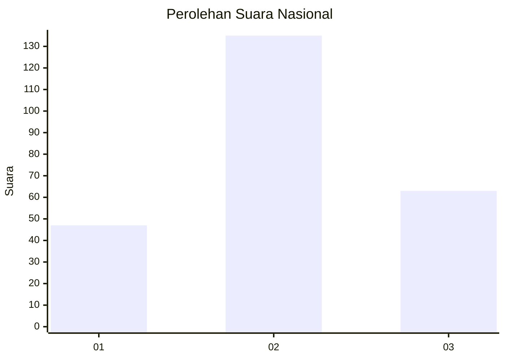
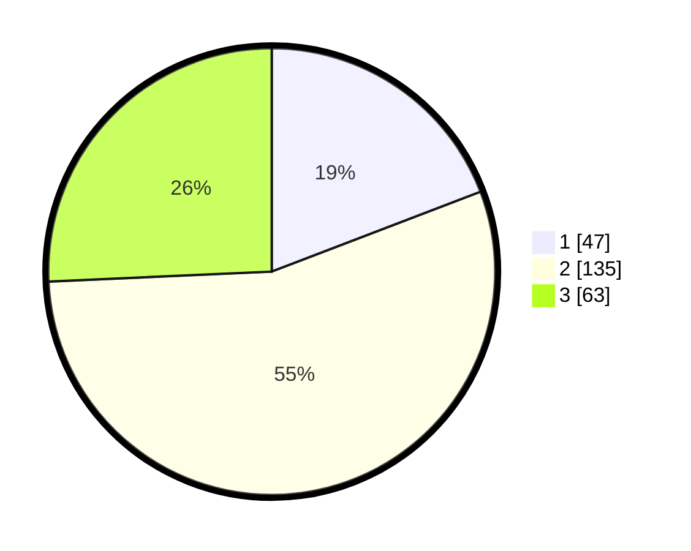

# Hasil

## Grafik

## Tabel

| No. | Nama Paslon    | Suara | Suara (raw) | Persentase |
|:--- |:-------------- | -----:| -----------:| ----------:|
| 1   | ANIES MUHAIMIN | 47    | [47][p-1]   | 19,18      |
| 2   | PRABOWO GIBRAN | 135   | [135][p-2]  | 55,10      |
| 3   | GANJAR MAHFUD  | 63    | [63][p-3]   | 25,71      |

[p-1]: https://github.com/gigit-pemilu/pemilu-2024/blob/main/pilpres/hitung-suara/sub/34-di-yogyakarta/sub/03-gunungkidul/sub/04-patuk/sub/2010-nglegi/sub/006-tps/sub/paslon-1.txt
[p-2]: https://github.com/gigit-pemilu/pemilu-2024/blob/main/pilpres/hitung-suara/sub/34-di-yogyakarta/sub/03-gunungkidul/sub/04-patuk/sub/2010-nglegi/sub/006-tps/sub/paslon-2.txt
[p-3]: https://github.com/gigit-pemilu/pemilu-2024/blob/main/pilpres/hitung-suara/sub/34-di-yogyakarta/sub/03-gunungkidul/sub/04-patuk/sub/2010-nglegi/sub/006-tps/sub/paslon-3.txt

## Foto C Plano

https://sirekap-obj-formc.kpu.go.id/12a5/pemilu/ppwp/34/03/04/20/10/3403042010006-20240214-213100--79dbf2d7-b4e4-4084-baf0-def9a1208d5b.jpg

https://sirekap-obj-formc.kpu.go.id/12a5/pemilu/ppwp/34/03/04/20/10/3403042010006-20240214-213249--a40f9b99-3756-4c84-b6d5-712340b5c594.jpg

https://sirekap-obj-formc.kpu.go.id/12a5/pemilu/ppwp/34/03/04/20/10/3403042010006-20240215-184400--45e17aaf-4eef-4007-b2ec-c29e147b527e.jpg

## Metadata

| Key        | Value               |
| ---------- | ------------------- |
| Time Stamp | 2024-02-15 19:00:26 |

