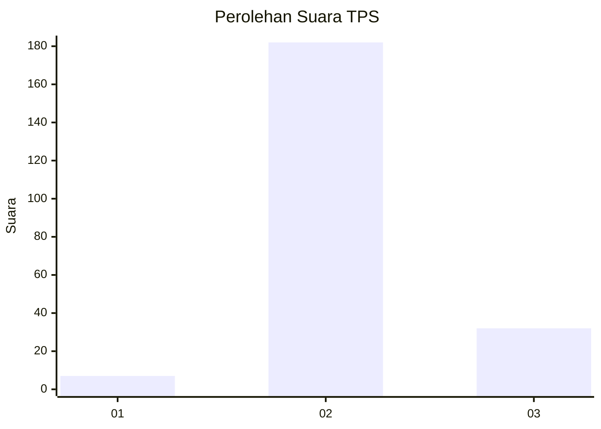
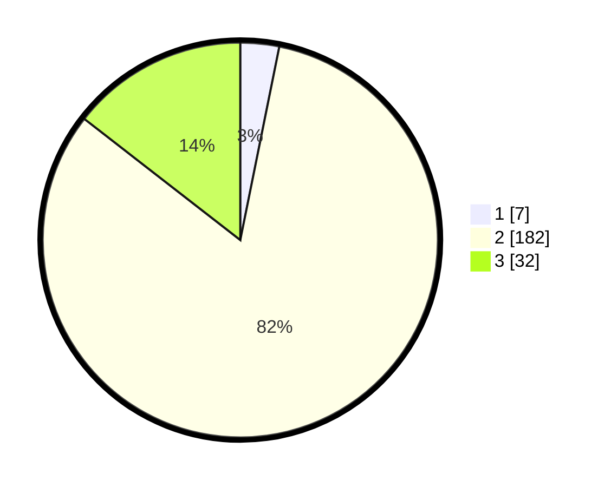

# Hasil

## Grafik

## Tabel

| No. | Nama Paslon    | Suara | Suara (raw) | Persentase |
|:--- |:-------------- | -----:| -----------:| ----------:|
| 1   | ANIES MUHAIMIN | 7     | [7][p-1]    | 3,17       |
| 2   | PRABOWO GIBRAN | 182   | [182][p-2]  | 82,35      |
| 3   | GANJAR MAHFUD  | 32    | [32][p-3]   | 14,48      |

[p-1]: https://github.com/gigit-pemilu/pemilu-2024-34-di-yogyakarta/blob/main/pilpres/hitung-suara/sub/34-di-yogyakarta/sub/03-gunungkidul/sub/04-patuk/sub/2010-nglegi/sub/007-tps/sub/paslon-1.txt
[p-2]: https://github.com/gigit-pemilu/pemilu-2024-34-di-yogyakarta/blob/main/pilpres/hitung-suara/sub/34-di-yogyakarta/sub/03-gunungkidul/sub/04-patuk/sub/2010-nglegi/sub/007-tps/sub/paslon-2.txt
[p-3]: https://github.com/gigit-pemilu/pemilu-2024-34-di-yogyakarta/blob/main/pilpres/hitung-suara/sub/34-di-yogyakarta/sub/03-gunungkidul/sub/04-patuk/sub/2010-nglegi/sub/007-tps/sub/paslon-3.txt

## Foto C Plano

https://sirekap-obj-formc.kpu.go.id/deae/pemilu/ppwp/34/03/04/20/10/3403042010007-20240215-024816--b8ee77cc-44c6-4d51-a80a-159cbc122f89.jpg

https://sirekap-obj-formc.kpu.go.id/deae/pemilu/ppwp/34/03/04/20/10/3403042010007-20240215-023458--583975eb-1c17-4ddc-bb0d-2abb221db491.jpg

https://sirekap-obj-formc.kpu.go.id/deae/pemilu/ppwp/34/03/04/20/10/3403042010007-20240215-011154--c319a1d1-bd80-49ff-b415-706947550a56.jpg

## Metadata

| Key        | Value               |
| ---------- | ------------------- |
| Time Stamp | 2024-02-15 17:00:25 |

