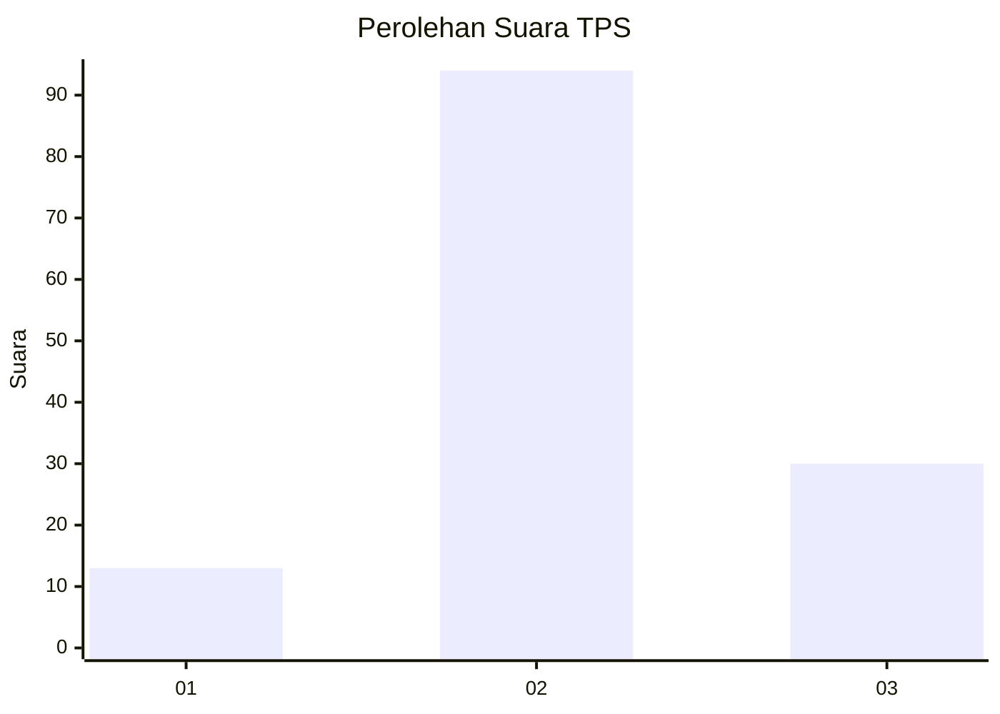
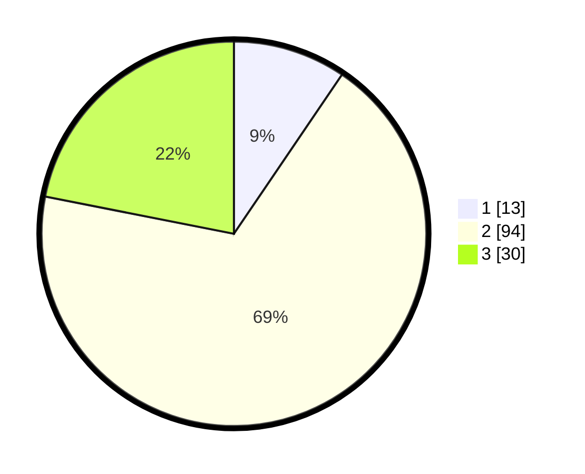

# Hasil

## Grafik

## Tabel

| No. | Nama Paslon    | Suara | Suara (raw) | Persentase |
|:--- |:-------------- | -----:| -----------:| ----------:|
| 1   | ANIES MUHAIMIN | 13    | [13][p-1]   | 9,49       |
| 2   | PRABOWO GIBRAN | 94    | [94][p-2]   | 68,61      |
| 3   | GANJAR MAHFUD  | 30    | [30][p-3]   | 21,90      |

[p-1]: https://github.com/gigit-pemilu/pemilu-2024-34-di-yogyakarta/blob/main/pilpres/hitung-suara/sub/34-di-yogyakarta/sub/03-gunungkidul/sub/04-patuk/sub/2010-nglegi/sub/008-tps/sub/paslon-1.txt
[p-2]: https://github.com/gigit-pemilu/pemilu-2024-34-di-yogyakarta/blob/main/pilpres/hitung-suara/sub/34-di-yogyakarta/sub/03-gunungkidul/sub/04-patuk/sub/2010-nglegi/sub/008-tps/sub/paslon-2.txt
[p-3]: https://github.com/gigit-pemilu/pemilu-2024-34-di-yogyakarta/blob/main/pilpres/hitung-suara/sub/34-di-yogyakarta/sub/03-gunungkidul/sub/04-patuk/sub/2010-nglegi/sub/008-tps/sub/paslon-3.txt

## Foto C Plano

https://sirekap-obj-formc.kpu.go.id/9b58/pemilu/ppwp/34/03/04/20/10/3403042010008-20240214-191917--d988c7c6-75e8-43f6-927c-57033f722b3f.jpg

https://sirekap-obj-formc.kpu.go.id/9b58/pemilu/ppwp/34/03/04/20/10/3403042010008-20240214-191936--6a2b5829-d2df-4612-8434-79a404509d09.jpg

https://sirekap-obj-formc.kpu.go.id/9b58/pemilu/ppwp/34/03/04/20/10/3403042010008-20240214-220950--398bc98e-2f4d-45fe-ba79-3bfb81ae4c94.jpg

## Metadata

| Key        | Value               |
| ---------- | ------------------- |
| Time Stamp | 2024-02-15 09:00:24 |

