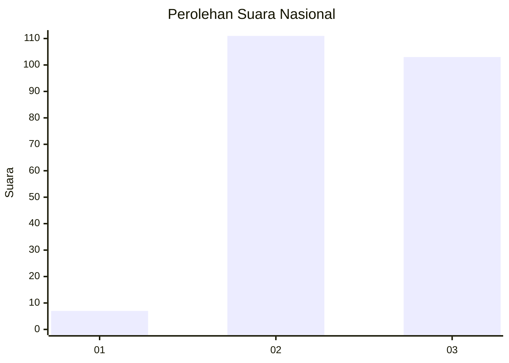
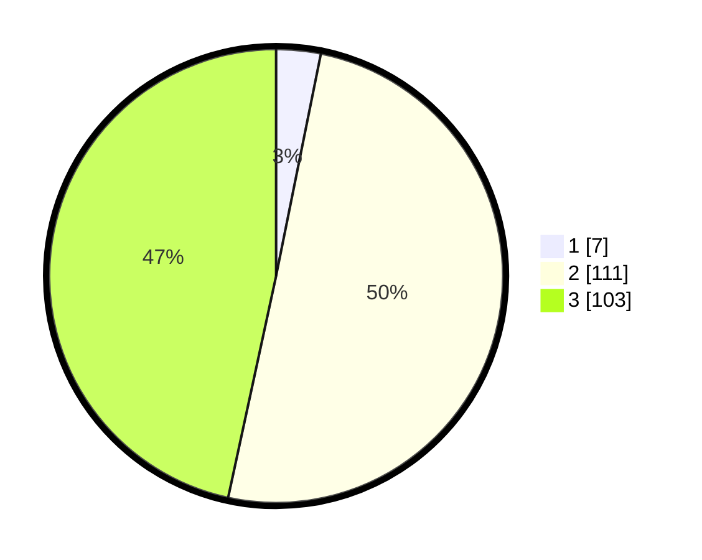

# Hasil

## Grafik

## Tabel

| No. | Nama Paslon    | Suara | Suara (raw) | Persentase |
|:--- |:-------------- | -----:| -----------:| ----------:|
| 1   | ANIES MUHAIMIN | 7     | [7][p-1]    | 3,17       |
| 2   | PRABOWO GIBRAN | 111   | [111][p-2]  | 50,23      |
| 3   | GANJAR MAHFUD  | 103   | [103][p-3]  | 46,61      |

[p-1]: https://github.com/gigit-pemilu/pemilu-2024/blob/main/pilpres/hitung-suara/sub/34-di-yogyakarta/sub/03-gunungkidul/sub/04-patuk/sub/2010-nglegi/sub/009-tps/sub/paslon-1.txt
[p-2]: https://github.com/gigit-pemilu/pemilu-2024/blob/main/pilpres/hitung-suara/sub/34-di-yogyakarta/sub/03-gunungkidul/sub/04-patuk/sub/2010-nglegi/sub/009-tps/sub/paslon-2.txt
[p-3]: https://github.com/gigit-pemilu/pemilu-2024/blob/main/pilpres/hitung-suara/sub/34-di-yogyakarta/sub/03-gunungkidul/sub/04-patuk/sub/2010-nglegi/sub/009-tps/sub/paslon-3.txt

## Foto C Plano

https://sirekap-obj-formc.kpu.go.id/3dc3/pemilu/ppwp/34/03/04/20/10/3403042010009-20240215-003955--b9725c2b-1ae7-458e-aaee-2b451b7bdbbf.jpg

https://sirekap-obj-formc.kpu.go.id/3dc3/pemilu/ppwp/34/03/04/20/10/3403042010009-20240215-003623--e8cad61f-1540-4378-9aa0-cd4df09fec11.jpg

https://sirekap-obj-formc.kpu.go.id/3dc3/pemilu/ppwp/34/03/04/20/10/3403042010009-20240215-004338--2abae40f-28f3-4497-9775-74aa26c2bb98.jpg

## Metadata

| Key        | Value               |
| ---------- | ------------------- |
| Time Stamp | 2024-02-15 15:00:29 |

