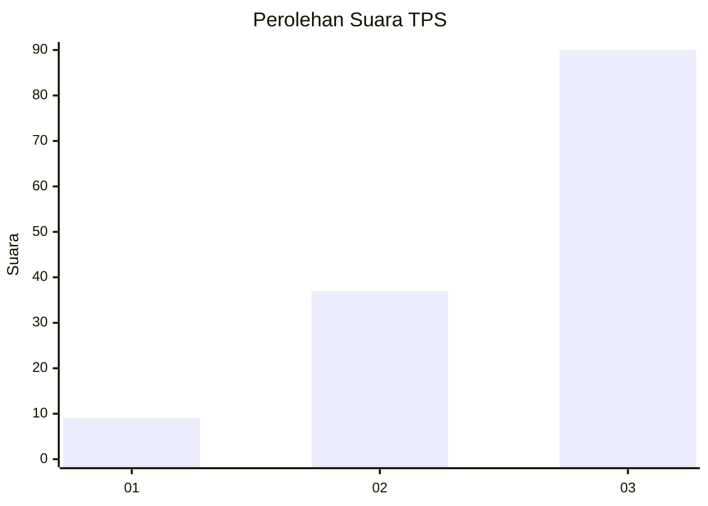
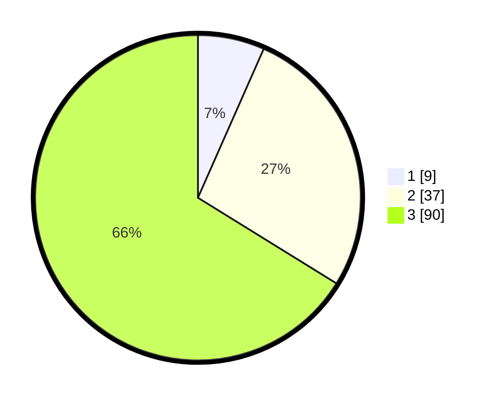

# Hasil

## Grafik

## Tabel

| No. | Nama Paslon    | Suara | Suara (raw) | Persentase |
|:--- |:-------------- | -----:| -----------:| ----------:|
| 1   | ANIES MUHAIMIN | 9     | [9][p-1]    | 6,62       |
| 2   | PRABOWO GIBRAN | 37    | [37][p-2]   | 27,21      |
| 3   | GANJAR MAHFUD  | 90    | [90][p-3]   | 66,18      |

[p-1]: https://github.com/gigit-pemilu/pemilu-2024-34-di-yogyakarta/blob/main/pilpres/hitung-suara/sub/34-di-yogyakarta/sub/03-gunungkidul/sub/04-patuk/sub/2011-terbah/sub/007-tps/sub/paslon-1.txt
[p-2]: https://github.com/gigit-pemilu/pemilu-2024-34-di-yogyakarta/blob/main/pilpres/hitung-suara/sub/34-di-yogyakarta/sub/03-gunungkidul/sub/04-patuk/sub/2011-terbah/sub/007-tps/sub/paslon-2.txt
[p-3]: https://github.com/gigit-pemilu/pemilu-2024-34-di-yogyakarta/blob/main/pilpres/hitung-suara/sub/34-di-yogyakarta/sub/03-gunungkidul/sub/04-patuk/sub/2011-terbah/sub/007-tps/sub/paslon-3.txt

## Foto C Plano

https://sirekap-obj-formc.kpu.go.id/c4ff/pemilu/ppwp/34/03/04/20/11/3403042011007-20240214-205621--b5088ca2-8afd-414a-b032-733dcab3d441.jpg

https://sirekap-obj-formc.kpu.go.id/c4ff/pemilu/ppwp/34/03/04/20/11/3403042011007-20240214-141020--70189cee-1805-4113-bd56-8808b0827755.jpg

https://sirekap-obj-formc.kpu.go.id/c4ff/pemilu/ppwp/34/03/04/20/11/3403042011007-20240214-141101--7c7a965a-27c7-4f6b-b4da-910b42ede7c0.jpg

## Metadata

| Key        | Value               |
| ---------- | ------------------- |
| Time Stamp | 2024-02-15 00:41:44 |

