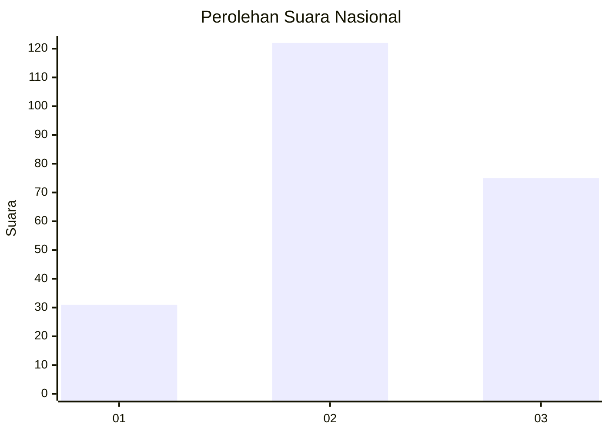
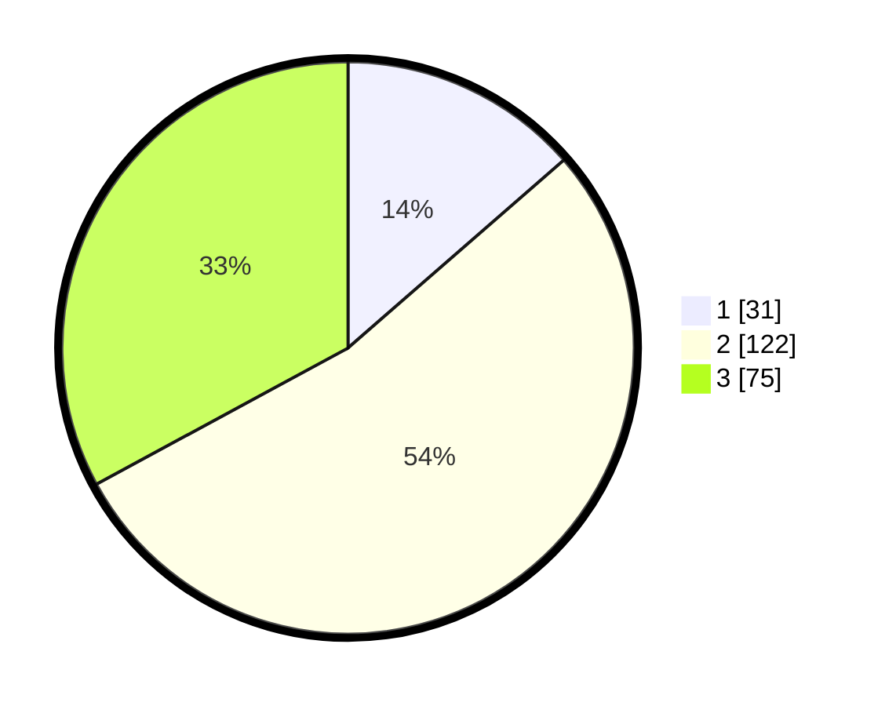

# Hasil

## Grafik

## Tabel

| No. | Nama Paslon    | Suara | Suara (raw) | Persentase |
|:--- |:-------------- | -----:| -----------:| ----------:|
| 1   | ANIES MUHAIMIN | 31    | [31][p-1]   | 13,60      |
| 2   | PRABOWO GIBRAN | 122   | [122][p-2]  | 53,51      |
| 3   | GANJAR MAHFUD  | 75    | [75][p-3]   | 32,89      |

[p-1]: https://github.com/gigit-pemilu/pemilu-2024/blob/main/pilpres/hitung-suara/sub/34-di-yogyakarta/sub/03-gunungkidul/sub/05-paliyan/sub/2001-sodo/sub/001-tps/sub/paslon-1.txt
[p-2]: https://github.com/gigit-pemilu/pemilu-2024/blob/main/pilpres/hitung-suara/sub/34-di-yogyakarta/sub/03-gunungkidul/sub/05-paliyan/sub/2001-sodo/sub/001-tps/sub/paslon-2.txt
[p-3]: https://github.com/gigit-pemilu/pemilu-2024/blob/main/pilpres/hitung-suara/sub/34-di-yogyakarta/sub/03-gunungkidul/sub/05-paliyan/sub/2001-sodo/sub/001-tps/sub/paslon-3.txt

## Foto C Plano

https://sirekap-obj-formc.kpu.go.id/ba2c/pemilu/ppwp/34/03/05/20/01/3403052001001-20240216-131930--07c9f0b4-088c-4211-a822-80ad9b9ef5b3.jpg

https://sirekap-obj-formc.kpu.go.id/ba2c/pemilu/ppwp/34/03/05/20/01/3403052001001-20240216-131932--dfbb4769-38f9-4e51-8537-9b4553c0e2fc.jpg

https://sirekap-obj-formc.kpu.go.id/ba2c/pemilu/ppwp/34/03/05/20/01/3403052001001-20240216-131931--ba02ec01-9a26-4564-8fe5-3c97bd8a4e82.jpg

## Metadata

| Key        | Value               |
| ---------- | ------------------- |
| Time Stamp | 2024-02-17 14:45:18 |

## DATA PEMILIH TETAP

Jumlah pemilih dalam DPT: **289**.
 * L: **136**.
 * P: **153**.

## DATA PENGGUNA HAK PILIH

Jumlah pengguna hak pilih dalam DPT: **243**.
 * L: **115**.
 * P: **128**.

Jumlah pengguna hak pilih dalam DPTb: **0**.
 * L: **0**.
 * P: **0**.

Jumlah pengguna hak pilih dalam DPK: **0**.
 * L: **0**.
 * P: **0**.

Jumlah pengguna hak pilih: **243**.
 * L: **115**.
 * P: **128**.

## JUMLAH SUARA SAH DAN TIDAK SAH

JUMLAH SELURUH SUARA SAH: **228**.

JUMLAH SUARA TIDAK SAH: **15**.

JUMLAH SELURUH SUARA SAH DAN SUARA TIDAK SAH: **243**.

