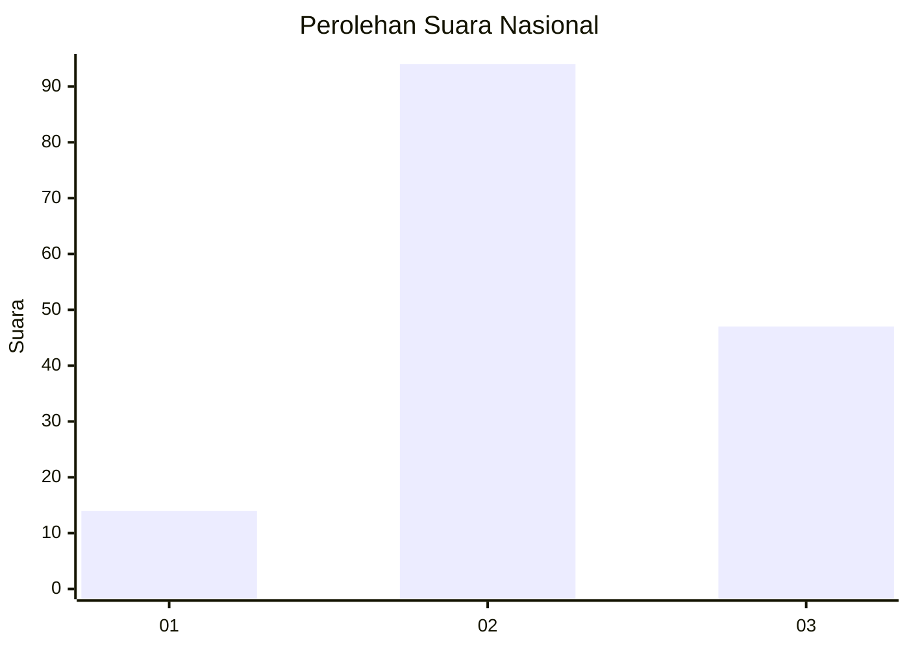
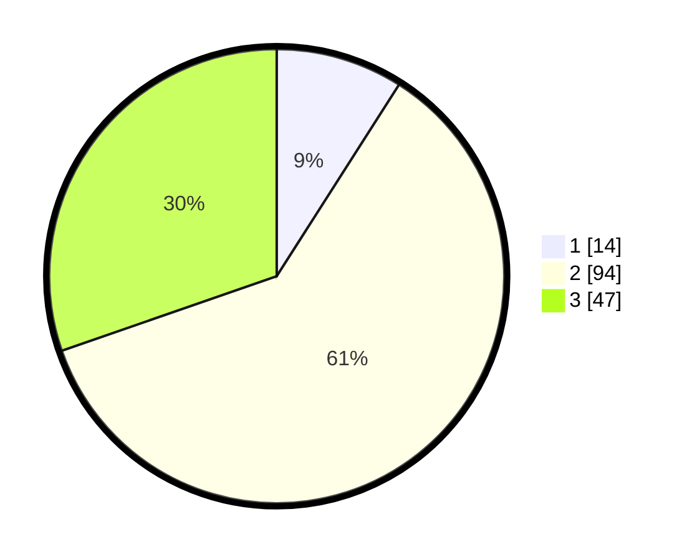

# Hasil

## Grafik

## Tabel

| No. | Nama Paslon    | Suara | Suara (raw) | Persentase |
|:--- |:-------------- | -----:| -----------:| ----------:|
| 1   | ANIES MUHAIMIN | 14    | [14][p-1]   | 9,03       |
| 2   | PRABOWO GIBRAN | 94    | [94][p-2]   | 60,65      |
| 3   | GANJAR MAHFUD  | 47    | [47][p-3]   | 30,32      |

[p-1]: https://github.com/gigit-pemilu/pemilu-2024/blob/main/pilpres/hitung-suara/sub/34-di-yogyakarta/sub/03-gunungkidul/sub/05-paliyan/sub/2001-sodo/sub/002-tps/sub/paslon-1.txt
[p-2]: https://github.com/gigit-pemilu/pemilu-2024/blob/main/pilpres/hitung-suara/sub/34-di-yogyakarta/sub/03-gunungkidul/sub/05-paliyan/sub/2001-sodo/sub/002-tps/sub/paslon-2.txt
[p-3]: https://github.com/gigit-pemilu/pemilu-2024/blob/main/pilpres/hitung-suara/sub/34-di-yogyakarta/sub/03-gunungkidul/sub/05-paliyan/sub/2001-sodo/sub/002-tps/sub/paslon-3.txt

## Foto C Plano

https://sirekap-obj-formc.kpu.go.id/bac1/pemilu/ppwp/34/03/05/20/01/3403052001002-20240215-233856--69adc178-1af9-4926-9c74-c9535079f241.jpg

https://sirekap-obj-formc.kpu.go.id/bac1/pemilu/ppwp/34/03/05/20/01/3403052001002-20240215-233859--6eae9898-9d29-49fc-902d-15e16d6f15db.jpg

https://sirekap-obj-formc.kpu.go.id/bac1/pemilu/ppwp/34/03/05/20/01/3403052001002-20240215-233858--68b56239-5bcf-4a19-a812-6c5028887a0e.jpg

## Metadata

| Key        | Value               |
| ---------- | ------------------- |
| Time Stamp | 2024-02-17 14:45:18 |

## DATA PEMILIH TETAP

Jumlah pemilih dalam DPT: **201**.
 * L: **104**.
 * P: **97**.

## DATA PENGGUNA HAK PILIH

Jumlah pengguna hak pilih dalam DPT: **168**.
 * L: **91**.
 * P: **77**.

Jumlah pengguna hak pilih dalam DPTb: **3**.
 * L: **1**.
 * P: **2**.

Jumlah pengguna hak pilih dalam DPK: **0**.
 * L: **0**.
 * P: **0**.

Jumlah pengguna hak pilih: **171**.
 * L: **92**.
 * P: **79**.

## JUMLAH SUARA SAH DAN TIDAK SAH

JUMLAH SELURUH SUARA SAH: **155**.

JUMLAH SUARA TIDAK SAH: **16**.

JUMLAH SELURUH SUARA SAH DAN SUARA TIDAK SAH: **171**.

