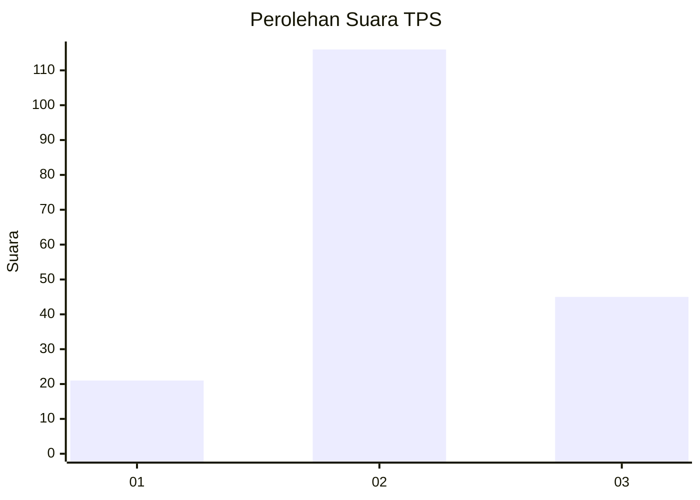
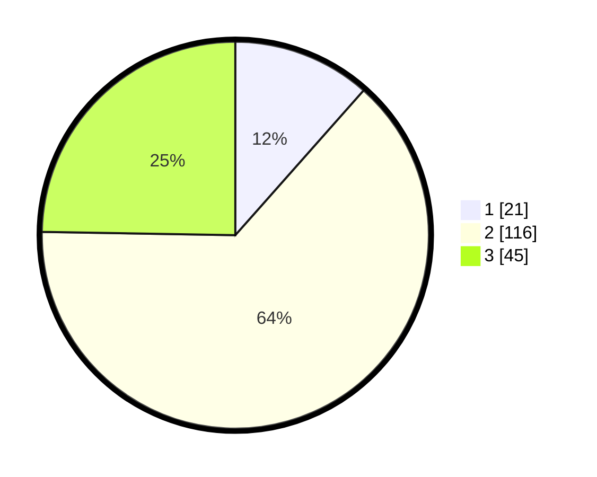

# Hasil

## Grafik

## Tabel

| No. | Nama Paslon    | Suara | Suara (raw) | Persentase |
|:--- |:-------------- | -----:| -----------:| ----------:|
| 1   | ANIES MUHAIMIN | 21    | [21][p-1]   | 11,54      |
| 2   | PRABOWO GIBRAN | 116   | [116][p-2]  | 63,74      |
| 3   | GANJAR MAHFUD  | 45    | [45][p-3]   | 24,73      |

[p-1]: https://github.com/gigit-pemilu/pemilu-2024-34-di-yogyakarta/blob/main/pilpres/hitung-suara/sub/34-di-yogyakarta/sub/03-gunungkidul/sub/05-paliyan/sub/2001-sodo/sub/003-tps/sub/paslon-1.txt
[p-2]: https://github.com/gigit-pemilu/pemilu-2024-34-di-yogyakarta/blob/main/pilpres/hitung-suara/sub/34-di-yogyakarta/sub/03-gunungkidul/sub/05-paliyan/sub/2001-sodo/sub/003-tps/sub/paslon-2.txt
[p-3]: https://github.com/gigit-pemilu/pemilu-2024-34-di-yogyakarta/blob/main/pilpres/hitung-suara/sub/34-di-yogyakarta/sub/03-gunungkidul/sub/05-paliyan/sub/2001-sodo/sub/003-tps/sub/paslon-3.txt

## Foto C Plano

https://sirekap-obj-formc.kpu.go.id/12e4/pemilu/ppwp/34/03/05/20/01/3403052001003-20240215-220057--028a76d5-a3f3-4960-a542-e2e5891b3f5d.jpg

https://sirekap-obj-formc.kpu.go.id/12e4/pemilu/ppwp/34/03/05/20/01/3403052001003-20240215-220101--6a7ddc5c-1d85-4e47-b7bf-a7985bdd1737.jpg

https://sirekap-obj-formc.kpu.go.id/12e4/pemilu/ppwp/34/03/05/20/01/3403052001003-20240215-220059--baf22fa2-d337-4c25-adee-4b051ed5d8d0.jpg

## Metadata

| Key        | Value               |
| ---------- | ------------------- |
| Time Stamp | 2024-02-17 14:45:18 |

## DATA PEMILIH TETAP

Jumlah pemilih dalam DPT: **225**.
 * L: **112**.
 * P: **113**.

## DATA PENGGUNA HAK PILIH

Jumlah pengguna hak pilih dalam DPT: **189**.
 * L: **99**.
 * P: **90**.

Jumlah pengguna hak pilih dalam DPTb: **3**.
 * L: **1**.
 * P: **2**.

Jumlah pengguna hak pilih dalam DPK: **2**.
 * L: **1**.
 * P: **1**.

Jumlah pengguna hak pilih: **194**.
 * L: **101**.
 * P: **93**.

## JUMLAH SUARA SAH DAN TIDAK SAH

JUMLAH SELURUH SUARA SAH: **182**.

JUMLAH SUARA TIDAK SAH: **12**.

JUMLAH SELURUH SUARA SAH DAN SUARA TIDAK SAH: **194**.

