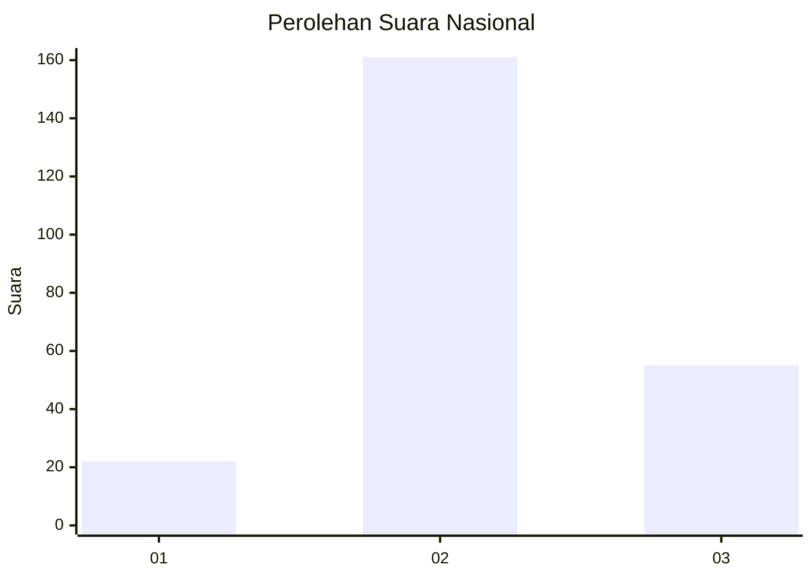
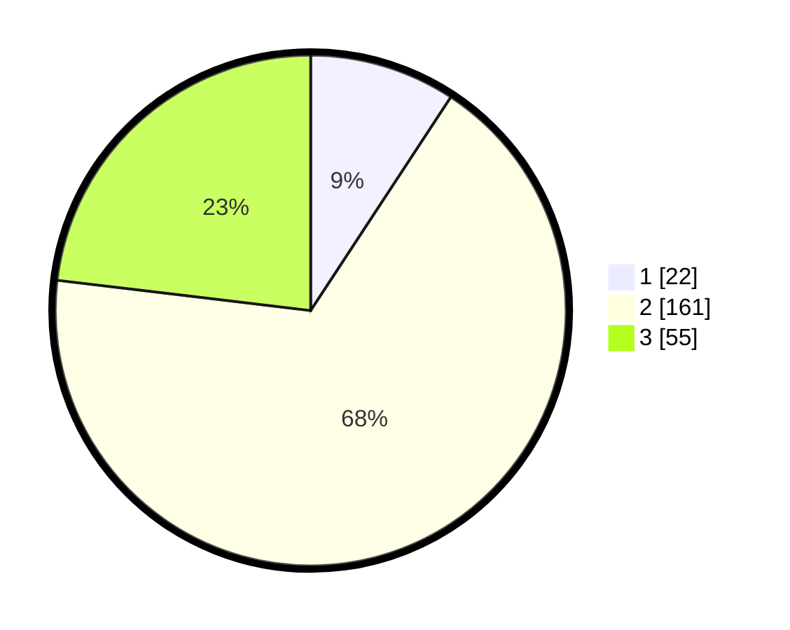

# Hasil

## Grafik

## Tabel

| No. | Nama Paslon    | Suara | Suara (raw) | Persentase |
|:--- |:-------------- | -----:| -----------:| ----------:|
| 1   | ANIES MUHAIMIN | 22    | [22][p-1]   | 9,24       |
| 2   | PRABOWO GIBRAN | 161   | [161][p-2]  | 67,65      |
| 3   | GANJAR MAHFUD  | 55    | [55][p-3]   | 23,11      |

[p-1]: https://github.com/gigit-pemilu/pemilu-2024/blob/main/pilpres/hitung-suara/sub/34-di-yogyakarta/sub/03-gunungkidul/sub/05-paliyan/sub/2001-sodo/sub/005-tps/sub/paslon-1.txt
[p-2]: https://github.com/gigit-pemilu/pemilu-2024/blob/main/pilpres/hitung-suara/sub/34-di-yogyakarta/sub/03-gunungkidul/sub/05-paliyan/sub/2001-sodo/sub/005-tps/sub/paslon-2.txt
[p-3]: https://github.com/gigit-pemilu/pemilu-2024/blob/main/pilpres/hitung-suara/sub/34-di-yogyakarta/sub/03-gunungkidul/sub/05-paliyan/sub/2001-sodo/sub/005-tps/sub/paslon-3.txt

## Foto C Plano

https://sirekap-obj-formc.kpu.go.id/a8b4/pemilu/ppwp/34/03/05/20/01/3403052001005-20240216-040621--65836a66-9b8a-40e7-a4ec-2c70d292ab40.jpg

https://sirekap-obj-formc.kpu.go.id/a8b4/pemilu/ppwp/34/03/05/20/01/3403052001005-20240216-040629--c83a7596-7f55-4034-b24a-81cd77ebba05.jpg

https://sirekap-obj-formc.kpu.go.id/a8b4/pemilu/ppwp/34/03/05/20/01/3403052001005-20240216-040045--4b4ae3f5-5268-4a21-a9fa-934d9ddcbc17.jpg

## Metadata

| Key        | Value               |
| ---------- | ------------------- |
| Time Stamp | 2024-02-17 14:45:18 |

## DATA PEMILIH TETAP

Jumlah pemilih dalam DPT: **276**.
 * L: **126**.
 * P: **150**.

## DATA PENGGUNA HAK PILIH

Jumlah pengguna hak pilih dalam DPT: **239**.
 * L: **110**.
 * P: **129**.

Jumlah pengguna hak pilih dalam DPTb: **2**.
 * L: **2**.
 * P: **0**.

Jumlah pengguna hak pilih dalam DPK: **0**.
 * L: **0**.
 * P: **0**.

Jumlah pengguna hak pilih: **241**.
 * L: **112**.
 * P: **129**.

## JUMLAH SUARA SAH DAN TIDAK SAH

JUMLAH SELURUH SUARA SAH: **238**.

JUMLAH SUARA TIDAK SAH: **3**.

JUMLAH SELURUH SUARA SAH DAN SUARA TIDAK SAH: **241**.

