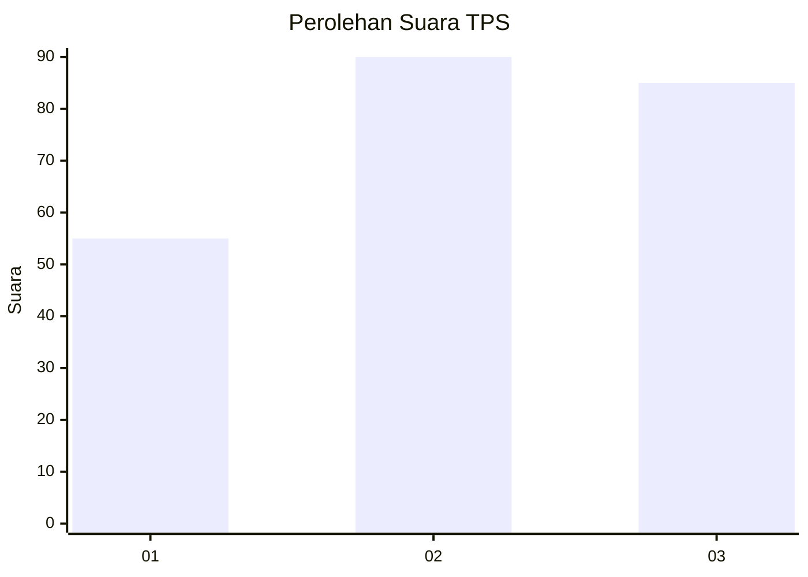
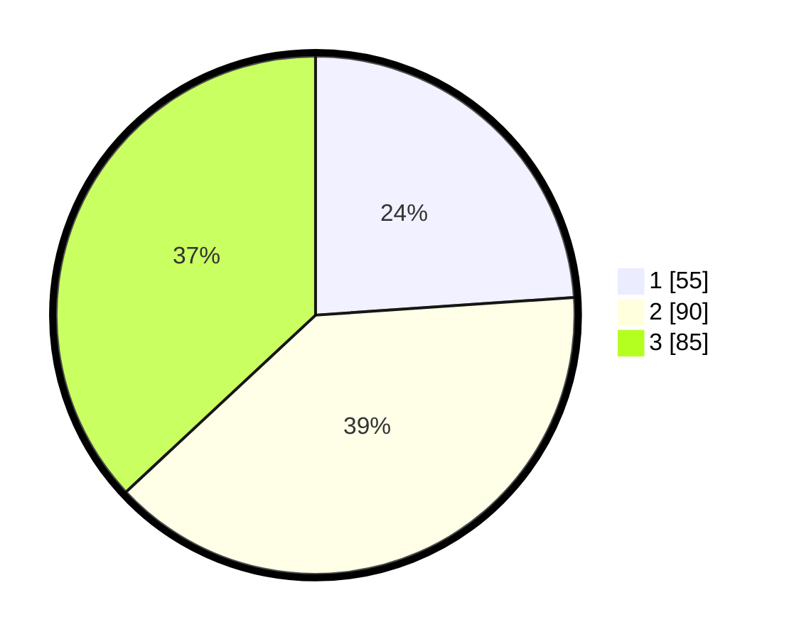

# Hasil

## Grafik

## Tabel

| No. | Nama Paslon    | Suara | Suara (raw) | Persentase |
|:--- |:-------------- | -----:| -----------:| ----------:|
| 1   | ANIES MUHAIMIN | 55    | [55][p-1]   | 23,91      |
| 2   | PRABOWO GIBRAN | 90    | [90][p-2]   | 39,13      |
| 3   | GANJAR MAHFUD  | 85    | [85][p-3]   | 36,96      |

[p-1]: https://github.com/gigit-pemilu/pemilu-2024-34-di-yogyakarta/blob/main/pilpres/hitung-suara/sub/34-di-yogyakarta/sub/03-gunungkidul/sub/05-paliyan/sub/2002-pampang/sub/007-tps/sub/paslon-1.txt
[p-2]: https://github.com/gigit-pemilu/pemilu-2024-34-di-yogyakarta/blob/main/pilpres/hitung-suara/sub/34-di-yogyakarta/sub/03-gunungkidul/sub/05-paliyan/sub/2002-pampang/sub/007-tps/sub/paslon-2.txt
[p-3]: https://github.com/gigit-pemilu/pemilu-2024-34-di-yogyakarta/blob/main/pilpres/hitung-suara/sub/34-di-yogyakarta/sub/03-gunungkidul/sub/05-paliyan/sub/2002-pampang/sub/007-tps/sub/paslon-3.txt

## Foto C Plano

https://sirekap-obj-formc.kpu.go.id/76df/pemilu/ppwp/34/03/05/20/02/3403052002007-20240217-122048--d1b139be-0355-4304-bf83-bf81b056429e.jpg

https://sirekap-obj-formc.kpu.go.id/76df/pemilu/ppwp/34/03/05/20/02/3403052002007-20240217-122341--fe138b9a-bd28-4ec9-a727-c90202e6e463.jpg

https://sirekap-obj-formc.kpu.go.id/76df/pemilu/ppwp/34/03/05/20/02/3403052002007-20240217-122851--1d2687d2-d42d-4c22-a9d0-d013abc3df06.jpg

## Metadata

| Key        | Value               |
| ---------- | ------------------- |
| Time Stamp | 2024-02-17 13:37:34 |

