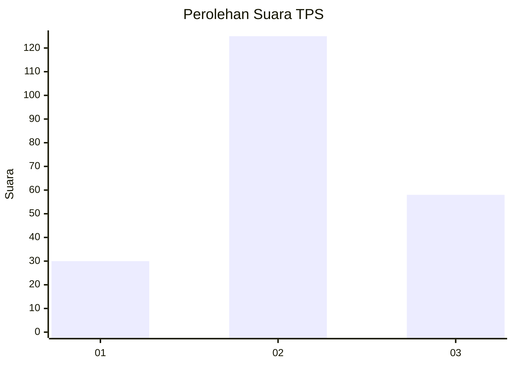
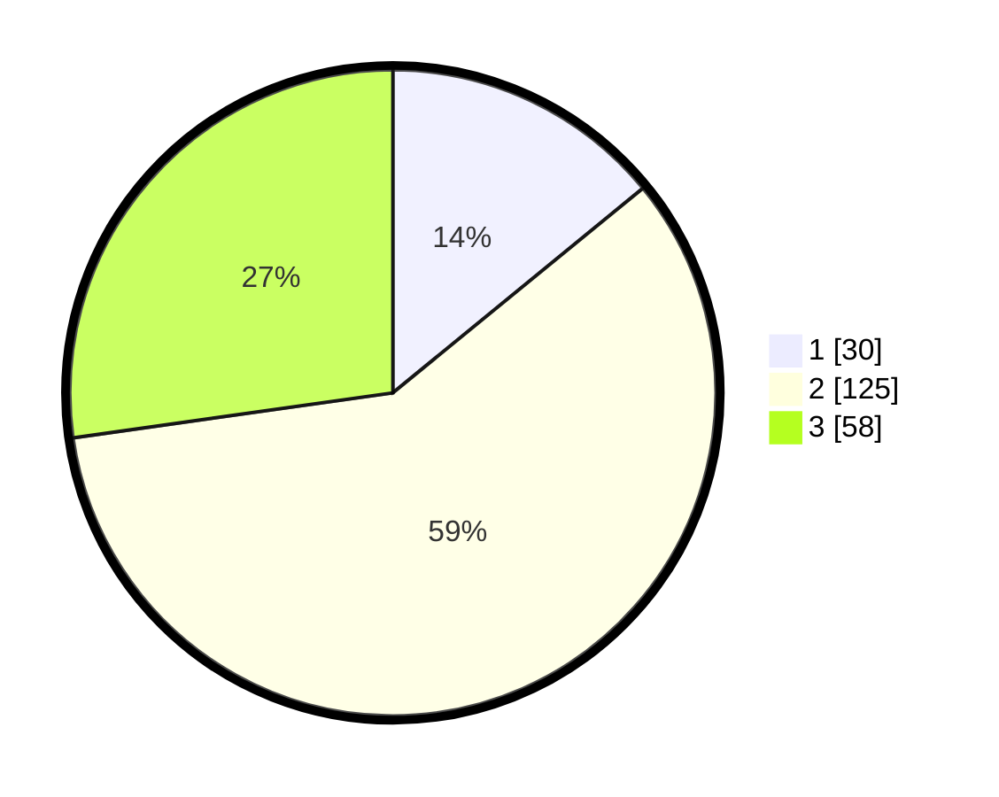

# Hasil

## Grafik

## Tabel

| No. | Nama Paslon    | Suara | Suara (raw) | Persentase |
|:--- |:-------------- | -----:| -----------:| ----------:|
| 1   | ANIES MUHAIMIN | 30    | [30][p-1]   | 14,08      |
| 2   | PRABOWO GIBRAN | 125   | [125][p-2]  | 58,69      |
| 3   | GANJAR MAHFUD  | 58    | [58][p-3]   | 27,23      |

[p-1]: https://github.com/gigit-pemilu/pemilu-2024-34-di-yogyakarta/blob/main/pilpres/hitung-suara/sub/34-di-yogyakarta/sub/03-gunungkidul/sub/05-paliyan/sub/2003-grogol/sub/003-tps/sub/paslon-1.txt
[p-2]: https://github.com/gigit-pemilu/pemilu-2024-34-di-yogyakarta/blob/main/pilpres/hitung-suara/sub/34-di-yogyakarta/sub/03-gunungkidul/sub/05-paliyan/sub/2003-grogol/sub/003-tps/sub/paslon-2.txt
[p-3]: https://github.com/gigit-pemilu/pemilu-2024-34-di-yogyakarta/blob/main/pilpres/hitung-suara/sub/34-di-yogyakarta/sub/03-gunungkidul/sub/05-paliyan/sub/2003-grogol/sub/003-tps/sub/paslon-3.txt

## Foto C Plano

https://sirekap-obj-formc.kpu.go.id/d6e1/pemilu/ppwp/34/03/05/20/03/3403052003003-20240214-194850--f47bd05b-eb2c-4b76-8d15-59476b0c6e95.jpg

https://sirekap-obj-formc.kpu.go.id/d6e1/pemilu/ppwp/34/03/05/20/03/3403052003003-20240215-011907--1076d868-49d5-4beb-a5c6-18c8606e7304.jpg

https://sirekap-obj-formc.kpu.go.id/d6e1/pemilu/ppwp/34/03/05/20/03/3403052003003-20240215-045120--bb287c4e-c30f-49f4-80dd-3b632da8d169.jpg

## Metadata

| Key        | Value               |
| ---------- | ------------------- |
| Time Stamp | 2024-02-15 15:00:29 |

