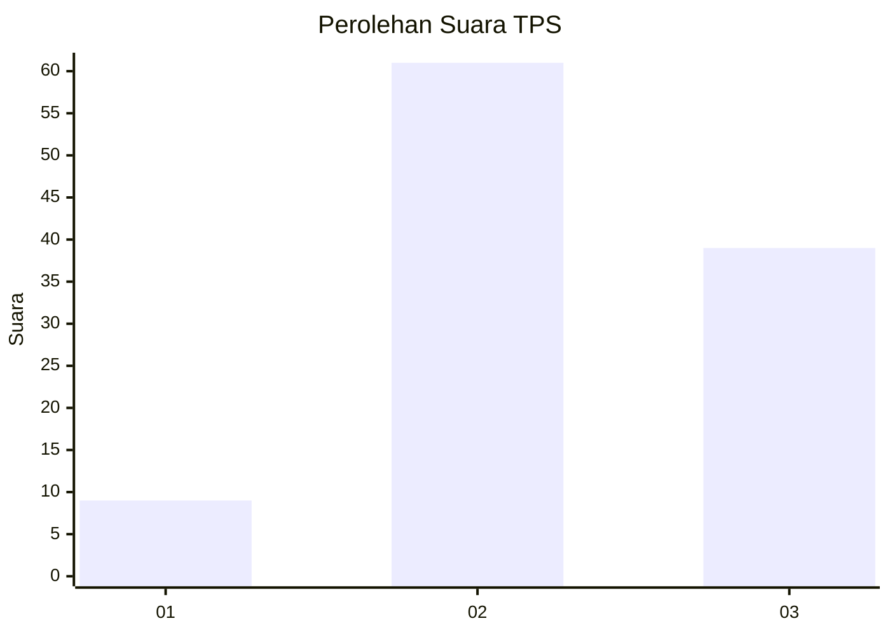
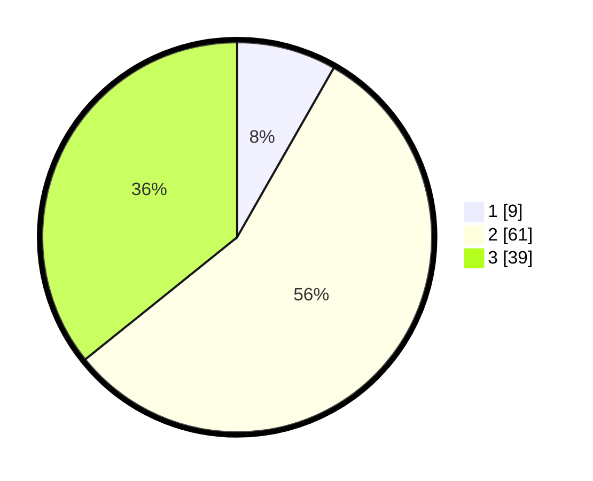

# Hasil

## Grafik

## Tabel

| No. | Nama Paslon    | Suara | Suara (raw) | Persentase |
|:--- |:-------------- | -----:| -----------:| ----------:|
| 1   | ANIES MUHAIMIN | 9     | [9][p-1]    | 8,26       |
| 2   | PRABOWO GIBRAN | 61    | [61][p-2]   | 55,96      |
| 3   | GANJAR MAHFUD  | 39    | [39][p-3]   | 35,78      |

[p-1]: https://github.com/gigit-pemilu/pemilu-2024-34-di-yogyakarta/blob/main/pilpres/hitung-suara/sub/34-di-yogyakarta/sub/03-gunungkidul/sub/05-paliyan/sub/2003-grogol/sub/005-tps/sub/paslon-1.txt
[p-2]: https://github.com/gigit-pemilu/pemilu-2024-34-di-yogyakarta/blob/main/pilpres/hitung-suara/sub/34-di-yogyakarta/sub/03-gunungkidul/sub/05-paliyan/sub/2003-grogol/sub/005-tps/sub/paslon-2.txt
[p-3]: https://github.com/gigit-pemilu/pemilu-2024-34-di-yogyakarta/blob/main/pilpres/hitung-suara/sub/34-di-yogyakarta/sub/03-gunungkidul/sub/05-paliyan/sub/2003-grogol/sub/005-tps/sub/paslon-3.txt

## Foto C Plano

https://sirekap-obj-formc.kpu.go.id/3d92/pemilu/ppwp/34/03/05/20/03/3403052003005-20240214-200950--cd3f4cb9-ed4d-4884-9ca5-ef23628689fb.jpg

https://sirekap-obj-formc.kpu.go.id/3d92/pemilu/ppwp/34/03/05/20/03/3403052003005-20240214-224612--c177cebf-d68b-4da9-a84f-f32fbadfb461.jpg

https://sirekap-obj-formc.kpu.go.id/3d92/pemilu/ppwp/34/03/05/20/03/3403052003005-20240214-224856--c881c186-9d27-41a2-9830-a8e30036a821.jpg

## Metadata

| Key        | Value               |
| ---------- | ------------------- |
| Time Stamp | 2024-02-17 19:30:00 |

## DATA PEMILIH TETAP

Jumlah pemilih dalam DPT: **155**.
 * L: **69**.
 * P: **86**.

## DATA PENGGUNA HAK PILIH

Jumlah pengguna hak pilih dalam DPT: **112**.
 * L: **50**.
 * P: **62**.

Jumlah pengguna hak pilih dalam DPTb: **1**.
 * L: **0**.
 * P: **1**.

Jumlah pengguna hak pilih dalam DPK: **0**.
 * L: **0**.
 * P: **0**.

Jumlah pengguna hak pilih: **113**.
 * L: **50**.
 * P: **63**.

## JUMLAH SUARA SAH DAN TIDAK SAH

JUMLAH SELURUH SUARA SAH: **109**.

JUMLAH SUARA TIDAK SAH: **4**.

JUMLAH SELURUH SUARA SAH DAN SUARA TIDAK SAH: **113**.

