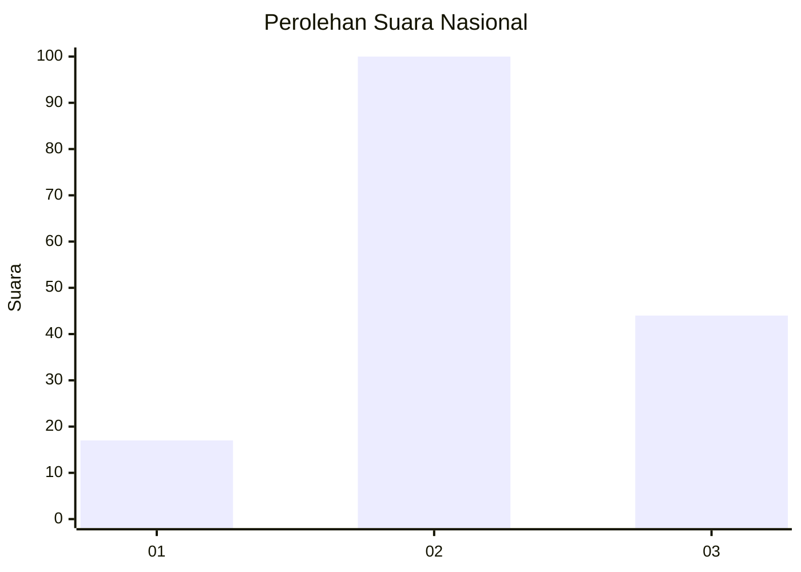
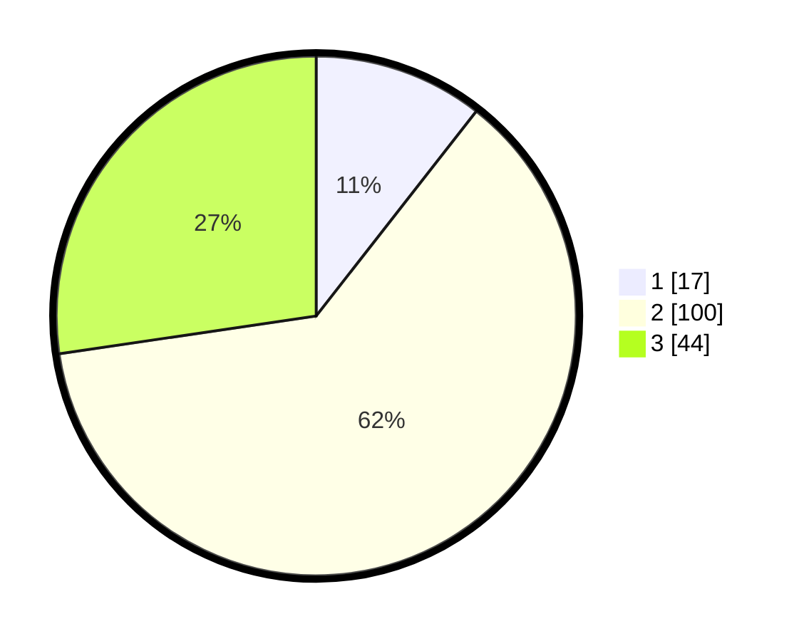

# Hasil

## Grafik

## Tabel

| No. | Nama Paslon    | Suara | Suara (raw) | Persentase |
|:--- |:-------------- | -----:| -----------:| ----------:|
| 1   | ANIES MUHAIMIN | 17    | [17][p-1]   | 10,56      |
| 2   | PRABOWO GIBRAN | 100   | [100][p-2]  | 62,11      |
| 3   | GANJAR MAHFUD  | 44    | [44][p-3]   | 27,33      |

[p-1]: https://github.com/gigit-pemilu/pemilu-2024/blob/main/pilpres/hitung-suara/sub/34-di-yogyakarta/sub/03-gunungkidul/sub/05-paliyan/sub/2003-grogol/sub/009-tps/sub/paslon-1.txt
[p-2]: https://github.com/gigit-pemilu/pemilu-2024/blob/main/pilpres/hitung-suara/sub/34-di-yogyakarta/sub/03-gunungkidul/sub/05-paliyan/sub/2003-grogol/sub/009-tps/sub/paslon-2.txt
[p-3]: https://github.com/gigit-pemilu/pemilu-2024/blob/main/pilpres/hitung-suara/sub/34-di-yogyakarta/sub/03-gunungkidul/sub/05-paliyan/sub/2003-grogol/sub/009-tps/sub/paslon-3.txt

## Foto C Plano

https://sirekap-obj-formc.kpu.go.id/d1ad/pemilu/ppwp/34/03/05/20/03/3403052003009-20240215-013739--6321ad35-b07f-4716-bd50-53cde1cce239.jpg

https://sirekap-obj-formc.kpu.go.id/d1ad/pemilu/ppwp/34/03/05/20/03/3403052003009-20240215-014130--443bd62c-3ef4-42e2-a771-5b5f45fd24ee.jpg

https://sirekap-obj-formc.kpu.go.id/d1ad/pemilu/ppwp/34/03/05/20/03/3403052003009-20240215-023229--a5c87a51-13f0-4f0c-a69f-e4bb878c8ffe.jpg

## Metadata

| Key        | Value               |
| ---------- | ------------------- |
| Time Stamp | 2024-02-15 15:00:29 |

