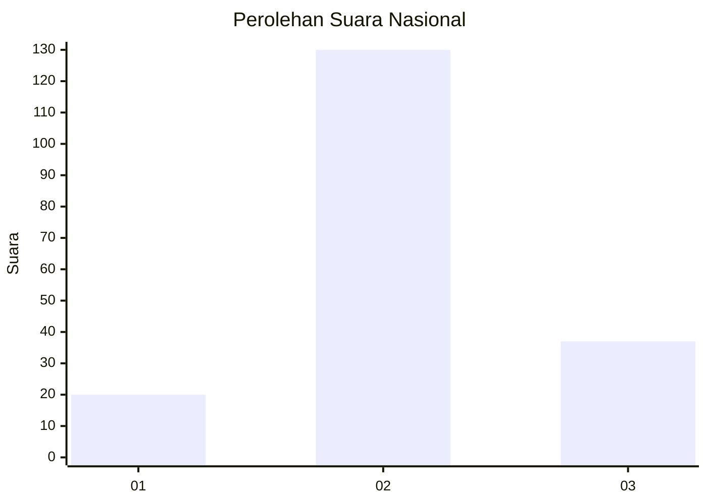
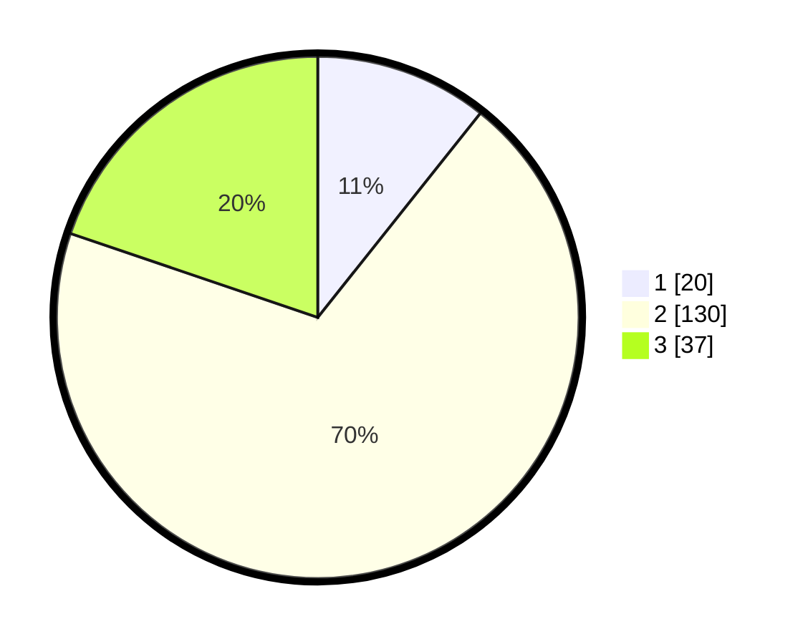

# Hasil

## Grafik

## Tabel

| No. | Nama Paslon    | Suara | Suara (raw) | Persentase |
|:--- |:-------------- | -----:| -----------:| ----------:|
| 1   | ANIES MUHAIMIN | 20    | [20][p-1]   | 10,70      |
| 2   | PRABOWO GIBRAN | 130   | [130][p-2]  | 69,52      |
| 3   | GANJAR MAHFUD  | 37    | [37][p-3]   | 19,79      |

[p-1]: https://github.com/gigit-pemilu/pemilu-2024/blob/main/pilpres/hitung-suara/sub/34-di-yogyakarta/sub/03-gunungkidul/sub/05-paliyan/sub/2004-karangduwet/sub/011-tps/sub/paslon-1.txt
[p-2]: https://github.com/gigit-pemilu/pemilu-2024/blob/main/pilpres/hitung-suara/sub/34-di-yogyakarta/sub/03-gunungkidul/sub/05-paliyan/sub/2004-karangduwet/sub/011-tps/sub/paslon-2.txt
[p-3]: https://github.com/gigit-pemilu/pemilu-2024/blob/main/pilpres/hitung-suara/sub/34-di-yogyakarta/sub/03-gunungkidul/sub/05-paliyan/sub/2004-karangduwet/sub/011-tps/sub/paslon-3.txt

## Foto C Plano

https://sirekap-obj-formc.kpu.go.id/f7ce/pemilu/ppwp/34/03/05/20/04/3403052004011-20240217-145531--98ce4276-3b38-4bdb-a9a1-b176b4d474d3.jpg

https://sirekap-obj-formc.kpu.go.id/f7ce/pemilu/ppwp/34/03/05/20/04/3403052004011-20240217-145824--4c9e8412-af8e-41cf-be00-aef5a7e80336.jpg

https://sirekap-obj-formc.kpu.go.id/f7ce/pemilu/ppwp/34/03/05/20/04/3403052004011-20240217-150426--7186d8af-95fd-4fb6-aade-86e7de713117.jpg

## Metadata

| Key        | Value               |
| ---------- | ------------------- |
| Time Stamp | 2024-02-17 16:00:02 |

