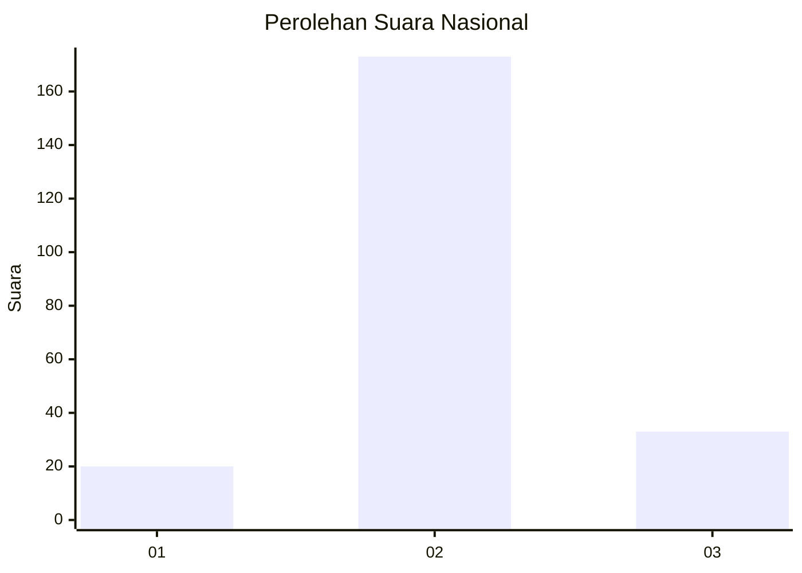

# Hasil

## Grafik

## Tabel

| No. | Nama Paslon    | Suara | Suara (raw) | Persentase |
|:--- |:-------------- | -----:| -----------:| ----------:|
| 1   | ANIES MUHAIMIN | 20    | [20][p-1]   | 8,85       |
| 2   | PRABOWO GIBRAN | 173   | [173][p-2]  | 76,55      |
| 3   | GANJAR MAHFUD  | 33    | [33][p-3]   | 14,60      |

[p-1]: https://github.com/gigit-pemilu/pemilu-2024/blob/main/pilpres/hitung-suara/sub/34-di-yogyakarta/sub/03-gunungkidul/sub/05-paliyan/sub/2004-karangduwet/sub/015-tps/sub/paslon-1.txt
[p-2]: https://github.com/gigit-pemilu/pemilu-2024/blob/main/pilpres/hitung-suara/sub/34-di-yogyakarta/sub/03-gunungkidul/sub/05-paliyan/sub/2004-karangduwet/sub/015-tps/sub/paslon-2.txt
[p-3]: https://github.com/gigit-pemilu/pemilu-2024/blob/main/pilpres/hitung-suara/sub/34-di-yogyakarta/sub/03-gunungkidul/sub/05-paliyan/sub/2004-karangduwet/sub/015-tps/sub/paslon-3.txt

## Foto C Plano

https://sirekap-obj-formc.kpu.go.id/bc34/pemilu/ppwp/34/03/05/20/04/3403052004015-20240216-145955--547c2927-d127-4f9d-b49c-f5fd98286de3.jpg

https://sirekap-obj-formc.kpu.go.id/bc34/pemilu/ppwp/34/03/05/20/04/3403052004015-20240216-145956--99ea9491-3cf9-4546-9f75-71cbb34ccfdc.jpg

https://sirekap-obj-formc.kpu.go.id/bc34/pemilu/ppwp/34/03/05/20/04/3403052004015-20240216-145955--cc3f8970-6f19-4d0e-b806-7af2b4449ac9.jpg

## Metadata

| Key        | Value               |
| ---------- | ------------------- |
| Time Stamp | 2024-02-17 14:45:18 |

## DATA PEMILIH TETAP

Jumlah pemilih dalam DPT: **259**.
 * L: **134**.
 * P: **125**.

## DATA PENGGUNA HAK PILIH

Jumlah pengguna hak pilih dalam DPT: **259**.
 * L: **134**.
 * P: **125**.

Jumlah pengguna hak pilih dalam DPTb: **228**.
 * L: **115**.
 * P: **113**.

Jumlah pengguna hak pilih dalam DPK: **2**.
 * L: **1**.
 * P: **1**.

Jumlah pengguna hak pilih: **230**.
 * L: **116**.
 * P: **114**.

## JUMLAH SUARA SAH DAN TIDAK SAH

JUMLAH SELURUH SUARA SAH: **226**.

JUMLAH SUARA TIDAK SAH: **4**.

JUMLAH SELURUH SUARA SAH DAN SUARA TIDAK SAH: **230**.

