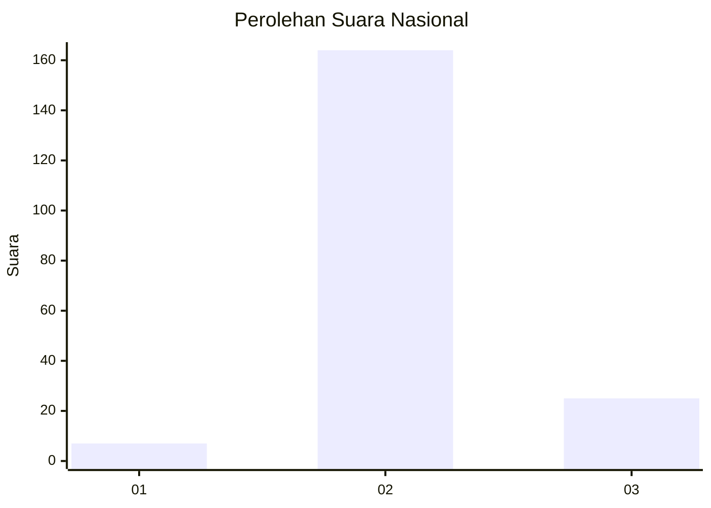
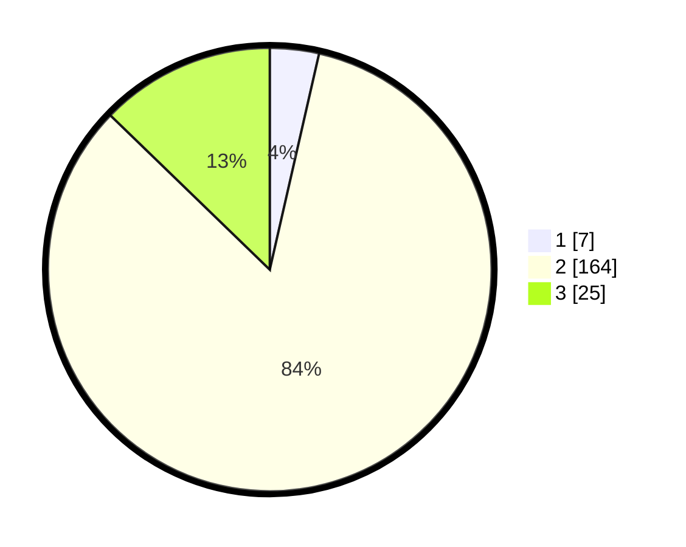

# Hasil

## Grafik

## Tabel

| No. | Nama Paslon    | Suara | Suara (raw) | Persentase |
|:--- |:-------------- | -----:| -----------:| ----------:|
| 1   | ANIES MUHAIMIN | 7     | [7][p-1]    | 3,57       |
| 2   | PRABOWO GIBRAN | 164   | [164][p-2]  | 83,67      |
| 3   | GANJAR MAHFUD  | 25    | [25][p-3]   | 12,76      |

[p-1]: https://github.com/gigit-pemilu/pemilu-2024/blob/main/pilpres/hitung-suara/sub/34-di-yogyakarta/sub/03-gunungkidul/sub/05-paliyan/sub/2004-karangduwet/sub/021-tps/sub/paslon-1.txt
[p-2]: https://github.com/gigit-pemilu/pemilu-2024/blob/main/pilpres/hitung-suara/sub/34-di-yogyakarta/sub/03-gunungkidul/sub/05-paliyan/sub/2004-karangduwet/sub/021-tps/sub/paslon-2.txt
[p-3]: https://github.com/gigit-pemilu/pemilu-2024/blob/main/pilpres/hitung-suara/sub/34-di-yogyakarta/sub/03-gunungkidul/sub/05-paliyan/sub/2004-karangduwet/sub/021-tps/sub/paslon-3.txt

## Foto C Plano

https://sirekap-obj-formc.kpu.go.id/e0e7/pemilu/ppwp/34/03/05/20/04/3403052004021-20240216-000815--19311ee5-c8fa-486c-bd6b-705d4938e027.jpg

https://sirekap-obj-formc.kpu.go.id/e0e7/pemilu/ppwp/34/03/05/20/04/3403052004021-20240216-000816--cc4a8bd7-d664-4b71-99df-af9a4fa696ae.jpg

https://sirekap-obj-formc.kpu.go.id/e0e7/pemilu/ppwp/34/03/05/20/04/3403052004021-20240216-000815--fe7b4821-78d1-4a59-9738-0951113bf793.jpg

## Metadata

| Key        | Value               |
| ---------- | ------------------- |
| Time Stamp | 2024-02-17 14:56:33 |

## DATA PEMILIH TETAP

Jumlah pemilih dalam DPT: **230**.
 * L: **106**.
 * P: **124**.

## DATA PENGGUNA HAK PILIH

Jumlah pengguna hak pilih dalam DPT: **190**.
 * L: **87**.
 * P: **103**.

Jumlah pengguna hak pilih dalam DPTb: **4**.
 * L: **2**.
 * P: **2**.

Jumlah pengguna hak pilih dalam DPK: **2**.
 * L: **2**.
 * P: **0**.

Jumlah pengguna hak pilih: **196**.
 * L: **91**.
 * P: **105**.

## JUMLAH SUARA SAH DAN TIDAK SAH

JUMLAH SELURUH SUARA SAH: **196**.

JUMLAH SUARA TIDAK SAH: **0**.

JUMLAH SELURUH SUARA SAH DAN SUARA TIDAK SAH: **196**.

