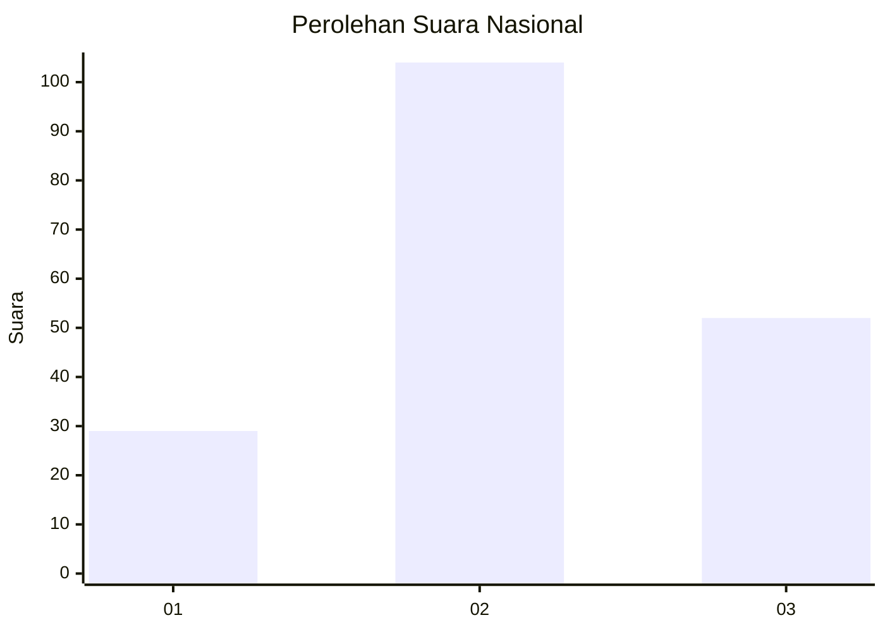
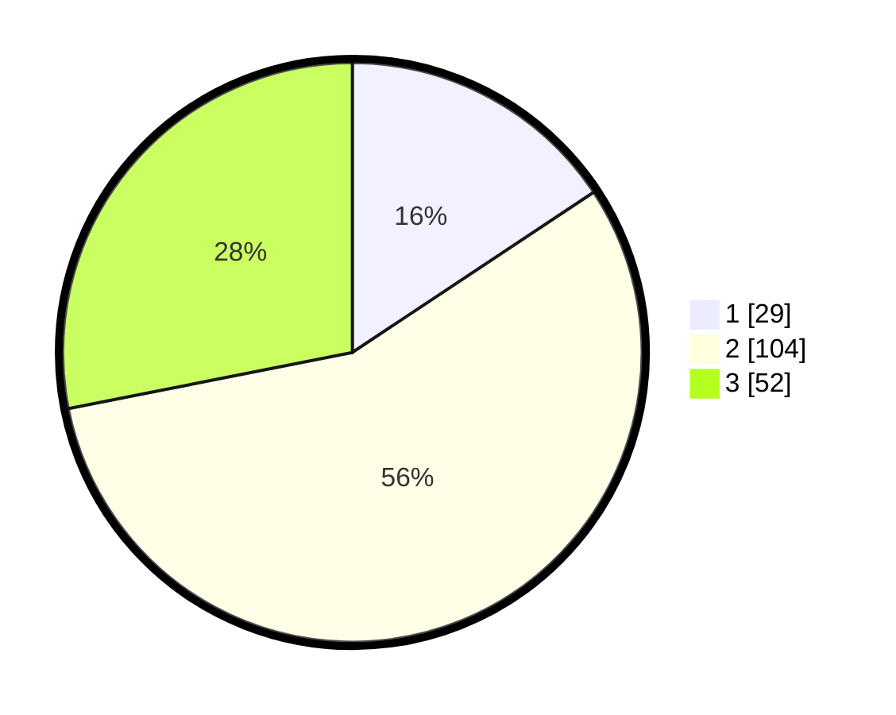

# Hasil

## Grafik

## Tabel

| No. | Nama Paslon    | Suara | Suara (raw) | Persentase |
|:--- |:-------------- | -----:| -----------:| ----------:|
| 1   | ANIES MUHAIMIN | 29    | [29][p-1]   | 15,68      |
| 2   | PRABOWO GIBRAN | 104   | [104][p-2]  | 56,22      |
| 3   | GANJAR MAHFUD  | 52    | [52][p-3]   | 28,11      |

[p-1]: https://github.com/gigit-pemilu/pemilu-2024/blob/main/pilpres/hitung-suara/sub/34-di-yogyakarta/sub/03-gunungkidul/sub/05-paliyan/sub/2005-karangasem/sub/005-tps/sub/paslon-1.txt
[p-2]: https://github.com/gigit-pemilu/pemilu-2024/blob/main/pilpres/hitung-suara/sub/34-di-yogyakarta/sub/03-gunungkidul/sub/05-paliyan/sub/2005-karangasem/sub/005-tps/sub/paslon-2.txt
[p-3]: https://github.com/gigit-pemilu/pemilu-2024/blob/main/pilpres/hitung-suara/sub/34-di-yogyakarta/sub/03-gunungkidul/sub/05-paliyan/sub/2005-karangasem/sub/005-tps/sub/paslon-3.txt

## Foto C Plano

https://sirekap-obj-formc.kpu.go.id/e8c7/pemilu/ppwp/34/03/05/20/05/3403052005005-20240215-222855--b32d6baf-d2b6-440d-a083-d04747d5be8b.jpg

https://sirekap-obj-formc.kpu.go.id/e8c7/pemilu/ppwp/34/03/05/20/05/3403052005005-20240215-222859--09331834-2b19-4ae2-9570-21c7cad93ce0.jpg

https://sirekap-obj-formc.kpu.go.id/e8c7/pemilu/ppwp/34/03/05/20/05/3403052005005-20240215-222857--50459df7-7f88-407b-acd5-b015762eb3e5.jpg

## Metadata

| Key        | Value               |
| ---------- | ------------------- |
| Time Stamp | 2024-02-17 14:56:33 |

## DATA PEMILIH TETAP

Jumlah pemilih dalam DPT: **218**.
 * L: **109**.
 * P: **109**.

## DATA PENGGUNA HAK PILIH

Jumlah pengguna hak pilih dalam DPT: **190**.
 * L: **94**.
 * P: **96**.

Jumlah pengguna hak pilih dalam DPTb: **2**.
 * L: **1**.
 * P: **1**.

Jumlah pengguna hak pilih dalam DPK: **0**.
 * L: **2**.
 * P: **0**.

Jumlah pengguna hak pilih: **194**.
 * L: **97**.
 * P: **97**.

## JUMLAH SUARA SAH DAN TIDAK SAH

JUMLAH SELURUH SUARA SAH: **185**.

JUMLAH SUARA TIDAK SAH: **9**.

JUMLAH SELURUH SUARA SAH DAN SUARA TIDAK SAH: **194**.

